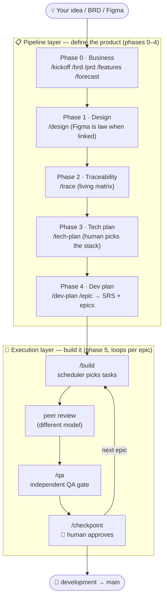
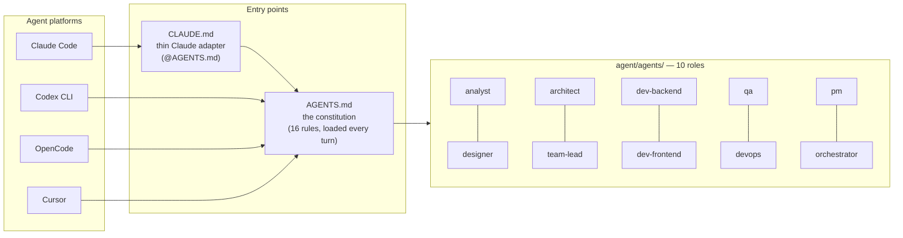
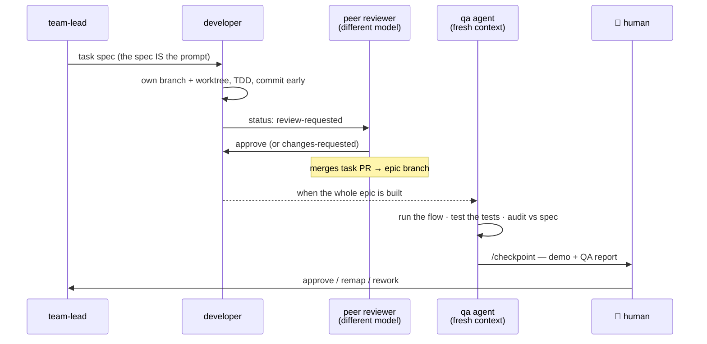
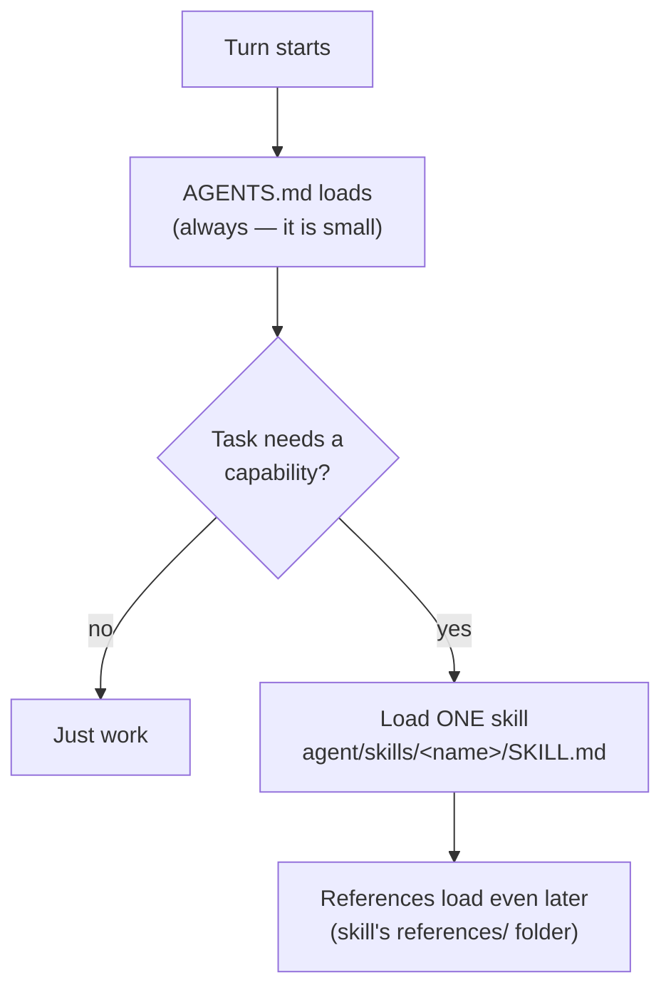
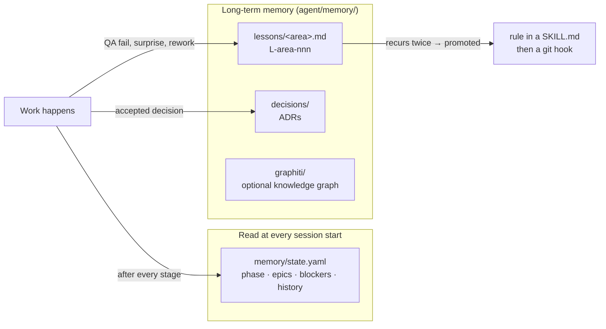
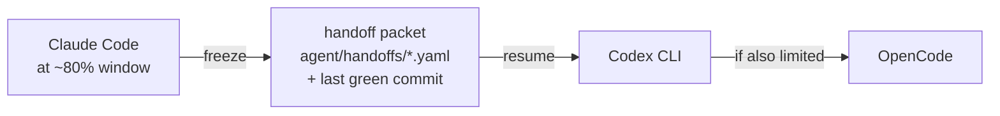

# Agentic Delivery Harness

A **reusable template** for building products with AI agents.

This repo is not a product. It is the **machine that builds products**.
You give it an idea (or a BRD). It drives the idea to shipped code —
through specs, design, plans, and QA-gated builds. A human approves
every important step.

It is **platform-agnostic**. Claude Code, Codex CLI, OpenCode, and Cursor
all read the same rules, use the same skills, and work the same queue.

---

## 1. The big picture



Two layers, one rule: **every arrow ends at a human gate before it moves on.**

---

## 2. How a platform talks to the agents

Any platform enters through the same two doors.



- **Claude Code**: `.claude/agents` and `.claude/skills` are symlinks into
  `agent/`. Agents become subagents. Skills become `/commands`. Native.
- **Other platforms**: they read `AGENTS.md` and reach the same files by
  path. Headless runs go through `agent/adapters/run-<platform>.sh`,
  which logs cost + session JSON into `runs/` and `metrics.csv`.

---

## 3. How the agents work together

One task moves through four hands. Never fewer.



Who does what:

| Role | One job | Never does |
|---|---|---|
| analyst | BRD, PRD, features, forecast | write code |
| designer | design system, screens, prototype | write product code |
| architect | tech plan + ADRs (options, human decides) | pick the stack alone |
| team-lead | dev plan, epic + task specs, final code review | implement features |
| developer ×2 | one task, one branch, TDD | touch files outside the spec |
| qa | independent verification, merge gate | edit product code |
| pm | SRS, priorities, feedback routing | technical specs |
| devops | CI/CD, releases, rollback | product features |
| orchestrator | scheduler, budgets, handoffs | write product code |

---

## 4. How skills load (and when)

Skills are **on-demand manuals**. Nothing loads until it is needed.
That keeps every session cheap.



- **Where**: all 35 skills live in `agent/skills/<name>/SKILL.md`.
- **When**: a pipeline step starts (`/brd`, `/qa`, …) or a capability is
  needed (git-flow, TDD, EARS, rate-limit handoff).
- **Who**: each agent card lists its `skills:` — its usual toolbox.
- On Claude Code every skill is also a slash command, via the
  `.claude/skills` symlink.

---

## 5. How the harness remembers (state, memory, lessons)



- **Session tracking**: `memory/state.yaml` is the single resume point.
  Any platform, any session: read state → announce position → continue.
  `/status` does this and refreshes the dashboard.
- **Lessons compound**: every mistake becomes a lesson. A lesson that
  repeats becomes a rule. A rule that matters becomes a hook. This is how
  the harness gets better with every project.
- **ADRs are forever**: decisions are reversed by new ADRs, never edited.

---

## 6. How handoffs work

Two kinds. Both are files, so nothing is ever lost.

**A. Phase / agent handoff** — every finished artifact ends with a
Handoff block (`templates/handoff.md`): what was decided, what is open,
what the next stage must not change. The next agent reads it first.

**B. Rate-limit handoff** — when a platform hits its usage window:



The statusline script watches the 5-hour and weekly windows. At the
threshold, work freezes into a packet and the next platform in
`harness.yaml: platforms` picks it up. Nothing is lost.

---

## 7. Watching the project (PM dashboard)

One static HTML file. No server, no login, no dependency.

```bash
make dashboard          # rebuild → dashboard/index.html
```

It shows: pipeline phases · every epic and task with status, worker →
reviewer, and dependencies · blockers · open questions · costs vs budget ·
links to every spec, QA report, and checkpoint. `/status` and
`/checkpoint` refresh it automatically.

Daily driving needs three commands:

| Command | Question it answers |
|---|---|
| `make status` | where are we? |
| `make next` | what runs now? |
| `make review` | what waits for review? |

---

## 8. Starting a project — the exact procedure

**Step 0 — get the skeleton**

```bash
# new repo (or branch) from this template, then:
pip install -r requirements.txt   # pyyaml
make hooks                        # git hooks (branch protection, no AI trailers)
git branch development main      # integration branch
make validate                     # both validators must pass
```

**Step 1 — drop in what you already have** (all optional)

| You have | Put it at |
|---|---|
| BRD | `docs/business/BRD.md` |
| Figma design | paste the URL in `docs/design/README.md` |
| SRS | `spec/srs.md` |

**Step 2 — run the pipeline** (Claude Code shown; any platform works)

```
/kickoff "<your product idea>"
```

Then follow the loop. Each command tells you the next one:

```
/brd → /prd → /features → /forecast     (human approves each)
→ /design → /trace → /tech-plan         (human picks the stack)
→ /dev-plan                             (human approves the epic map)
→ /build → /qa E00 → /checkpoint E00    (walking skeleton ships)
→ /epic E01 → /build → /qa → /checkpoint → …repeat per epic
```

Lost? Run `/status`. It reads the state, checks it against reality,
and tells you the single next action.

**Your job as the human**: answer batched questions, pick the stack,
approve checkpoints. Everything else is the machine's job.
Full playbook: [`docs/HUMAN-GUIDE.md`](docs/HUMAN-GUIDE.md).

---

## 9. Updating the harness itself

The harness improves through a fixed ladder — never by drive-by edits:

1. Something goes wrong → `/lesson` records it (`L-<area>-nnn`).
2. It happens again → the lesson is **promoted** to a rule in the
   relevant `SKILL.md` (human approves — rules are code).
3. Deterministic rules become git hooks in `agent/hooks/`.
4. New capability needed → `skills/skill-authoring` defines how to add
   a skill properly.
5. Every harness change must pass `make validate` (DAG + constitution
   checks: IDs, frontmatter, peer rule, dead paths, lesson files).

Structural changes (new roles, new phases) go through an ADR in
`agent/memory/decisions/` like any other significant decision.

---

## 10. Map of the repo

Every folder carries its own `README.md` answering three questions:
**why it exists · how it works · what it does NOT cover.** The validator
fails if one is missing. The map below is the short version.

| Path | What lives there |
|---|---|
| `AGENTS.md` | the constitution — 16 rules, IDs, pipeline (start here) |
| `CLAUDE.md` | Claude Code adapter (`@AGENTS.md` + symlink notes) |
| `harness.yaml` | policy: platforms, model tiers, budgets, human gates |
| `agent/agents/` | 10 role cards / subagents |
| `agent/skills/` | 35 skills (pipeline drivers + capabilities) |
| `agent/workflows/` | 12 step-by-step processes |
| `agent/orchestrator/` | scheduler, validators, metrics, dashboard |
| `agent/adapters/` | run-claude.sh · run-codex.sh · run-opencode.sh |
| `agent/hooks/` | git hooks + rate-limit statusline |
| `agent/memory/` | lessons, ADRs, graphiti schema |
| `agent/mcp/` | external platform guides (Figma, DB, Jira, Slack…) |
| `templates/` | canonical artifact templates (see its README) |
| `project/` | phase 0–4 artifacts of YOUR product |
| `spec/` | the SRS — law once approved |
| `epics/` | the work queue: epic + task specs |
| `memory/state.yaml` | pipeline position — the resume point |
| `dashboard/` | the PM console (generated) |
| `runs/` | headless run logs — the audit trail |
| `docs/` | harness guide (deep dive) · human guide · design canon |

Deep dive: [`docs/harness-guide.md`](docs/harness-guide.md) ·
Constitution: [`AGENTS.md`](AGENTS.md) ·
Human playbook: [`docs/HUMAN-GUIDE.md`](docs/HUMAN-GUIDE.md)
