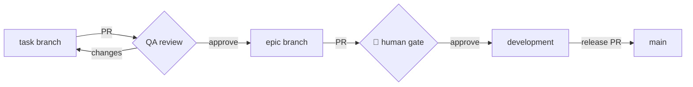

# plain-language — docs a human can actually read

Every document a human reads must pass this skill. Task specs and code
comments follow it too, except where precise legal/spec wording matters
(EARS criteria, ADR decisions — keep those exact).

## The rules

1. **Short sentences.** Target under 20 words. Hard stop at 30. One idea
   per sentence. Split anything longer.
2. **Simple words.** Say "use", not "utilize". Say "start", not
   "instantiate" (unless it is the real technical term). Define every
   acronym once, at first use.
3. **Front-load the point.** First sentence = the takeaway. Details after.
   Never make the reader hunt.
4. **Visuals over prose.** Before writing a paragraph, ask: is this really
   a table, a list, or a diagram?
   - process / flow → Mermaid `flowchart` or `sequenceDiagram`
   - comparisons / options / who-does-what → table
   - steps → numbered list
   - statuses → the standard emoji set: ✅ done · 🔄 in progress ·
     ⬜ pending · ⛔ blocked · 🧍 human gate
5. **Small paragraphs.** 1–3 sentences. White space is free.
6. **Active voice.** "QA verifies the epic", not "the epic is verified".
7. **Speak to the reader.** "You approve each checkpoint", not "the
   operator shall approve".
8. **No filler.** Delete "in order to", "it should be noted that",
   "basically", "leverage". They add nothing.
9. **DIAGRAM-FIRST.** A "flow" = anything with ORDER or BRANCHING: a
   sequence, a lifecycle, a state machine, a dependency chain, a
   gate/approval path, an architecture hop, a request round-trip, a
   build/CI pipeline, a git promotion path. How hard the rule bites
   depends on WHO reads the document:

   **9a. Hard rule — human-gate documents.** Dev plans, epic specs,
   architecture/tech plans, ADRs, READMEs, guides, checkpoints, QA
   reports. A human reads these to make a decision, and a wrong mental
   model is expensive. Every flow ships as Mermaid. Prose or a bare
   numbered list describing a flow is a DEFECT — draw it.

   **9b. Value test — task specs.** A task spec is read mostly by an
   implementer agent that needs the CONTRACT (`files:`, signatures,
   ACs, DoD) more than a picture. Draw a diagram only when at least one
   holds:
   - two or more actors/systems interact (client ↔ API ↔ DB), **or**
   - there is real branching: retry, failure, offline, conflict, void, **or**
   - it is a lifecycle/state machine, **or**
   - misreading the order would cause real rework.
   Otherwise write `N/A — no flow` and move on. A checklist of outputs,
   a linear "do A, then B" setup, or pure config/docs work does NOT need
   a diagram. **One diagram per task is the norm; two needs a reason.**
   Padding a linear task with a flowchart is itself a defect — it costs
   tokens on every re-read (implementer, reviewer, QA) and buys nothing.

   Applies to both:
   - ASCII art, arrow-strings (`A -> B -> C`), and indented text trees are
     NOT diagrams. Convert them to Mermaid.
   - Pick the right type: `sequenceDiagram` (who calls whom, over time) ·
     `flowchart` (branching/decisions) · `stateDiagram-v2` (lifecycles) ·
     `erDiagram` (data model) · `gantt` (schedule only).
   - Prose may only SUMMARIZE a diagram, never replace it. Put the diagram
     first, then at most 2 lines of caption.
   - Exception: a file/folder tree stays a fenced code block (it is a
     hierarchy, not a flow).

## Self-check before finishing any document

- [ ] Could a newcomer follow this without asking anything?
- [ ] Is every sentence under ~20 words (hard max 30)?
- [ ] Did every list of 3+ parallel facts become a table or list?
- [ ] **Human-gate doc (plan/epic/ADR/guide): does EVERY flow have a
      Mermaid diagram? (rule 9a — hard gate)**
- [ ] **Task spec: does each diagram pass the rule 9b value test — and did
      linear/checklist tasks correctly say `N/A — no flow`?**
- [ ] **Zero ASCII art / arrow-strings / text trees describing a flow?**
- [ ] Is the main point in the first two lines?

## Rewrite pass (`/plain-language <file>`)

1. Read the file. Keep ALL meaning, IDs, and traceability links intact.
2. Apply the rules above. Turn prose into tables/lists/diagrams where
   they fit. Do not change what the document promises — only how it reads.
3. **Flow sweep (rule 9).** Find every flow — grep for arrow-strings
   (`->`, `→`, `-->`), "then", "after that", "step 1/2/3", ASCII boxes.
   In a human-gate doc (9a) convert each to Mermaid; a file with a flow
   and no diagram FAILS. In a task spec (9b) convert only the flows that
   pass the value test, and DELETE diagrams that merely restate a linear
   checklist — removing dead ceremony is part of the pass.
4. Precision islands stay verbatim: EARS criteria, ADR decision lines,
   API contracts, code blocks, frontmatter.
5. Commit as `docs(<file>): plain-language pass`.

## Example

Before:
> In order to facilitate the verification process, it should be noted
> that the QA agent must be instantiated within a fresh context so as to
> prevent contamination from the builder's reasoning.

After:
> QA runs in a fresh context. It never sees the implementer's reasoning.
> This keeps the verdict honest.

### Example 2 — a flow (rule 9)

Before (a defect — prose/arrow-string flow):
> The task branch opens a PR into the epic branch, QA reviews it, and on
> approval it squash-merges; then the epic PRs into development, where the
> human approves. task -> epic -> development -> main.

After:

Caption, max 2 lines: QA gates task→epic. You gate epic→development.
