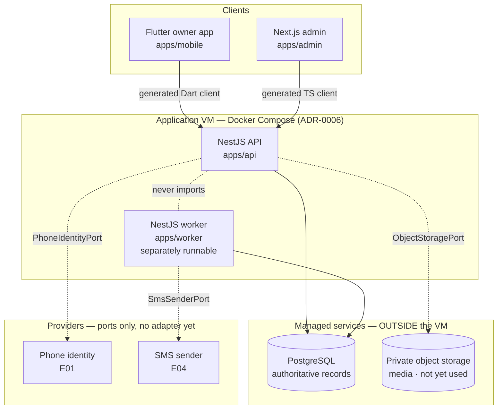
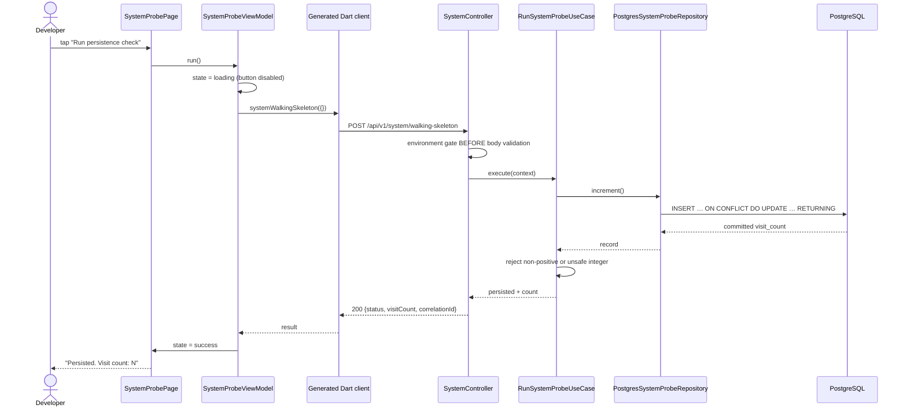
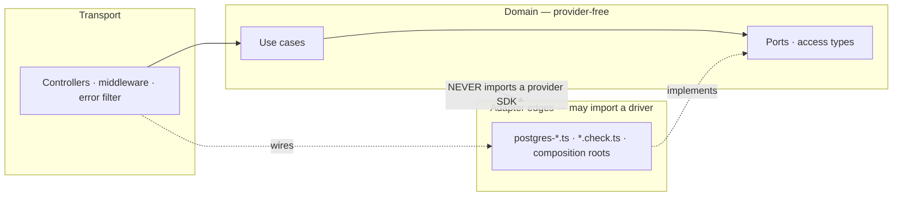

# System map

What exists after E00, and where the boundaries are.

## Runtime shape

Dotted lines are boundaries that exist as **ports** with no adapter behind them
yet. Solid lines work today.

The database sits outside the VM deliberately: the VM is an accepted shared
failure domain, and a workshop's money records must survive losing it.

## The walking skeleton, end to end

The gate runs **before** body validation on purpose: validating first would let
a caller tell a disabled route from a nonexistent one by the error it gets back.

## Layers and what may depend on what

`tests/architecture/module-boundaries.spec.ts` enforces this and keeps an
**enumerated** list of files allowed to import a driver, so the exemption cannot
spread one "just this once" at a time.

## Trust boundaries

| Boundary | Rule |
|---|---|
| Client → API | Nothing a client sends is authority. A workshop id in a request is data (NFR-SEC-01). |
| API → domain | Only server-resolved context crosses. `anonymous`/`none`/`locked` are first-class states. |
| Domain → provider | Ports only. No SDK type reaches domain code. |
| Any → logs | Redaction by substring, failing closed — including owner-PIN-protected money. |
| Production → diagnostic | Four independent guards; see `docs/security/baseline.md`. |

## What E00 does NOT contain

No authentication, workshop, customer, vehicle, job, bill, due, reminder,
inventory, admin or reporting behaviour. No product table. No provider adapter.
The only database table is a diagnostic counter, and its primary key is
constrained so it cannot quietly become anything else.
