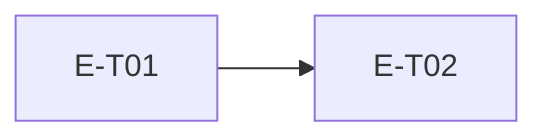

# E<NN> · <Epic title> · Progress

**Status:** todo · **Started:** — · **Completed:** — · **Progress:** 0/<N>
> Only the ORCHESTRATOR edits this file. Statuses: todo → in-progress →
> review-requested → (changes-requested →) done → verified · side: blocked, frozen.

## Tasks
- [ ] E<NN>-T01 · <title> · todo · —
- [ ] E<NN>-T02 · <title> · todo · —

## Dependency graph

## Review log
(peer + QA verdicts land here: date · task · reviewer · outcome)

## Blocked / Frozen
(none)

## Event log (append-only)
- <ts> E<NN>-T01 todo→in-progress (dispatched to developer-backend)
