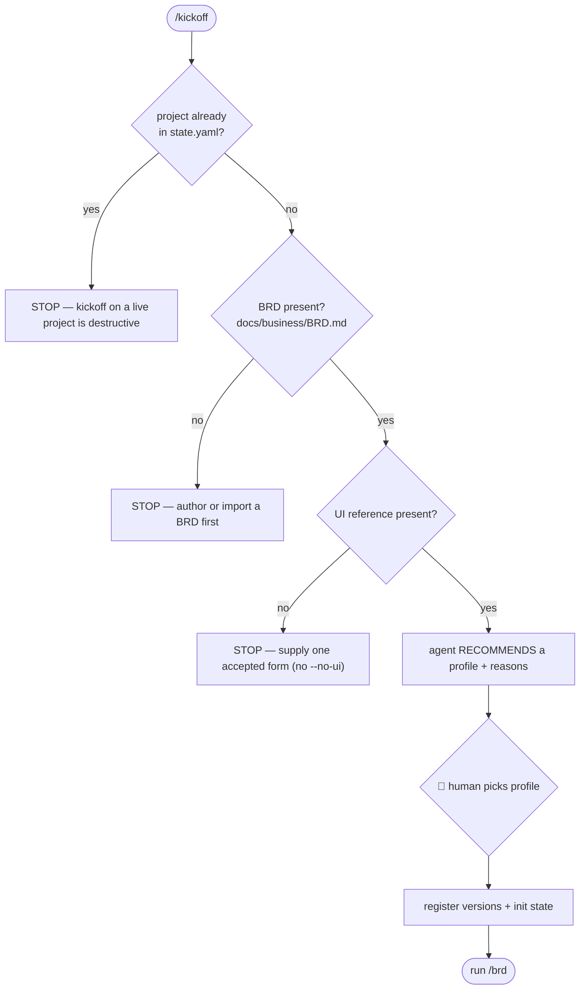

# /kickoff — start a new project

1. **Guard.** Read `memory/state.yaml`. If a project is already set, STOP and
   ask — kickoff on a live project is destructive.

2. **Prerequisites gate (hard-block · ADR-0001 D-5).** Both must exist before
   anything else; there is no `--no-ui` escape. The gate checks *existence*,
   not quality — a screenshot set is a legitimate UI reference.
   - **BRD** at `docs/business/BRD.md` (real content, not the placeholder).
   - **UI reference** — any one accepted form
     (`harness.yaml: prerequisites.ui_reference_forms`):

     | Form | How it is consumed |
     |---|---|
     | Figma file/link | MCP pull; frames named per screen; Figma is law |
     | HTML prototype | imported, tokens extracted (into `project/assets/design-imports/`) |
     | Agent-generated design | generated then human-approved, becomes canon |
     | Stitch export | imported like an HTML prototype |
     | Screenshots | lowest fidelity; tokens inferred, gaps raised as `Q-###` |

   Missing either → STOP and tell the human exactly what to supply.

3. **Recommend a profile, human picks (rule 13 · ADR-0001 D-1..D-3).** Read the
   signals — team size · regulated domain? · money/PII handling? · forecast
   scale · integration count · expected lifetime — then recommend ONE profile
   with your reasons and STOP for the human to pick. Never auto-select.

   **Decision guide** (pick the row where any strong signal fits; when torn,
   go one level lighter — escalating later is cheap, un-baking ceremony is not):

   | Profile | Pick when… | Example |
   |---|---|---|
   | `small` | throwaway / spike / demo / internal tool · 1 person · no external users · < 1 week | a proof-of-concept UI |
   | `medium` | real product · solo or 2–3 people · real users · not regulated · no high-stakes money/auth | TireBook (fuel logger) |
   | `large` | real product with several integrations or a broad surface · small team · light compliance | a SaaS wiring 3+ external APIs |
   | `extra-large` | serious money/auth/PII · staged releases · several devs in parallel · needs a `development` integration branch | a pre-enterprise payments app |
   | `enterprise` | regulated (health/finance) · external audit · multi-team · every task independently QA'd, PRs mandatory | a bank / healthcare platform |

   Each profile decides phases, human gates, review depth, git tiers, and QA
   depth (`harness.yaml: profiles`). The pick is recorded in `harness.yaml:
   profile` + `state.yaml`. Escalating up mid-project is allowed (record it
   like an ADR); a downgrade must state the verification it drops.

4. **Capture the idea.** From `$ARGUMENTS` or by asking (ONE batched round):
   working name, one-liner, target users, the problem, known constraints,
   what "success in 6 months" looks like.

5. **Initialize.**
   - Create the `project/00-business/ … 04-plan/` dirs the chosen profile's
     phases need, `project/assets/design-imports/`, and
     `project/open-questions.md` (from `templates/open-questions.md`).
   - Fill `memory/state.yaml`: project name/one-liner/started, `profile`,
     `phase: business`, business `in-progress`, the artifact versions
     (`brd: {version: N}`, `ui: {version: N, source: <form>}`), history entry
     "kickoff". Set `harness.yaml: profile` to the pick.
   - Write `project/00-business/idea.md` — the raw captured idea, verbatim-ish.

6. **Commit** (`kickoff: <project name> (<profile>)`), then run `/brd`.
