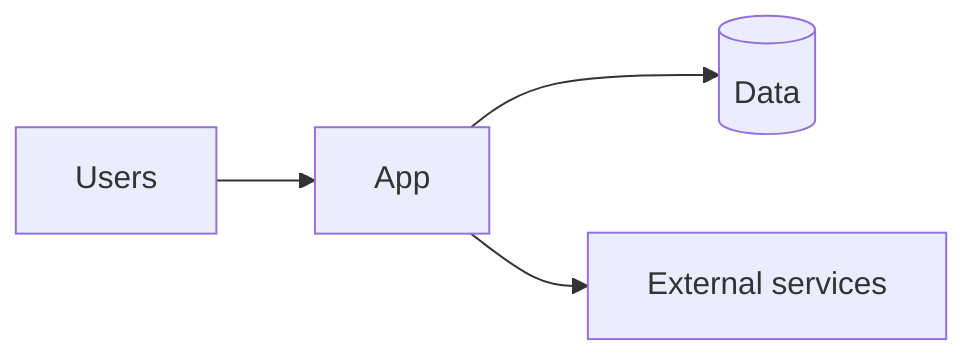

# Technical Plan — <Project Name>

- Traces from: BRD, PRD, Feature list (depth), Design (SCR-###), Forecast (`FC-###`)
- Traces to: ADRs (`ADR-###`), Dev plan
- Status: draft | decided
- Last updated: YYYY-MM-DD

RULE: every sizing/scale claim cites an `FC-###`. Every option gets honest cons — a plan
where the recommended option has no real cons is rejected.

## 1. Inputs digest
5–10 bullets: the requirements, feature depths, UI complexity, and forecast numbers that
actually drive this plan.

## 2. System context

Replace with the real context diagram.

## 3. Decision areas
Repeat this block per major decision (architecture style, language/framework, data store,
hosting, auth, API style, background jobs, …).

### 3.x <Decision area>
**Options considered**

| | Option A | Option B | Option C |
|---|---|---|---|
| Summary | | | |
| Pros | | | |
| Cons | | | |
| Cost (build/run) | | | |
| Fits forecast (FC-###) | | | |
| Team/agent friendliness | | | |
| Exit cost if wrong | | | |

**Diagram** (architecture sketch of the leading option, Mermaid)

**Recommendation:** Option _ because … (2–4 sentences, cite FC/FR/FT IDs).
**Decision:** → `ADR-###` once accepted.

## 4. Target architecture (chosen)
```mermaid
graph TD
  %% full picture of the chosen architecture
```
Component responsibilities, data flow, key sequence diagram for the most complex flow.

## 5. Cross-cutting concerns
Security, observability, error handling strategy, testing strategy, CI/CD — one short
subsection each, each ending in a concrete convention Epic 00 will encode.

## 6. Risks & mitigations
| Risk | Trigger | Mitigation | Owner |
|---|---|---|---|

## 7. Decisions index
| ADR | Decision | Status |
|---|---|---|

## Handoff
