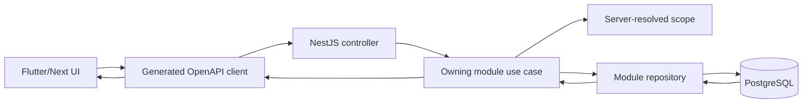
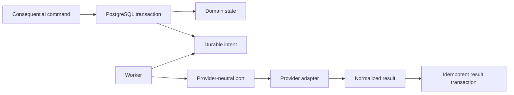
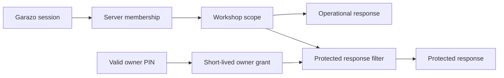

# E00 Conventions — Garazo

- Traces from: technical plan v1; ADR-0001–ADR-0009; design v1; SRS v1;
  `Q-005`; inherited lessons
- Status: binding — human `/dev-plan` approval passed 2026-07-30
- Applies to: all E00 work and every later task unless a superseding accepted
  ADR says otherwise
- Last updated: 2026-07-30

This is the extracted §3 contract for E00. A task may not silently choose
another pattern. A conflict goes to the team lead and, if foundational, back
through `/tech-plan`.

## 1. Naming

| Item | Convention | Example |
|---|---|---|
| TypeScript files | lowercase kebab-case; role suffix where useful | `request-context.middleware.ts` |
| Dart files | lowercase snake_case | `system_probe_repository.dart` |
| Directories | lowercase kebab-case in TS/infra; snake_case under Dart `lib/` | `server-core/`, `system_probe/` |
| TypeScript variables/functions | `camelCase`; verbs for functions | `resolveWorkshopScope()` |
| Dart variables/functions | `lowerCamelCase`; verbs for functions | `loadSystemProbe()` |
| Types/classes/enums | `PascalCase` | `SystemProbeResult` |
| Constants | `UPPER_SNAKE_CASE` only for true constants/env keys | `REQUEST_ID_HEADER` |
| PostgreSQL tables/columns | plural `snake_case` tables; `snake_case` columns | `system_probes.created_at` |
| REST routes | plural or resource nouns, lowercase kebab-case under `/api/v1` | `/api/v1/system/walking-skeleton` |
| JSON | `camelCase` | `correlationId` |
| Domain events | past-tense dotted names | `job.created.v1` |
| Feature flags | `area.capability` | `system.walkingSkeleton` |
| Branches | constitution flat scheme | `epic_00_task_01` |
| Commits | Conventional Commit + task ID | `chore(E00-T01): scaffold workspaces` |

IDs use only the formats in `AGENTS.md`. Do not create a product field merely
to satisfy a code preference.

## 2. Project structure

```text
apps/
  mobile/                 Flutter owner app
  admin/                  Next.js support-admin surface
  api/                    NestJS HTTP entry point
  worker/                 NestJS background-worker entry point
packages/
  server-core/            shared modular-monolith domain/application code
  api-client-typescript/  generated OpenAPI TypeScript client
  design-tokens/          generated language targets from design tokens
contracts/
  openapi/                canonical versioned REST contract and generator config
infra/
  compose/                production/development Compose definitions
  db/                     reviewed migrations and database policy
  vm/                     rebuild, hardening, deploy and recovery runbooks
scripts/                  repeatable repository commands; no secret values
tests/
  architecture/           import/module-boundary checks
  contract/               OpenAPI and generated-client drift checks
  e2e/                    cross-process/browser/device journeys
docs/
  architecture/           maps and accepted implementation guidance
  operations/             local and VM operator instructions
  security/               threat boundaries and verification evidence
```

Rules:

- Business rules live in an owning module under `packages/server-core`; never
  in controllers, React components, Flutter widgets, migration files, or
  provider adapters.
- `apps/api` and `apps/worker` are composition roots. They may import a
  module's public interface, not its private internals.
- Modules do not import each other's persistence adapters. Cross-module use
  goes through a public application port.
- Provider SDK types stop in the adapter. Domain records, OpenAPI schemas, and
  product events are provider-neutral.
- PostgreSQL stores structured authoritative records; object binaries stay in
  private object storage and are referenced by workshop-scoped metadata.
- Generated clients are never hand-edited. Change the OpenAPI contract,
  regenerate, and pass the drift check.

## 3. Code patterns

### Error handling

All API failures use one envelope:

```json
{
  "error": {
    "code": "SYSTEM.UNAVAILABLE",
    "messageKey": "errors.systemUnavailable",
    "correlationId": "opaque-request-id",
    "fieldErrors": []
  }
}
```

- `code` is stable and provider-neutral.
- `messageKey` is localized by the client; server text is not user copy.
- `correlationId` is safe to show to support.
- `fieldErrors` contains only validated field names and stable codes.
- No OTP, PIN, token, phone content, protected money, raw provider response,
  stack trace, SQL, or foreign-workshop identifier appears in the envelope.
- Consequential failures are awaited or durably recorded; never use
  fire-and-forget for money, audit, media cleanup, SMS credit, or reminders.

### Validation

- Validate every untrusted path, query, header, body, provider callback, and
  environment variable at its entry boundary before a typed database call.
- OpenAPI declares transport constraints. Runtime validation enforces the same
  constraints. Domain invariants are checked again by the owning use case.
- Unknown fields are rejected for consequential writes unless a later
  approved compatibility rule says otherwise.
- Lists must state pagination. The initial convention is opaque cursor
  pagination with `{items, nextCursor}`; a task may use no pagination only
  when the endpoint is provably non-list and says so.

### Logging and observability

- Emit structured JSON logs with ISO-8601 UTC time, level, service,
  correlation ID, operation, actor class, non-secret workshop scope,
  result code, and duration.
- Propagate the same correlation ID across HTTP, worker, audit, metric, and
  provider-attempt boundaries.
- Levels: `debug` local diagnostic, `info` normal lifecycle, `warn`
  recoverable abnormal result, `error` failed operation requiring attention.
- Never log OTPs, PINs, session tokens, customer phone content, protected
  money, raw provider payloads, or secrets.
- Operational telemetry and approved product events are separate. No event
  may implement or claim `NFR-ADOPTION-02` while D-001 is frozen.

### State management and data access

- Flutter follows view → view model → repository interface → generated API
  client. Widgets render immutable view state and contain no domain rules.
- Next.js UI calls the generated TypeScript client through a server/client
  boundary appropriate to the route; components do not construct ad-hoc API
  URLs or duplicate transport models.
- Server controllers translate HTTP to a use-case command/query, then map the
  result back to the OpenAPI contract.
- Repositories are owned by modules and parameterized with the server-resolved
  request scope. A client-provided workshop ID is never authorization.
- Financial, audit, idempotency, and durable-intent writes use one explicit
  PostgreSQL transaction boundary where the accepted domain model requires
  agreement.

Do:

```text
controller -> owning use case -> repository/port -> transaction -> result
```

Do not:

```text
controller -> raw SQL + provider SDK + response formatting
```

### Dependency injection and module boundaries

- Constructor injection is the default.
- Each module exports a narrow application interface and owns its adapters.
- Composition roots bind ports to adapters. Domain code does not access
  process environment or a global service locator.
- An architecture test rejects forbidden cross-module/private imports.
- Cyclic module dependencies are a spec defect; do not hide them with a
  forward-reference workaround.

### Enum pattern

- Transport and persisted enums use explicit lowercase string values; never
  ordinal numbers.
- An enum lists only approved states. Do not add cancellation, refund,
  write-off, opt-out, conflict, or other unapproved states.
- Unknown provider values are normalized at the adapter boundary to an
  approved stable outcome or a safe failure.
- Database constraints and OpenAPI schemas must agree with the domain enum.

## 4. Blessed design patterns

| Problem | Required pattern |
|---|---|
| Domain ownership | Modular monolith with public module ports |
| External services | Ports and replaceable adapters in the owning module |
| Consequential background work | Durable intent in the same PostgreSQL transaction, replay-safe worker handler |
| Retried writes | Idempotency identity + unique constraint + transactional result |
| UI state | Immutable state + view model/repository |
| Cross-client models | OpenAPI source + generated Dart/TypeScript clients |
| Read authorization | Server-resolved workshop/admin scope before repository access |
| Protected money | Separate short-lived owner-money grant plus response filtering |

Banned without a superseding ADR:

- microservices, function-per-capability backend, direct SDK calls in use
  cases, provider types in domain/API contracts, client-authorized tenant
  scope, mutable balance as source of truth, generated-code edits, application
  startup migrations, swallowed consequential errors, and feature code in E00.

## 5. UI patterns

- Flutter feature anatomy:
  `features/<feature>/{presentation,application,data}/`; widgets render tokens
  and view state, view models coordinate repositories, repositories call the
  generated client.
- Next.js feature anatomy:
  `app/<route>/page.tsx` plus colocated components; server-side fetching is
  preferred for admin reads unless interaction requires client state.
- Consume generated `packages/design-tokens`; never inline hex values, magic
  spacing, or copied prototype CSS.
- Owner screens remain Android-first at the approved 412×892 work frame;
  support admin may use the approved responsive admin shell.
- Every product frontend task references an exact `SCR-###` and implements
  loading, error, empty, and data states. The E00 diagnostic page is
  development-only, feature-flagged, and not a new product screen.
- Protected values must be absent from API response, cache, widget tree,
  accessibility tree, logs, and error state while locked; visual masking alone
  is not authorization.
- Bangla and English strings use localized keys. Language changes
  presentation only, never stored business data.

## 6. Route and navigation map

E00 creates only shells and one development-only diagnostic route. Product
routes remain owned by their mapped epics and exact screen contracts.

| Surface | Route group | Canonical screens | Owning epic |
|---|---|---|---|
| Owner access | `/access` | SCR-001 | E01 |
| Owner shell/home/jobs/customers | `/home`, `/jobs`, `/customers` | SCR-002–SCR-005, SCR-007–SCR-008, SCR-013 | E02 |
| Owner billing/money/share | `/bills`, `/dues`, `/money` | SCR-005–SCR-006, SCR-009–SCR-010 | E03 |
| Owner plan/reminders/settings | `/settings`, `/pro`, `/reminders` | SCR-009, SCR-011–SCR-012 | E04 |
| Support admin | `/admin` | SCR-014 | E05 |
| Development diagnostic | `/dev/walking-skeleton` | N/A — not a product screen | E00 only; disabled by default |

## 7. Feature-level data-flow patterns







## 8. Test patterns

- TypeScript unit tests: colocated `*.spec.ts`; integration tests under
  `tests/integration`; cross-process tests under `tests/e2e`.
- Flutter unit/widget tests mirror `lib/` under `test/`; device journeys live
  under `integration_test/`.
- Name behavior tests with trace IDs, for example
  `test_FR_ACCESS_05_rejects_foreign_workshop`.
- Use Arrange/Act/Assert with explicit fixtures. Fixtures contain no real PII
  or secrets and make workshop scope visible.
- Unit tests cover state/calculation; integration tests cover PostgreSQL
  transactions, constraints, tenant isolation, audit, queue claims, and
  adapter mapping; browser/device tests cover actual session, lifecycle,
  accessibility, and protected-value behavior.
- Race tests are mandatory for money, credit, single-use OTP, PIN cooldown,
  admin mutation, job transitions, and idempotency. A sequential suite is not
  proof.
- Minimum E00 floors: 100% of the walking-skeleton functions exercised,
  architecture/contract checks green, and one real test at UI, API,
  PostgreSQL integration, container health, and end-to-end layers. Global
  percentage targets start after baseline measurement; do not game coverage.

## 9. Toolchain contract

- Flutter stable 3.44.x / Dart 3.12.x, pinned in repository tooling. The
  official Flutter documentation reflected Flutter 3.44.7 on
  2026-07-30:
  <https://docs.flutter.dev/install/archive?tab=android>.
- Node.js 24 LTS, pinned to an exact patch when E00-T01 begins. Node's official
  release table identifies v24 as LTS:
  <https://nodejs.org/en/about/previous-releases>.
- NestJS 11 and Next.js 16 are the accepted-stack current major baselines;
  exact dependency patches are lockfile-controlled after human dependency
  approval. Official references:
  <https://docs.nestjs.com/migration-guide> and
  <https://nextjs.org/docs/app/guides/upgrading>.
- One pinned pnpm release manages TypeScript workspaces. Flutter uses the
  pinned SDK's `flutter pub`.
- Dockerfiles use multi-stage builds and non-root runtime users. Production
  Compose contains admin, API, and worker; PostgreSQL and object storage are
  external managed boundaries.

Commands created by E00:

```text
make install    # dependency install after approval
make dev        # documented local development
make test       # all applicable tests
make lint       # formatting + static analysis
make build      # immutable deployable artifacts
make up         # Compose application stack
make down       # stop local stack without deleting data
make contract   # validate OpenAPI + generated-client drift
make verify     # lint + tests + build + contract + Compose smoke
```

## 10. Security and configuration baseline

- Required config is schema-validated at process start. Any new required key
  updates `.env.example`, Compose, CI, tests, and operator docs in the same
  task.
- `.env.example` contains names and safe placeholders only. No credential,
  private key, token, PIN, OTP, customer data, or production endpoint is
  committed.
- Firebase, SMS, object storage, and future TireBook configuration bind only
  in adapters. E00 uses fakes/test doubles; it does not enable production
  suppliers.
- Authentication, migration, schema, secrets, and production configuration
  changes pause at their human gates.
- Liveness is process-only. Readiness may test required dependencies but
  reveals no secret/config value.

## Handoff

- Quote this file or link it from every E00 task.
- Any accepted change must ripple to E00 specs and traceability in the same
  approved commit.
- After E00 passes QA and the human exit gate, update the AGENTS.md project
  convention summaries under the separate protected-harness approval.
