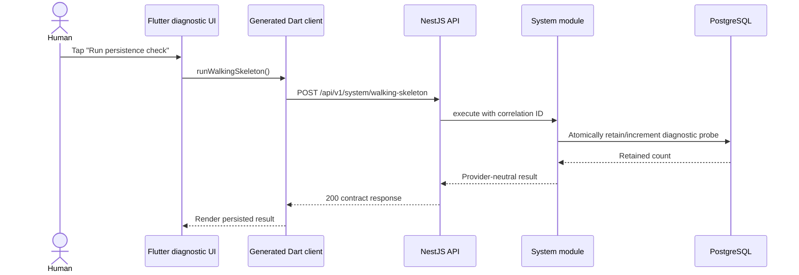
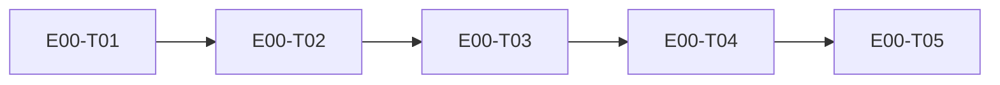

# E00 — Genesis and Walking Skeleton

- Traces from: technical plan v1, ADR-0001–ADR-0009, design system v1,
  SRS v1, traceability matrix
- Status: specced — human `/dev-plan` approval passed 2026-07-30
- Runnable flow when done: from a clean clone, a human starts the
  containerized application stack, opens a development-only diagnostic UI,
  sends one request through the generated client and NestJS API to
  PostgreSQL, sees the retained result return in the UI, and runs the same
  checks green in CI.

E00 makes later epics identical in shape. It creates no product feature,
production secret, live provider integration, or unapproved product field.
The walking skeleton is an isolated diagnostic, disabled by default, and must
be removed or remain unavailable in production.

## 1. Project structure

```text
apps/
  mobile/                 Flutter owner-app shell and diagnostic page
  admin/                  Next.js admin shell
  api/                    NestJS HTTP composition root
  worker/                 NestJS worker composition root
packages/
  server-core/            modular domain/application interfaces
  api-client-typescript/  generated TypeScript client
  design-tokens/          generated token targets
contracts/openapi/        canonical v1 OpenAPI contract and generator config
infra/
  compose/                production/development Compose files
  db/                     reviewed SQL migrations/policy
  vm/                     hardening/rebuild/deploy/recovery runbooks
scripts/                  repeatable repository automation
tests/
  architecture/           module-boundary tests
  contract/               contract/client drift tests
  e2e/                    real cross-layer flow
docs/
  architecture/           maps and ADR-consequence evidence
  operations/             local/VM operator guidance
  security/               baseline and threat-boundary evidence
```

Code placement, allowed imports, and provider/data boundaries are binding in
`conventions.md`. No business logic belongs in route handlers or UI widgets.

## 2. Toolchain

| Area | E00 baseline | Source / rule |
|---|---|---|
| Mobile | Flutter stable 3.44.x / Dart 3.12.x, exact patch pinned by T01 | [Flutter SDK archive](https://docs.flutter.dev/install/archive?tab=android) |
| TypeScript runtime | Node.js 24 LTS, exact patch pinned by T01 | [Node release table](https://nodejs.org/en/about/previous-releases) |
| API/worker | NestJS 11 | [NestJS migration guide](https://docs.nestjs.com/migration-guide) |
| Admin | Next.js 16 | [Next.js upgrade guides](https://nextjs.org/docs/app/guides/upgrading) |
| TypeScript workspace | Pinned pnpm release and lockfile | Dependency set requires human approval before install |
| Data | Managed PostgreSQL in production; development/test compatibility service only | ADR-0005 |
| Runtime | Per-service Dockerfiles and Docker Compose for admin/API/worker on one hardened VM | ADR-0006; [Docker Compose production](https://docs.docker.com/compose/how-tos/production/) |
| API contract | Versioned REST/JSON OpenAPI with generated Dart/TypeScript clients | ADR-0008; [OpenAPI Specification](https://spec.openapis.org/oas/latest.html) |

E00 adds exact `install`, `dev`, `test`, `lint`, `build`, `up`, `down`,
`contract`, and `verify` targets to the existing Makefile. Dependency
installation waits for the human new-dependency gate. Migrations wait for the
human migration gate. No migration runs at application startup.

## 3. Conventions (the identical-everywhere contract)

The full required section is extracted to
`workspace/epics/E00-genesis/conventions.md` and is incorporated here by
reference without omission. It defines:

- file, directory, symbol, database, route, event, branch, and commit naming;
- the one error envelope, boundary/domain validation, structured/redacted
  logging, immutable UI state, repository/data-access, DI, and enum patterns;
- modular-monolith, ports/adapters, durable intent, idempotency, scope, and
  generated-contract patterns plus explicit bans;
- Flutter/Next component anatomy, token-only styling, localization,
  accessibility, protected-value absence, and screen references;
- test location/naming/fixtures, race-test rules, and E00 layer evidence;
- route/navigation ownership and feature-level data-flow diagrams.

No task may substitute a pattern without an approved spec revision or
superseding ADR.

## 4. Walking skeleton

The thin slice is a development-only persistence probe:



Contract boundaries:

- Route exists only when `system.walkingSkeleton` is enabled in a
  non-production environment; disabled returns the standard 404 error
  envelope.
- The empty request creates no product record or customer/workshop data.
- Response is `{status: "persisted", visitCount: integer >= 1,
  correlationId: string}`.
- Database failure returns 503 with `SYSTEM.DATABASE_UNAVAILABLE`, stores no
  false success, and shows no configuration detail.
- Repeated taps increment only the diagnostic counter. This is not a financial
  idempotency claim and does not trace to a product workflow.
- One real test exists at Flutter view-model/widget, generated contract, API,
  PostgreSQL integration, Compose health, and end-to-end layers.

The diagnostic route is not `SCR-###`, not an MVP feature, and may never be
presented as product behavior.

## 5. Accepted ADR consequence map

| ADR | Consequence executed in E00 | Later mapping / N/A |
|---|---|---|
| ADR-0001 | T01 scaffolds Flutter, Next.js, NestJS API/worker and both language toolchains; T04 exercises Flutter-to-Nest | Camera/media/share/offline plugin choices belong to their feature tasks |
| ADR-0002 | T01 creates public module boundaries and separate API/worker composition roots; T02 adds architecture checks | Extraction is N/A until measured pressure and a new ADR |
| ADR-0003 | Five S/M vertical tasks, WIP 3, peer/QA/checkpoint gates | Applied by tracker/orchestrator; no runtime code |
| ADR-0004 | T01/T02 define owning-module ports and provider-neutral contracts; T03 configures adapter-only boundaries | Firebase/SMS/object-storage live adapters are later human-gated E01/E04 work; TireBook is E14 |
| ADR-0005 | T03 keeps PostgreSQL/object storage outside production Compose; T04 proves PostgreSQL via a diagnostic migration | Product schema, ORM/query layer, provider, retention, backup targets remain later approved contracts |
| ADR-0006 | T03 creates Dockerfiles, production Compose, health checks, non-root images, off-host telemetry contract, and VM runbooks; T05 rehearses rebuild/rollback | Supplier, region, TLS/ingress, secrets, RPO/RTO, sizing, and production configuration require later human approval |
| ADR-0007 | T02 establishes separate identity/session/scope/owner-grant interfaces and redaction rules; no auth bypass in the diagnostic | Firebase integration and Bangladesh pilot are E01; PIN behavior is E03; admin auth is E05 |
| ADR-0008 | T02 creates canonical OpenAPI v1, standard error envelope, generated-client pipeline, and drift tests | Product endpoints are introduced only by approved feature task contracts |
| ADR-0009 | T01 creates a separately runnable worker boundary and durable-job port; T03 containerizes it | Concrete queue dependency/payload/retries/schedule/retention require the later E04 human dependency/task contract |

## 6. Security, configuration, and observability baseline

- Server-resolved workshop/admin scope, main session, and owner-money grant are
  separate concepts even though E00 does not implement feature authentication.
- No secret or production endpoint is committed. `.env.example` contains safe
  placeholders and every required-key change updates all launchers and CI.
- Logs are structured, correlated, off-host compatible, and redact OTP, PIN,
  token, phone, raw provider payload, protected money, and secrets.
- Liveness proves process state; readiness proves required dependency state
  without leaking details.
- CI runs format/static analysis, unit/integration/E2E, architecture and
  contract drift, secret scan, dependency audit, Flutter/TypeScript builds,
  and Compose smoke.
- PostgreSQL migrations are explicit, reversible where possible, reviewed,
  and human-approved; never application startup magic.
- The production VM contract includes non-root containers, least-exposed
  ports, firewall/access-hardening checklist, immutable images, rollback,
  off-host backups/config material, and tested rebuild instructions. It does
  not choose a supplier or write production configuration.

## 7. Tasks

| ID | Task | Spec file | Depends on | Size | Status |
|---|---|---|---|---|---|
| E00-T01 | Scaffold repository and module boundaries | `tasks/E00-T01-repo-scaffold.md` | — | M | todo |
| E00-T02 | Establish OpenAPI and generated clients | `tasks/E00-T02-api-contract.md` | E00-T01 | M | todo |
| E00-T03 | Containerize runtime and CI baseline | `tasks/E00-T03-runtime-baseline.md` | E00-T02 | M | todo |
| E00-T04 | Implement the persistence walking skeleton | `tasks/E00-T04-walking-skeleton.md` | E00-T03 | M | todo |
| E00-T05 | Prove integration and recovery gate | `tasks/E00-T05-integration-gate.md` | E00-T04 | M | todo |



## 8. Analyze report

Formal `/analyze E00` completed on 2026-07-30 after an independent,
fresh-context team-lead review. Three initial defects were corrected: the
diagnostic body is now exactly `{}`, dependency-lock writers are serialized
with explicit lockfile ownership, and MoSCoW was regraded to 60% Must.

| Check | Result | Evidence |
|---|---|---|
| Task ↔ EARS trace | PASS | T01–T05 each own criteria and cover EARS-E00-1–EARS-E00-14 exactly once |
| Contract sanity | PASS | T02 alone defines the routes; T04 implements them unchanged; `{}` is required; every list check is explicitly N/A; error envelope and camelCase casing are uniform |
| Collision matrix | PASS | E00 is a serial T01 → T02 → T03 → T04 → T05 DAG; `pnpm-lock.yaml`/`pubspec.lock` ownership is explicit and ordered |
| Scope fences | PASS | Every task contains filled DOES and does-NOT sections; no task authorizes feature code, live providers, secrets, or production configuration |
| MoSCoW inflation | PASS | T01, T02, T04 are Must; T03 and T05 are Should; 3/5 = 60% |
| Estimates and routing | PASS | Five M tasks, no L task; T01–T04 use `build`, T05 uses `deep` |
| Human gates | PASS, dispatch condition retained | Exact dependencies, diagnostic migration, auth/security work, secrets/environment, and production configuration remain gated |
| Frozen requirement | PASS | Q-006/D-001/NFR-ADOPTION-02 remains excluded |

**Analyze verdict:** specification consistency PASS. Dispatch remains locked
until the human approves this report and the exact dependency/version/license
baseline required by E00-T01.

## 9. Open questions

| ID | Question | Blocks | Status |
|---|---|---|---|
| N/A | No unresolved foundational choice. Exact dependency patches and additions for T01/T02/T04 still require the explicit human dependency gate before install. | E00 build start | gate, not a spec gap |
| Q-006 | Definition of qualifying support remains deferred under D-001. | NFR-ADOPTION-02 only | frozen; excluded from E00 |

## 10. Epic Definition of Done

- [x] Human approves the dev plan and E00 specification.
- [x] Human approves the protected E00 repository write-scope bootstrap.
- [ ] Human approves the exact dependency/version/license baseline.
- [ ] All five tasks pass peer review by a different model.
- [ ] High-risk migration/security work receives task-level QA.
- [ ] `make verify` is green from a clean clone.
- [ ] Production Compose validates and boots admin/API/worker with external
      managed-service boundaries; no database/object store is placed on the
      production application VM.
- [ ] The human sees the diagnostic UI → API → PostgreSQL → UI response.
- [ ] CI proves lint, tests, builds, architecture, contract drift, secret
      scan, dependency audit, and Compose smoke.
- [ ] VM rebuild, rollback, and off-host recovery material are reviewed and a
      non-production rehearsal is recorded.
- [ ] Every ADR consequence is implemented or explicitly mapped in §5.
- [ ] No feature code, production secret/configuration, unapproved provider,
      or NFR-ADOPTION-02 instrumentation is present.
- [ ] Independent `/qa E00` approves, then the human E00 exit gate verifies.
- [ ] Only after the exit gate, the protected AGENTS.md conventions summary is
      updated with separately recorded human approval.

## Handoff

- Team-lead specification approved; do not dispatch before formal
  `/analyze E00` approval and the exact dependency gate.
- Start E00-T01 on `epic_00_task_01`; T02 → T03 → T04 → T05 remain serial
  because the middle tasks update the dependency lock in order.
- New dependencies, the diagnostic migration, any auth/security code,
  secrets/environment changes, and production configuration retain their
  separate human gates.
- Feature epics remain unsharded until E00 passes QA and the human has seen
  the walking skeleton respond.
