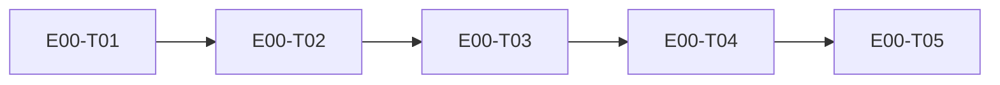

# E00 · Genesis and Walking Skeleton · Progress

**Status:** in-progress · **Started:** 2026-08-05 · **Completed:** — · **Progress:** 0/5
> Only the ORCHESTRATOR edits this file. Statuses: todo → in-progress →
> review-requested → (changes-requested →) done → verified · side: blocked,
> frozen.

## Tasks

- [ ] E00-T01 · Scaffold repository and module boundaries · in-progress · developer-backend
- [ ] E00-T02 · Establish OpenAPI and generated clients · todo · —
- [ ] E00-T03 · Containerize runtime and CI baseline · todo · —
- [ ] E00-T04 · Implement the persistence walking skeleton · todo · —
- [ ] E00-T05 · Prove integration and recovery gate · todo · —

## Dependency graph

## Parallel lanes

- E00 runs T01 → T02 → T03 → T04 → T05 serially. T02, T03, and T04 each
  update the shared dependency lock in sequence, so no lockfile merge or
  dependency provenance can be lost.
- T04 is the only writer to walking-skeleton implementation files.
- T05 is the final integration/verification task.

## Review log

(peer + QA verdicts land here: date · task · reviewer · outcome)

## Blocked / Frozen

- Q-006 / D-001 freezes NFR-ADOPTION-02 only; no E00 task implements it.
- Human gates are prerequisites, not active blockers until their task reaches
  the gated action: dependencies (T01/T02), migration (T04),
  auth/security/production configuration (if scope changes).

## Event log (append-only)

- 2026-07-30 E00 task set drafted by team-lead; awaiting dev-plan approval.
- 2026-07-30 Project owner approved the dev plan, E00 specification, lean
  routing, and protected repository write-scope bootstrap; formal `/analyze`
  and dependency gates remain.
- 2026-07-30 Fresh-context `/analyze E00` found and corrected the request-body
  mismatch, lockfile collision, and MoSCoW inflation; all consistency checks
  now pass and await the human analyze gate.
