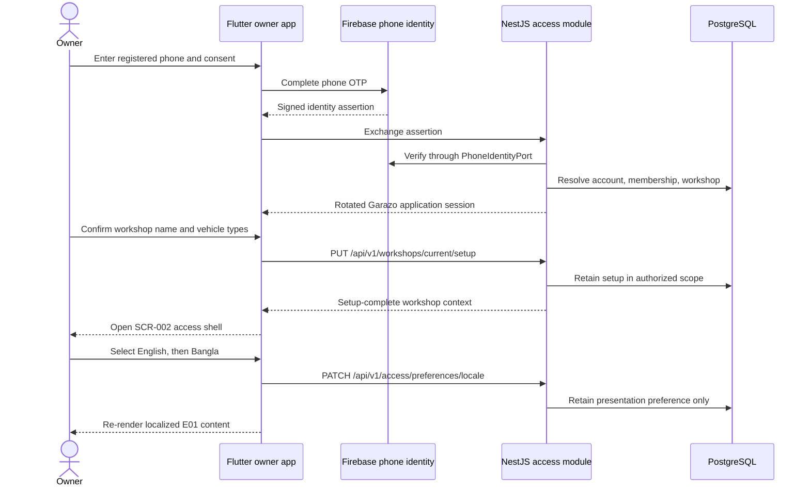
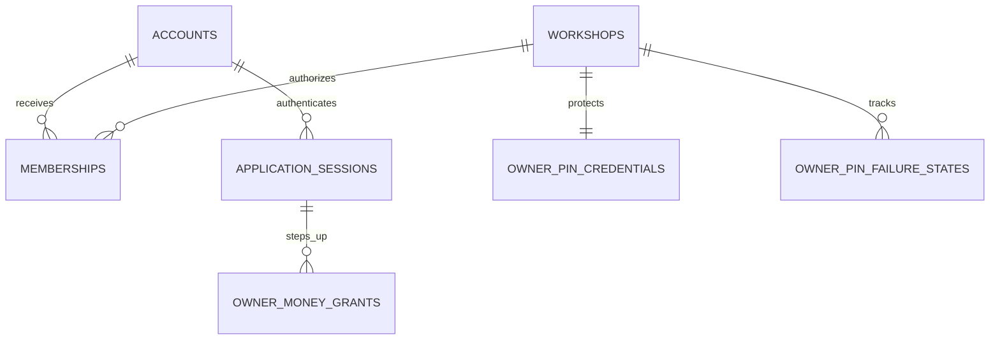
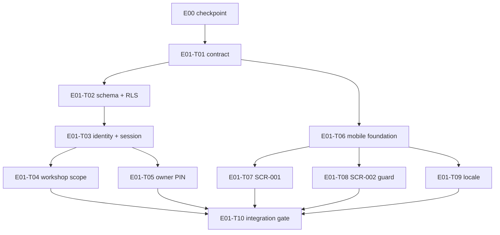

# E01 · Secure Workshop Access

- Traces from: SRS v1 (`FR-ACCESS-01`–`FR-ACCESS-15`, `NFR-SEC-01`–`NFR-SEC-03`,
  `NFR-I18N-01`–`NFR-I18N-03`, `NFR-A11Y-01`), feature list v1
  (`FT-001`, `FT-002`, `FT-017`, and the access lifecycle needed by `FT-010`),
  design v1 (`SCR-001`, access boundary of `SCR-002`, language control of
  `SCR-011`), technical plan v1, `ADR-0001`, `ADR-0002`, `ADR-0004`,
  `ADR-0005`, `ADR-0007`, `ADR-0008`, `Q-005`, and
  `workspace/epics/E00-genesis/conventions.md`
- Traces to: `tasks/E01-T01` … `tasks/E01-T10`
- Status: specced — awaiting `/analyze E01` and the human dispatch gate
- Last updated: 2026-08-05

## Business goal

Give a Bangladesh workshop a trustworthy front door. An owner proves control
of the registered phone, creates the workshop once, receives a Garazo-owned
session restricted to that workshop, and can use Bangla or English without
changing business data. The separate owner-PIN grant is established here so
later protected routes can fail closed and E02 batch entry is not left behind
an unusable authorization boundary.

## User-visible outcome

After E01 an owner can:

1. complete Firebase phone verification through the approved consent flow;
2. create the initial workshop with a name and at least one approved vehicle
   type, then open its operational home;
3. close and reopen the app and enter only the workshop resolved by the server;
4. set and verify a four-digit owner PIN, recover it through a valid OTP sent
   to the registered phone, and observe the fixed relock/cooldown rules; and
5. switch all released E01 presentation between Bangla and English without
   changing any stored business value.

Failed phone authentication, missing membership, expired session, wrong PIN,
active PIN cooldown, and invalid/expired recovery OTP reveal no workshop or
protected value.

## Runnable flow when done

> Verify the owner phone, set up the workshop, enter only the authorized
> workshop, and switch Bangla/English presentation.

## Dependencies this epic consumes (does NOT re-implement)

| From | What E01 consumes | Enforced by |
|---|---|---|
| E00 | Flutter, NestJS API and separate worker, pnpm workspace, generated design tokens, OpenAPI generation, generated clients, common errors/request context, CI/Compose | `E00-T01`–`E00-T05` |
| E00 | Provider ports under `packages/server-core/src/ports/`, including `PhoneIdentityPort`; separate `WorkshopScope` and `OwnerMoneyGrant` types | `E00-T01`, `E00-T02` |
| Design v1 | Android-first 412×892 shell, Bangla-first copy, approved tokens, loading/error/empty/data behavior | `SCR-001`, `SCR-002`, `SCR-011` |
| ADR-0007 | Firebase proves phone possession only; Garazo owns authorization, application session, and separate owner-PIN grant | `E01-T01`–`E01-T10` |

E01 extends the E00 scaffold. It does not recreate any app, workspace,
provider port, client generator, design-token package, runtime, or worker.

## Scope

**In scope**

- Firebase phone-identity assertion verification behind `PhoneIdentityPort`,
  with a deterministic local/fake adapter for tests and local runs and the real
  Firebase adapter behind the same port. No real credential is required.
- Garazo-owned accounts, memberships, application sessions, server-resolved
  workshop scope, session rotation/revocation, generic pre-session failures,
  and zero client-authorized tenant selection.
- Initial workshop setup using the approved `SCR-001` fields: required name
  and one or more approved vehicle-type selections; BD region profile and
  default Bangla locale are assigned by the access domain, not unrelated data.
- Owner-PIN credential, verification, short-lived grant, immediate relock,
  inactivity relock, progressive cooldown, and registered-phone OTP recovery.
- `SCR-001`, the access-only entry state of `SCR-002`, and the language control
  of `SCR-011`, with complete Bangla/English E01 strings and accessible states.
- PostgreSQL access schema, application authorization, row-level-security
  defense in depth, race tests, real-device lifecycle tests, and cross-workshop
  negative tests.
- Firebase Bangladesh delivery/privacy/consent/abuse/cost pilot evidence as a
  production gate; local completion uses fake/test identities only.

**Out of scope**

| Excluded from E01 | Why | Owner |
|---|---|---|
| Jobs, customers, vehicles, job dashboard data, or operational aggregates | E01 proves access only | E02 |
| Bills, payments, dues, money summaries, protected money payloads | No money record exists yet | E03 |
| Rendering SCR-010 or any protected money screen | E01 issues/invalidates the grant; E03 consumes it | E03 |
| Plans, SMS credits, reminders, full Settings screen | Only the language control is in E01 | E04 |
| Support-admin authentication or authorization | Separate actor and surface | E05 |
| Offline cache, sync, device reconciliation | First-paying-cohort scope | E06 |
| Firebase project creation, real credential, production enablement, or a first-party OTP fallback | ADR-0007 production gates and new-ADR rule | Human gate / new ADR |
| Auth0, direct Firebase types in domain/API contracts, client-selected workshop authorization | Rejected by ADR-0004/ADR-0007 | Not approved |
| NFR-ADOPTION-02 instrumentation | Frozen by Q-006/D-001 | Approved SRS amendment only |

## Data-model changes

One human-gated, reversible access migration is owned by `E01-T02`.

| Migration | Tables | Task | Gate |
|---|---|---|---|
| `0002_access_workshop` | `accounts`, `workshops`, `workshop_vehicle_types`, `memberships`, `application_sessions`, `owner_pin_credentials`, `owner_pin_failure_states`, `owner_money_grants` | E01-T02 | 🧑 explicit human migration approval before execution |

Session and PIN secrets are stored only as approved one-way digests/verifiers.
Raw Firebase assertions, OTPs, PINs, session tokens, and owner-grant tokens are
never retained or logged.

## API surface

All routes use `/api/v1`, camelCase JSON, E00's one error envelope, generated
clients, and server-side authorization. No list endpoint exists, so pagination
is N/A throughout.

| Method | Path | Owner task | Purpose |
|---|---|---|---|
| POST | `/api/v1/access/sessions` | T01 contract → T03 implementation | Exchange an identity assertion for a rotated Garazo session |
| GET | `/api/v1/access/session` | T01 → T03 | Restore the current authorized context |
| DELETE | `/api/v1/access/session` | T01 → T03 | Revoke the current application session |
| GET | `/api/v1/workshops/current` | T01 → T04 | Read only the server-resolved workshop/setup context |
| PUT | `/api/v1/workshops/current/setup` | T01 → T04 | Confirm initial workshop setup once |
| PATCH | `/api/v1/access/preferences/locale` | T01 → T04 | Persist `bn` or `en` presentation preference |
| PUT | `/api/v1/access/owner-pin` | T01 → T05 | Establish an initial PIN or replace it with valid recovery proof |
| POST | `/api/v1/access/owner-pin/verifications` | T01 → T05 | Verify PIN and issue the separate owner-money grant |
| DELETE | `/api/v1/access/owner-pin/grant` | T01 → T05 | Explicitly revoke the current owner-money grant |
| POST | `/api/v1/access/owner-pin/recoveries` | T01 → T05 | Verify registered-phone assertion and atomically set a new PIN |

Exact request/response schemas, validation, error codes, idempotency, and
authorization rules live in `E01-T01`. No implementation task may alter them.

## UI screens

The HTML prototype is the visual law. E01 implements only the access portions
needed by its requirements; later epics extend the operational surfaces.

| Screen | Route | Design source | Task |
|---|---|---|---|
| SCR-001 Onboarding and phone access | `/access` | `screens/SCR-001-onboarding.md`, `prototype/SCR-001-onboarding.html` | E01-T07 |
| SCR-002 Workshop dashboard access shell | `/home` | `screens/SCR-002-dashboard.md`, `prototype/SCR-002-dashboard.html` | E01-T08 |
| SCR-011 Settings, language control only | `/settings/language` | `screens/SCR-011-settings.md`, `prototype/SCR-011-settings.html` | E01-T09 |
| Access/session navigation foundation | all above | `design-system.md`, `tokens.json` | E01-T06 |

The E01 SCR-002 shell shows the authorized workshop identity and honest empty
operational state; it must not invent job, money, due, SMS, plan, or reminder
data. E02–E04 replace those empty sections with their approved features.

## Acceptance criteria (epic-level, EARS)

SRS-owned criteria (verbatim):

- **EARS-ACCESS-1** — WHEN a first-time owner confirms all required setup values, the system SHALL retain the workshop context. (`FR-ACCESS-01`)
- **EARS-ACCESS-2** — WHEN initial setup is saved, the system SHALL open `SCR-002`. (`FR-ACCESS-02`)
- **EARS-ACCESS-3** — WHEN a registered owner completes valid phone authentication, the system SHALL create an authenticated workshop session. (`FR-ACCESS-03`)
- **EARS-ACCESS-4** — IF phone authentication fails, THEN the system SHALL show no workshop record. (`FR-ACCESS-04`)
- **EARS-ACCESS-5** — WHILE a user is authenticated for one workshop, the system SHALL return only records authorized for that workshop. (`FR-ACCESS-05`)
- **EARS-ACCESS-6** — WHEN the owner selects Bangla or English, the system SHALL apply that language to supported interface content. (`FR-ACCESS-06`)
- **EARS-ACCESS-7** — WHEN the owner selects explicit lock, the system SHALL end protected owner-money authorization immediately. (`FR-ACCESS-07`)
- **EARS-ACCESS-8** — WHEN the user leaves a protected route, the system SHALL end protected owner-money authorization immediately. (`FR-ACCESS-08`)
- **EARS-ACCESS-9** — WHEN the app enters the background, the system SHALL end protected owner-money authorization immediately. (`FR-ACCESS-09`)
- **EARS-ACCESS-10** — WHEN protected-area inactivity reaches 5 continuous minutes, the system SHALL end protected owner-money authorization. (`FR-ACCESS-10`)
- **EARS-ACCESS-11** — WHEN five consecutive invalid PIN entries complete a failure cycle, the system SHALL block PIN verification for 60 seconds after the first cycle, 120 seconds after the second cycle, and 240 seconds after the third or any later cycle. (`FR-ACCESS-11`)
- **EARS-ACCESS-12** — WHILE an owner-PIN cooldown is active, the system SHALL reject every new PIN-verification attempt. (`FR-ACCESS-12`)
- **EARS-ACCESS-13** — WHEN the owner completes valid OTP verification on the registered owner phone, the system SHALL allow the owner to set a new PIN. (`FR-ACCESS-13`)
- **EARS-ACCESS-14** — IF a recovery OTP is invalid or expired, THEN the system SHALL keep the existing owner PIN unchanged. (`FR-ACCESS-14`)
- **EARS-ACCESS-15** — WHEN PIN verification succeeds or OTP recovery completes, the system SHALL reset the next failure-cycle cooldown to 60 seconds. (`FR-ACCESS-15`)

E01-specific criteria that make accepted ADR/NFR consequences executable:

- **EARS-E01-1** — WHEN any pre-session identity exchange fails, the API SHALL return the same generic `AUTH.INVALID_CREDENTIALS` shape and SHALL reveal no account/workshop existence. (`ADR-0007`, `L-auth-003`)
- **EARS-E01-2** — WHEN a valid Firebase assertion is exchanged, the system SHALL verify it through `PhoneIdentityPort`, rotate the Garazo application session, and SHALL never treat Firebase identity as workshop authorization. (`ADR-0004`, `ADR-0007`, `L-auth-001`)
- **EARS-E01-3** — WHILE no real Firebase credential is configured in a local/test run, the system SHALL use the explicit local/fake port adapter and SHALL make no external provider call. (`ADR-0004`)
- **EARS-E01-4** — WHEN two workshops are used in the isolation suite, every access query SHALL return zero record from the other workshop at both application and PostgreSQL policy layers. (`NFR-SEC-01`, `ADR-0005`)
- **EARS-E01-5** — WHEN the locale changes between `bn` and `en`, every released E01 string and supported number/date presentation SHALL change while all stored business values remain byte-for-byte equivalent. (`NFR-I18N-01`–`03`)
- **EARS-E01-6** — WHILE the owner-money grant is absent, expired, revoked, or cooled down, the API, mobile state, cache, accessibility tree, log, and error output SHALL contain zero protected value. (`NFR-SEC-02`, `NFR-SEC-03`)

## Task list

| Task | Title | Layer | Size | MoSCoW | Depends on |
|---|---|---|---|---|---|
| E01-T01 | Define the secure-access API contract and regenerate clients | cross-cutting | M | must | E00 |
| E01-T02 | Create the access schema and tenant policies | infra | M | must | E01-T01 |
| E01-T03 | Implement phone identity and application sessions | backend | M | must | E01-T02 |
| E01-T04 | Implement workshop setup and server scope | backend | M | must | E01-T03 |
| E01-T05 | Implement owner-PIN grants and recovery | backend | M | must | E01-T03 |
| E01-T06 | Build the mobile access/session foundation | frontend | M | must | E01-T01 |
| E01-T07 | Build phone onboarding and workshop setup (SCR-001) | frontend | M | must | E01-T06 |
| E01-T08 | Build the authorized workshop home guard (SCR-002) | frontend | S | must | E01-T06 |
| E01-T09 | Build Bangla/English presentation switching (SCR-011) | frontend | M | must | E01-T06 |
| E01-T10 | Prove access, isolation, PIN lifecycle, and locale integration | cross-cutting | M | should | E01-T04, E01-T05, E01-T07, E01-T08, E01-T09 |

## Test strategy

| Layer | What it proves | Owner |
|---|---|---|
| Contract | OpenAPI validation, exact generated Dart/TS output, uniform redacted errors | T01 |
| PostgreSQL integration | Constraints, session/PIN token digests, membership resolution, RLS, reversible migration | T02–T05 |
| Unit | Session rotation, generic failures, setup invariants, locale policy, PIN state machine | T03–T05 |
| Race | Concurrent assertion exchange, session rotation, fifth PIN attempt, cooldown boundary, one-time recovery | T03, T05 |
| Adapter compatibility | Fake and Firebase adapters satisfy the same provider-neutral contract | T03 |
| Flutter unit/widget | Immutable access states, no stale workshop/protected data, all UI states, bn/en copy | T06–T09 |
| Device/emulator | App-background relock, protected-route exit, 5-minute inactivity, restored/signed-out navigation | T10 |
| End to end | Phone assertion → session → setup → correct workshop → locale switch; all failure branches | T10 |
| Tenant isolation | Two accounts/two workshops, application and RLS paths, zero foreign result | T10 |

Bug-sweep focus: session fixation, account enumeration, client-supplied scope,
stale cached workshop data after auth failure/sign-out, a Firebase type crossing
the adapter, local fake accidentally enabled in production, PIN race/cooldown
off-by-one, recovery changing a PIN on invalid proof, and untranslated or
hard-coded Bangladesh presentation.

## Risks & mitigations

| Risk | Mitigation |
|---|---|
| Firebase identity is mistaken for authorization | Exchange through the server, rotate Garazo session, resolve membership/workshop server-side on every request |
| No build credential exists | Fake/local adapter is first-class for local/tests; real adapter compiles behind the same port and stays disabled without approved configuration |
| Auth failures reveal registered phones or workshops | One pre-session error code/message key/status and equal response schema; no names/ids |
| Session token leaks | Store only digest server-side, use platform secure storage on device, redact all logs/errors, clear on failure/sign-out |
| Cross-workshop query bypasses application scope | Repository requires server scope plus PostgreSQL RLS; two-workshop negative suite exercises both |
| PIN attempts race | Row lock or atomic conditional update around failure state; mandatory parallel-attempt tests |
| Background/route lock cannot reach server | Mobile clears grant/protected state synchronously before best-effort revocation; server validates inactivity/expiry independently |
| Locale switch mutates records | Store only the presentation preference; compare business tables before/after; BD formatting comes from region profile |
| Bangladesh production readiness is assumed | Keep production adapter disabled until delivery, privacy/consent, abuse, and cost pilot is human-approved |

## Third-party touchpoints

| Service | Used by | Contract |
|---|---|---|
| Firebase Authentication / Identity Platform | T03 server adapter; T06/T07 mobile adapter; T10 compatibility tests | Conditional ADR-0007 choice; fake/local adapter required; no credentials committed |
| PostgreSQL | T02–T05, T10 | Managed boundary from ADR-0005; local compatibility database for tests only |
| SMS sender | N/A | PIN recovery uses Firebase registered-phone verification; do not route it through reminder SMS or invent a first-party OTP |
| Object storage / durable worker | N/A | E01 creates no media or background job |

## Open Questions

- **OQ-E01-1 — E01 owns the full owner-PIN lifecycle.** E02's approved sibling
  spec records that leaving PIN issuance until E03 makes the E02 batch-entry
  flow unrunnable and recommends moving `FR-ACCESS-07`–`FR-ACCESS-15` to E01.
  The current user instruction explicitly requires E01 to specify the fixed
  Q-005 behavior. This specification therefore assigns the access/PIN
  lifecycle to E01 while E03 continues to own protected money data and UI.
  The traceability matrix must be updated by the orchestrator after this spec
  is approved; this task intentionally does not edit it.
  - **Status:** 🟢 answered
  - **Answer:** E01 owns PIN credential/grant/recovery/relock behavior; E03 consumes the grant for money.
  - **Answered by:** project instruction (manual)
  - **Date:** 2026-08-05

- **OQ-E01-2 — Security dependency and parameter gate.** ADR-0007 deliberately
  leaves exact token storage, session lifetime, PIN hashing parameters,
  Firebase SDK versions, and provider tenant configuration to a later
  human-approved security contract. T01/T02/T03/T05 state behavior without
  inventing those values. Before implementation, the developer must present
  the exact dependency versions/licenses and security parameters for explicit
  human approval.
  - **Status:** 🟢 answered — see `Q-007` in `workspace/open-questions.md` for the full text
  - **Answer:** Conservative published defaults adopted now, revisited before the
    pilot. PIN verifier Argon2id via `@node-rs/argon2` (m=19456 KiB, t=2, p=1,
    16-byte salt, 32-byte output). Session: opaque 256-bit token stored only as a
    SHA-256 hash, 30-day absolute expiry sliding on use, revocable per row, no JWT.
    Owner-PIN grant: separate short-lived row, 5-minute inactivity expiry per
    `Q-005`. Mobile secure storage `flutter_secure_storage` ^9. Firebase
    `firebase_core` + `firebase_auth` pinned to the latest stable resolved at
    implementation time and recorded in the completion report, always behind
    `PhoneIdentityPort` with the fake adapter as the dev/test/CI default.
  - **Answered by:** project owner's standing autonomous-run authorization (simplest spec-faithful default, logged)
  - **Date:** 2026-08-06

- **OQ-E01-3 — Approved workshop vehicle-type option keys.** SCR-001 requires
  one or more approved vehicle types but the SRS does not enumerate stable
  stored keys. T01 reserves `vehicleTypes` as an array of contract enum values
  but must not populate that enum until the owner approves the exact keys and
  bn/en labels. Workshop name remains required and is not blocked.
  - **Status:** 🟢 answered — see `Q-008` in `workspace/open-questions.md`
  - **Answer:** Exactly the four vehicle classes BRD v1 §1 names, ordered by the
    §3 beachhead: `bike` (মোটরসাইকেল / Motorcycle), `cng` (সিএনজি / CNG),
    `car` (গাড়ি / Car), `truck` (ট্রাক / Truck). Multi-select, at least one
    required. No `other` key — that would be invented scope. The enum is
    additive-only.
  - **Answered by:** project owner's standing autonomous-run authorization (simplest spec-faithful default, logged)
  - **Date:** 2026-08-06

- **OQ-E01-4 — Recovery-path throttling (`Q-009`).** `Q-005` quantifies owner-PIN
  attempt throttling but is silent on the OTP recovery path, so the PIN cooldown
  was bypassable by repeatedly recovering.
  - **Status:** 🟢 answered — see `Q-009`
  - **Answer:** At most 5 OTP send requests per registered phone per rolling
    hour; each OTP valid 5 minutes; at most 5 verify attempts per OTP before it
    is invalidated. Exceeding either limit returns the redacted `429` envelope
    with `retryAfterSeconds` and never reveals whether the phone is registered.
  - **Answered by:** project owner's standing autonomous-run authorization (logged)
  - **Date:** 2026-08-06

- **OQ-E01-5 — Consent disclosure copy (`Q-010`).** ADR-0007 requires the Flutter
  flow to disclose Google's processing of the phone number, but no approved
  Bangla/English copy exists in the design canon or the SRS.
  - **Status:** 🟢 answered (provisional copy) — see `Q-010`
  - **Answer:** T06 authors the ARB keys with provisional plain-language copy;
    consent is explicit and blocks onboarding until accepted. The wording is
    **provisional and must be confirmed by the owner before the pilot**; the keys
    are named so replacing the copy touches no code.
  - **Answered by:** project owner's standing autonomous-run authorization (logged)
  - **Date:** 2026-08-06

## Analyze report

<appended by /analyze — do not fill manually>

**Team-lead pre-analyze notes:**

| Check | Reading | Evidence |
|---|---|---|
| SRS coverage | `FR-ACCESS-01`–`FR-ACCESS-15`, all applicable security/i18n/a11y requirements, and six E01 criteria are assigned | task trace lists |
| Collision matrix | Zero shared path between tasks allowed to run together | `tracker.md` parallel-lane table |
| Sizes | Nine M/S implementation tasks plus one M integration gate; zero L task | task frontmatter |
| High-risk QA | T01–T08 and T10 explicitly require task-level QA; T02 also retains migration human gate | task DoDs |
| Provider boundary | Fake/local and real Firebase adapters share `PhoneIdentityPort`; no Firebase type enters domain/OpenAPI | T03/T06 |
| Frozen scope | Q-006/D-001/NFR-ADOPTION-02 is excluded everywhere | scope fences |

## Epic Definition of Done

- [x] Dispatch authorized — the project owner's standing autonomous-run
      instruction covers the E01 dispatch gate.
- [x] E00 independent QA (PASS, both findings fixed) and the human checkpoint
      (`workspace/epics/E00-genesis/checkpoint.md`) are complete.
- [x] OQ-E01-2 and OQ-E01-3 are answered (`Q-007`, `Q-008`), as are the two
      questions the specification itself raised (`Q-009`, `Q-010`).
- [x] Auth dependencies, security parameters and the migration are pre-approved
      by the standing authorization; the exact resolved versions must still be
      recorded in each task's completion report.
- [ ] ~~Every task passes peer review by a different agent/model.~~ **Waived for
      this project** by the owner's Claude-only instruction, which removes the
      second model. Independent QA in a fresh context stands in its place —
      the same debt E00 accepted at its checkpoint.
- [ ] Task-level QA APPROVE is recorded for every auth/session/PIN/security
      task and the schema migration task.
- [ ] All `EARS-ACCESS-1`–`15` and `EARS-E01-1`–`6` pass through trace-named tests.
- [ ] Two-workshop application and PostgreSQL RLS suites return zero foreign record.
- [ ] The local/test flow passes with fake adapters and no real credential or network call.
- [ ] The Firebase adapter has provider-contract tests and remains production-disabled until the Bangladesh pilot gate passes.
- [ ] PIN behavior matches Q-005 exactly: immediate relock on explicit lock,
      protected-route exit, or app background; 5-minute inactivity relock;
      five invalid entries per failure cycle; cooldowns 60s, 120s, then 240s
      capped; registered-phone OTP recovery permits a new PIN; invalid/expired
      OTP changes nothing; successful PIN or recovery resets escalation.
- [ ] SCR-001, the SCR-002 access shell, and SCR-011 language control ship all
      required states, complete bn/en strings, token-only styling, and WCAG AA.
- [ ] No workshop/protected data survives failed access, sign-out, background
      relock, protected-route exit, expired session, or invalid recovery.
- [ ] `make verify` is green from a clean clone; generated-client drift is zero.
- [ ] Independent `/qa E01` approves, then the human runs the E01 flow and
      approves the epic checkpoint before E02 starts.
- [ ] Traceability matrix/state updates are performed by the orchestrator,
      not by this specification commit.

## Retro

→ `retro.md` (written by `/retro` after completion)
