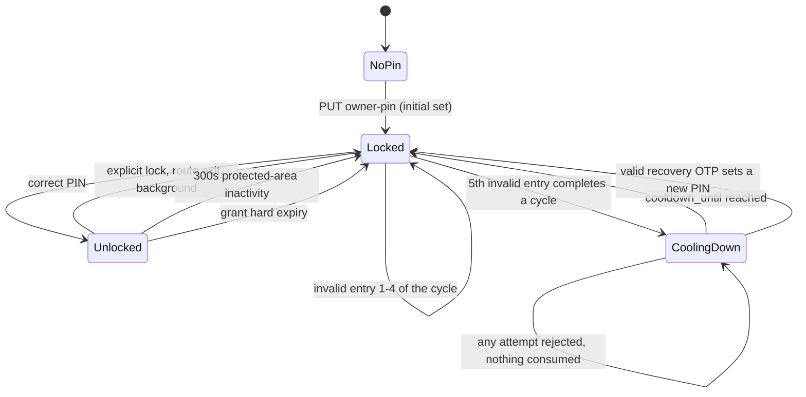

# E01-T05 · Implement owner-PIN grants and recovery

## 1. Feature goal

Give the owner a second, separate authorization step so protected money can be
unlocked on a shared workshop phone, and make that unlock expire on exactly the
approved triggers.

## 2. Business logic

Garazo runs on one phone that the whole workshop touches. Being signed in must
never mean "may see money" (BRD Law 2, `Q-004`, `ADR-0007`). The owner-money
grant is therefore a **separate short-lived credential**, issued only by a
correct PIN, and validated by the server on every protected read.

`Q-005` fixed the exact behaviour on 2026-07-29. It is not open for
re-derivation, re-tuning, or "sensible defaults". Every number below is
binding:

| Rule | Exact value | Trace |
|---|---|---|
| Relock on explicit lock | immediate | `FR-ACCESS-07` |
| Relock on protected-route exit | immediate | `FR-ACCESS-08` |
| Relock on app background | immediate | `FR-ACCESS-09` |
| Relock on protected-area inactivity | exactly 300 seconds (5 minutes) | `FR-ACCESS-10` |
| Invalid entries per failure cycle | exactly 5 | `FR-ACCESS-11` |
| Cooldown after cycle 1 | 60 seconds | `FR-ACCESS-11` |
| Cooldown after cycle 2 | 120 seconds | `FR-ACCESS-11` |
| Cooldown after cycle 3 and every later cycle | 240 seconds (capped) | `FR-ACCESS-11` |
| Verification during an active cooldown | always rejected | `FR-ACCESS-12` |
| Valid registered-phone OTP | permits setting a new PIN | `FR-ACCESS-13` |
| Invalid or expired recovery OTP | changes nothing at all | `FR-ACCESS-14` |
| Successful PIN verification or completed recovery | resets escalation to zero | `FR-ACCESS-15` |

Three consequences that are easy to get wrong and are requirements here:

1. **A rejected cooldown attempt is not an attempt.** While `cooldown_until` is
   in the future, a verification request is refused *before* the PIN is even
   compared. It does not consume one of the five entries, does not extend the
   cooldown, and does not advance the cycle. Otherwise an owner tapping a
   disabled button would escalate themselves to 240 seconds.
2. **Recovery is never blocked by a cooldown.** `FR-ACCESS-13` is the escape
   hatch. If a 240-second cooldown also froze recovery, a rush-hour owner would
   have no way back in — which is exactly the outcome `Q-005` rejected.
3. **Failure state is per workshop, and it survives a restart.** `T02` stores
   `completed_cycles`; do not recompute escalation from anything in memory. A
   process restart must not hand an attacker a fresh budget of five entries.

This task owns the **server** half of the lifecycle. `T06` owns the client half
(immediate clearing on lock, route exit and background). Both are required:
the client makes relock instant, and the server makes relock true.



Escalation resets to zero on the `correct PIN` and `valid recovery OTP` edges.

## 3. What this task DOES

- Store and verify the owner PIN as a one-way, salted, memory-hard verifier.
- Implement the failure-cycle policy exactly as tabled above, atomically.
- Issue, validate and revoke the short-lived owner-money grant.
- Enforce the 300-second protected-area inactivity rule server-side.
- Implement registered-phone OTP recovery that atomically replaces the PIN and
  clears all escalation, and that changes nothing on invalid proof.
- Bind the four owner-PIN routes from `T01`'s contract.

## 4. What this task does NOT do (scope fence)

- Do not render any UI. `SCR-010` and every protected money screen are E03.
- Do not return, compute or touch a money value. E01 has no money record.
- Do not change the contract. A mismatch returns to `T01`.
- Do not implement identity exchange or sessions (`T03`) or workshop setup
  (`T04`).
- Do not build a second OTP channel. Recovery reuses `PhoneIdentityPort`; it
  must not touch the reminder SMS sender or invent a first-party OTP.
- Do not add a new cryptography, rate-limit or auth library beyond the single
  approved PIN-hashing dependency, and do not install even that one before the
  `OQ-E01-2` human dependency gate is recorded.
- Do not invent the grant lifetime, the hashing parameters or the recovery
  throttle. They are `OQ-E01-2` values; read them from configuration.
- Do not implement the client-side relock triggers. `T06` owns those.
- Do not log a PIN, an assertion, a grant token, a digest or a failure count.
- Do not weaken `T03`'s session behaviour or `T02`'s tenant guard.

## 5. Files & changes

### Add

- `owner-pin/pin-digest.ts` — one-way salted PIN verifier and constant-time
  verification.
- `owner-pin/pin-failure-policy.ts` — the pure `Q-005` state machine. No I/O,
  no clock of its own; it takes `now` and returns the next state.
- `owner-pin/owner-grant.service.ts` — issue, validate, touch-activity and
  revoke the owner-money grant.
- `owner-pin/set-owner-pin.use-case.ts` — initial establishment and
  proof-backed replacement.
- `owner-pin/verify-owner-pin.use-case.ts` — cooldown check, verification,
  failure accounting, grant issue.
- `owner-pin/recover-owner-pin.use-case.ts` — OTP-proved atomic PIN reset.
- Four co-located spec files.
- `apps/api/src/access/owner-pin.controller.ts` — the four routes.
- `tests/integration/owner-pin-lifecycle.spec.ts` — the full lifecycle against
  a real database, including the race tests.

### Update

- `packages/server-core/src/access/access.repository.ts` — add the PIN
  credential, failure-state and grant methods in §8. **`T02` created this file
  and merges long before this task; extend the interface, do not restructure
  it.**
- `packages/server-core/src/access/postgres-access.repository.ts` — implement
  the new methods with the atomic SQL described in §6.
- `packages/server-core/src/index.ts` — export the use cases, the grant service
  and the policy type.
- `apps/api/src/access/access.module.ts` — register the controller, the three
  use cases and the grant service. **`T03` created this file; `T04` also
  extends it.**

### Delete

- None.

> The diff may not exceed this list. QA enforces.

> **Shared-file rule.** `packages/server-core/src/index.ts` and
> `apps/api/src/access/access.module.ts` are also written by `E01-T04`.
> `T04` is the prior owner. This task may only start once `T04` has merged into
> the epic branch, and must rebase onto it before touching either file. If both
> are running, stop and tell the team lead — this is the resharding trigger in
> `skills/git-flow` §Conflicts.

## 6. Database changes

No migration. `T02`'s `owner_pin_credentials`, `owner_pin_failure_states` and
`owner_money_grants` tables are used as-is, through `withTenantScope`.

Two write paths must be atomic, because both are attacker-reachable in parallel
(`L-auth-004`, `L-process-003`):

- **Failure accounting** — one conditional `UPDATE ... RETURNING` inside a
  transaction, with the row locked. Read-then-write lets N parallel wrong PINs
  count as one and hands an attacker unlimited entries.
- **Recovery** — replacing the PIN digest and clearing
  `consecutive_failures`, `completed_cycles` and `cooldown_until` happen in one
  transaction. A partial recovery that sets a new PIN but leaves a 240-second
  cooldown locks the owner out of the credential they just created.

The correct-PIN path also resets the failure row to zero in the same
transaction that issues the grant.

## 7. API changes

No contract change. Implements `T01`'s four routes exactly.

| Method | Path | Auth | Request | Response | Status |
|---|---|---|---|---|---|
| PUT | `/api/v1/access/owner-pin` | session | `{pin, recoveryAssertion?}` | empty | 204 |
| POST | `/api/v1/access/owner-pin/verifications` | session | `{pin}` | `{grant: GrantEnvelope}` | 200 |
| DELETE | `/api/v1/access/owner-pin/grant` | session | none | empty | 204 |
| POST | `/api/v1/access/owner-pin/recoveries` | session | `{recoveryAssertion, newPin}` | empty | 204 |

Reachable errors and the exact rule behind each:

| Case | Code | Status | Extra |
|---|---|---|---|
| `PUT` with no existing credential | — | 204 | initial establishment |
| `PUT` with an existing credential and absent/invalid proof | `AUTH.RECOVERY_INVALID` | 401 | PIN unchanged |
| Verification, wrong PIN, entries 1–4 of the cycle | `AUTH.PIN_INVALID` | 401 | `remainingAttempts` |
| Verification, wrong PIN, 5th entry of the cycle | `AUTH.PIN_COOLDOWN` | 429 | `retryAfterSeconds` |
| Verification while cooling down | `AUTH.PIN_COOLDOWN` | 429 | `retryAfterSeconds`; nothing consumed |
| Verification with no credential | `AUTH.PIN_NOT_SET` | 409 | — |
| Recovery with invalid/expired assertion | `AUTH.RECOVERY_INVALID` | 401 | nothing changes |
| Session missing/expired on any of the four | `AUTH.SESSION_INVALID` | 401 | — |

Behaviour the contract implies and this task must honour:

- `remainingAttempts` counts down 4, 3, 2, 1 and then the cycle completes. It
  is disclosed on purpose: it is the user's own state and reveals nothing about
  anyone else.
- `retryAfterSeconds` is computed from `cooldown_until` and the server clock,
  never echoed from the request.
- `DELETE .../grant` is idempotent: revoking an absent grant is still 204. The
  client calls it on background and on route exit, possibly twice.
- Grant tokens are opaque, ≥256 bits, stored only as digests, and are
  `OwnerGrantToken` — never interchangeable with a session token.
- A grant is bound to one session and one workshop. Revoking the session
  revokes the grant through `T02`'s cascade.

## 8. Functions

```yaml
functions:
  - signature: "nextFailureState(current: PinFailureState, outcome: 'valid' | 'invalid', now: EpochMillis) -> PinFailureState"
    params:
      current: "the stored failure row for this workshop"
      outcome: "result of comparing the presented PIN"
      now: "server clock, injected so tests are deterministic"
    returns: "the next state: counters, completed cycles, and any cooldown_until"
    purpose: "The whole Q-005 escalation as one pure, exhaustively testable function"
  - signature: "cooldownSecondsForCycle(completedCycles: number) -> 60 | 120 | 240"
    params: { completedCycles: "cycles already completed, including this one" }
    returns: "60 for cycle 1, 120 for cycle 2, 240 for cycle 3 and above"
    purpose: "One place the capped progression is written down"
  - signature: "isCoolingDown(state: PinFailureState, now: EpochMillis) -> boolean"
    params: { state: "stored failure row", now: "server clock" }
    returns: "true while cooldown_until is in the future"
    purpose: "Refuse an attempt BEFORE the PIN is compared, so it consumes nothing"
  - signature: "digestPin(pin: string) -> Promise<string>"
    params: { pin: "the 4-6 digit PIN; never stored, never logged" }
    returns: "salted one-way verifier using the approved memory-hard parameters"
    purpose: "A database dump must not yield a PIN, and 10^4 guesses must be slow"
  - signature: "verifyPinDigest(pin: string, digest: string) -> Promise<boolean>"
    params: { pin: "presented PIN", digest: "stored verifier" }
    returns: "constant-time match result"
    purpose: "Stop verification timing becoming a side channel"
  - signature: "SetOwnerPinUseCase.execute(context: RequestContext, input: { pin: string, recoveryAssertion?: string }) -> Promise<void>"
    params: { context: "authenticated, workshop-scoped context", input: "validated body" }
    returns: "void; throws AUTH.RECOVERY_INVALID when replacing without valid proof"
    purpose: "Establish the first PIN, or replace one only with proof of the registered phone"
  - signature: "VerifyOwnerPinUseCase.execute(context: RequestContext, pin: string) -> Promise<GrantEnvelope>"
    params: { context: "authenticated, workshop-scoped context", pin: "presented PIN" }
    returns: "a fresh grant envelope; throws PIN_INVALID, PIN_COOLDOWN or PIN_NOT_SET"
    purpose: "The only path from 'signed in' to 'may see money'"
  - signature: "RecoverOwnerPinUseCase.execute(context: RequestContext, input: { recoveryAssertion: string, newPin: string }) -> Promise<void>"
    params: { context: "authenticated, workshop-scoped context", input: "validated body" }
    returns: "void; throws AUTH.RECOVERY_INVALID and changes nothing on bad proof"
    purpose: "The escape hatch that must work even during a 240-second cooldown"
  - signature: "OwnerGrantService.issue(context: RequestContext) -> Promise<GrantEnvelope>"
    params: { context: "authenticated, workshop-scoped context" }
    returns: "opaque grant token plus expiry; only the digest is persisted"
    purpose: "Mint the separate money authorization, bound to one session and workshop"
  - signature: "OwnerGrantService.validate(token: string, now: EpochMillis) -> Promise<OwnerMoneyGrant>"
    params: { token: "presented grant token", now: "server clock" }
    returns: "E00's OwnerMoneyGrant; 'locked' when absent, expired, revoked or idle past 300s"
    purpose: "Server-side truth for every protected read E03 will add"
  - signature: "OwnerGrantService.touchActivity(token: string, now: EpochMillis) -> Promise<void>"
    params: { token: "presented grant token", now: "server clock" }
    returns: "void"
    purpose: "Restart the 300-second inactivity window on real protected-area activity"
  - signature: "OwnerGrantService.revoke(context: RequestContext) -> Promise<void>"
    params: { context: "authenticated, workshop-scoped context" }
    returns: "void; idempotent"
    purpose: "Explicit lock, route exit and background all land here"
  - signature: "AccessRepository.findPinCredential(scope: WorkshopScope) -> Promise<PinCredential | null>"
    params: { scope: "server-resolved workshop scope" }
    returns: "the stored verifier and its updated_at, or null when no PIN is set"
    purpose: "Distinguish 'no PIN yet' from 'wrong PIN' without leaking either"
  - signature: "AccessRepository.replacePinCredentialAndResetFailures(scope: WorkshopScope, digest: string, now: EpochMillis) -> Promise<void>"
    params: { scope: "server-resolved scope", digest: "new verifier", now: "server clock" }
    returns: "void; one transaction"
    purpose: "Recovery must not be able to half-succeed"
  - signature: "AccessRepository.applyPinAttempt(scope: WorkshopScope, outcome: 'valid' | 'invalid', now: EpochMillis) -> Promise<PinFailureState>"
    params: { scope: "server-resolved scope", outcome: "verification result", now: "server clock" }
    returns: "the committed next state"
    purpose: "Atomic failure accounting that parallel attempts cannot under-count"
```

## 9. UI changes

None. E03 renders `SCR-010`; `T06` holds the client-side grant state.

## 10. External services & feature flags

- **Firebase phone identity**, reached only through `PhoneIdentityPort` and only
  for recovery proof. The fake adapter from `T03` is what local and test runs
  use; no real credential and no network call.
- Configuration keys (values come from the `OQ-E01-2` approved security
  contract, and this task must not choose them): the grant hard-expiry ceiling
  and the PIN verifier's memory/time/parallelism parameters. Add them to
  `.env.example`? **No** — that file belongs to `T03`. List the required keys in
  §17 and hand them to the team lead so `T03`'s configuration doc covers them.
- No feature flag.

## 11. Challenges / Risks

- **Off-by-one on the fifth entry.** "Five invalid entries complete a cycle"
  means the cooldown starts *after* the fifth, not the fourth and not the sixth.
  Test entries 1, 2, 3, 4, 5 and 6 individually rather than in a loop.
- **Counting the cooldown-rejected attempt.** The most likely defect in this
  task. A rejected attempt must leave the row byte-identical.
- **Parallel wrong PINs.** Five concurrent invalid entries must produce exactly
  one completed cycle, not five (`L-auth-004`).
- **Recovery blocked by cooldown** would lock the owner out with no recourse.
- **Partial recovery** that writes the new digest but not the counter reset.
- **Grant outliving its session.** The FK cascade from `T02` handles it; a race
  where a grant is issued against a session revoked microseconds earlier does
  not. Issue the grant in a transaction that re-checks the session is live.
- **Inactivity measured from issue time instead of last activity** silently
  turns the 5-minute idle rule into a 5-minute hard cap, or the reverse.
- **PIN space is 10^4.** A fast hash makes an offline dump trivially crackable;
  the memory-hard verifier is what makes the whole scheme worth anything.
- **Timing leak** between "no PIN set" and "wrong PIN": both paths must do
  comparable work.
- **`L-process-012` (binding).** Never interpolate a value into a log message.
  `logger.warn(\`pin failed ${count} for ${workshopId}\`)` defeats redaction
  entirely, because key-based redaction cannot see free text. Pass keyed fields:
  `logger.warn('owner_pin.attempt_rejected', { workshopScope, resultCode })`.
  A PIN, assertion, grant token, digest or raw phone number must never be a
  field either.

## 12. Implementation checklist  (live execution log)

- [ ] `OQ-E01-2` dependency and security-parameter approval recorded before any
      install
- [ ] tests written FIRST and failing for `FR-ACCESS-07`–`FR-ACCESS-15`
- [ ] `pin-failure-policy.ts` is pure and covers entries 1–6 of a cycle
- [ ] cooldowns are exactly 60, then 120, then 240 capped
- [ ] a cooldown-rejected attempt changes no stored value
- [ ] five parallel invalid entries complete exactly one cycle
- [ ] correct PIN resets counters, cycles and cooldown to zero
- [ ] recovery works during an active cooldown and resets escalation
- [ ] invalid or expired recovery proof changes nothing
- [ ] grant is opaque, ≥256 bits, stored only as a digest
- [ ] grant is invalid after 300 seconds of protected-area inactivity
- [ ] revoke is idempotent; session revocation leaves no usable grant
- [ ] no PIN, assertion, token or digest is logged, and no value is
      interpolated into a log message (`L-process-012`)
- [ ] `skills/security-review` checklist walked and recorded

## 13. Test plan

### Automated

- `test_FR_ACCESS_11_fifth_invalid_entry_starts_a_60_second_cooldown`
- `test_FR_ACCESS_11_second_cycle_cooldown_is_120_seconds`
- `test_FR_ACCESS_11_third_and_later_cycles_cool_down_240_seconds` → cycles 3,
  4 and 7 all yield 240.
- `test_FR_ACCESS_12_attempt_during_cooldown_is_rejected_and_consumes_nothing`
  → the failure row is byte-identical before and after.
- `test_FR_ACCESS_11_five_parallel_invalid_entries_complete_exactly_one_cycle`
  → `Promise.all` of five wrong PINs (`L-process-003`).
- `test_FR_ACCESS_15_correct_pin_resets_escalation_to_zero` → after a 240-second
  cycle and a successful verification, the next cycle cools down 60 seconds.
- `test_FR_ACCESS_13_valid_recovery_sets_a_new_pin_during_an_active_cooldown`
- `test_FR_ACCESS_14_invalid_recovery_changes_nothing` → digest, counters,
  cycles and cooldown all unchanged; the old PIN still verifies.
- `test_FR_ACCESS_14_expired_recovery_changes_nothing`
- `test_FR_ACCESS_15_completed_recovery_resets_escalation_to_zero`
- `test_FR_ACCESS_10_grant_is_invalid_after_300_seconds_of_inactivity` → valid
  at 299s of idle, invalid at 301s.
- `test_FR_ACCESS_10_activity_restarts_the_inactivity_window`
- `test_FR_ACCESS_07_explicit_revoke_invalidates_the_grant_immediately`
- `test_FR_ACCESS_07_revoke_is_idempotent` → second call is still 204.
- `test_ADR_0007_revoking_the_session_leaves_no_usable_grant`
- `test_ADR_0007_a_grant_from_one_workshop_never_unlocks_another`
- `test_NFR_SEC_02_no_pin_assertion_token_or_digest_appears_in_any_log_line` →
  seeded values appear zero times in captured output.
- `test_NFR_SEC_02_pin_is_stored_only_as_a_memory_hard_verifier`
- `test_FR_ACCESS_13_recovery_uses_the_phone_identity_port_only` → the SMS
  sender port is never called.

### Manual QA

1. Set a PIN, verify it → grant returned.
2. Enter four wrong PINs → `remainingAttempts` counts 4, 3, 2, 1.
3. Enter the fifth → 429 with `retryAfterSeconds` 60.
4. Attempt again immediately → still 429; the countdown does not restart.
5. Wait out the cooldown, fail five more times → 120 seconds.
6. Recover with a valid fake assertion mid-cooldown → succeeds; the next cycle
   cools down 60 seconds again.
7. Recover with an invalid assertion → nothing changes; the old PIN still works.

## 14. Acceptance criteria (EARS)

- **EARS-E01-T05-1** — WHEN five consecutive invalid PIN entries complete a
  failure cycle, the system SHALL block PIN verification for exactly 60 seconds
  after the first cycle, 120 seconds after the second, and 240 seconds after the
  third and every later cycle. (`FR-ACCESS-11`)
- **EARS-E01-T05-2** — WHILE an owner-PIN cooldown is active, the system SHALL
  reject every verification attempt and SHALL leave the stored failure state
  unchanged. (`FR-ACCESS-12`)
- **EARS-E01-T05-3** — WHEN the owner completes valid OTP verification on the
  registered owner phone, the system SHALL allow a new PIN to be set even while
  a cooldown is active. (`FR-ACCESS-13`)
- **EARS-E01-T05-4** — IF a recovery assertion is invalid or expired, THEN the
  system SHALL keep the existing PIN, counters, completed cycles and cooldown
  unchanged. (`FR-ACCESS-14`)
- **EARS-E01-T05-5** — WHEN PIN verification succeeds or OTP recovery
  completes, the system SHALL reset the escalation so the next failure cycle
  cools down 60 seconds. (`FR-ACCESS-15`)
- **EARS-E01-T05-6** — WHEN the owner-money grant is explicitly revoked, the
  system SHALL treat it as locked on the very next request. (`FR-ACCESS-07`,
  `FR-ACCESS-08`, `FR-ACCESS-09`)
- **EARS-E01-T05-7** — WHEN 300 continuous seconds pass without protected-area
  activity, the system SHALL treat the grant as locked. (`FR-ACCESS-10`)
- **EARS-E01-T05-8** — WHERE a PIN or grant token is stored, the system SHALL
  store only a one-way verifier or digest. (`NFR-SEC-02`)

## 15. Self-review (agent fills BEFORE status: review-requested)

- [ ] All checklist items done (with commit hashes)
- [ ] `make test && make lint` pass
- [ ] Loading/error/empty states: N/A — no UI
- [ ] Audit entry on lifecycle writes — grant issue/revoke and PIN change
      timestamps set server-side
- [ ] No secrets/PII logged; no value interpolated into a log message
- [ ] Diff confined to §5 list; §4 respected

### Deviations from spec

(none)

### Files touched (actual)

- ...

## 16. Definition of Done

- [ ] All §14 criteria pass via tests named by EARS/trace ID
- [ ] UI fidelity: N/A
- [ ] Peer-AI review approved by a different model
- [ ] **Task-level QA APPROVE — REQUIRED.** Authentication, PIN and recovery
      surface (constitution rule 3)
- [ ] **`skills/security-review` pass recorded** — walk its enumeration,
      session-fixation, token-race and secret-leak checklist against this diff
- [ ] `OQ-E01-2` human approval recorded for the PIN verifier dependency and
      parameters
- [ ] Squash-merged to epic branch; tracker + metrics stamped
- [ ] Graphiti episode written or "graph not consulted" noted
- [ ] Human verified at E01 checkpoint

## 17. Notes for the implementing agent

- `Q-005` in `workspace/open-questions.md` is the authority. Re-read it before
  writing the policy function, and do not average it with anything you have
  seen elsewhere.
- Write `pin-failure-policy.ts` first, as a pure function with no database and
  no clock. Every number in §2's table becomes one test. Only then wire it.
- The configuration keys this task needs (grant ceiling, verifier parameters)
  belong in `T03`'s `.env.example` and `docs/operations/configuration.md`.
  Do **not** edit those files; list the keys in §15 Deviations and tell the team
  lead so `T03` or a follow-up carries them (`L-process-005`).
- Reuse `digestToken` and `timingSafeEquals` from `T03`'s `token-digest.ts` for
  the *grant* token. The *PIN* needs the memory-hard verifier instead, because
  a 4-digit secret has 10,000 possibilities.
- `grantsMoneyAccess()` already exists in
  `packages/server-core/src/access/owner-money-grant.ts` (E00). Return E00's
  `OwnerMoneyGrant` shape from `validate()`; do not define a parallel type.
- OWASP session management:
  <https://cheatsheetseries.owasp.org/cheatsheets/Session_Management_Cheat_Sheet.html>

## 18. Handoff

At `review-requested`, hand to a different-model peer, then to task-level QA
**and** a `skills/security-review` pass. Both are merge gates. `T10` proves the
lifecycle end to end on a device and will fail loudly if any number here drifts.

## Open Questions

- **Q-007 — Recovery-attempt throttling is unspecified.** `Q-005` quantifies PIN
  attempts but says nothing about how many recovery attempts a session may make.
  This task relies on the identity provider's own OTP rate limits and adds no
  first-party throttle. `ADR-0007` already defers "OTP expiry/rate limits" to a
  later human-approved security contract, and `OQ-E01-2` already blocks this
  task on that contract, so no new blocker is created — but the parameter must
  be named in that approval rather than discovered later.
  - **Status:** 🟡 open
  - **Answer:** _Confirm the recovery-attempt limit and OTP expiry as part of the OQ-E01-2 security contract._
  - **Answered by:** _project owner (manual)_
  - **Date:** _YYYY-MM-DD_

## Feedback log

- (human feedback on this deliverable lands here)

## Run log

- (security-review ref, race-test evidence, cooldown timings, and session refs)
