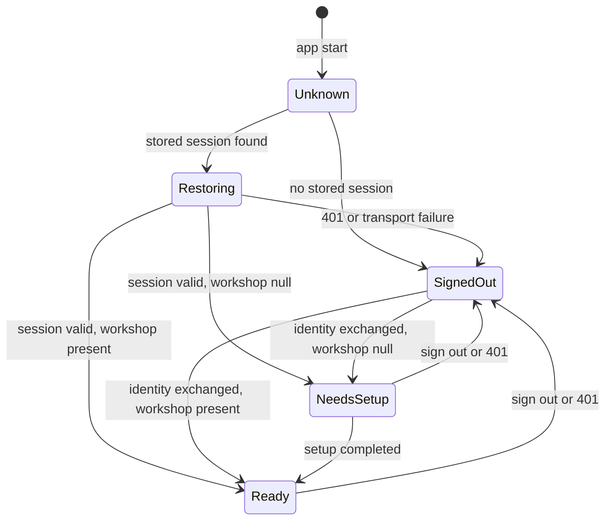

# E01-T06 · Build the mobile access/session foundation

## 1. Feature goal

Give the owner app one place that knows who is signed in, which workshop the
server authorized, which language to render, and whether money is unlocked — so
the three screen tasks can be built in parallel without any of them inventing
their own answer.

## 2. Business logic

This task is the reason `T07`, `T08` and `T09` can run at the same time. It owns
every file all three would otherwise fight over: the app root, the route table,
the localization files, and the dependency manifest. Those files are **single
owner** in this epic's DAG (`tracker.md`, anti-collision rule).

Four rules drive the design.

**The server decides, the app displays.** The app never picks a workshop and
never keeps one it was not just handed. Access state comes from
`GET /access/session` and nothing else (`FR-ACCESS-05`).

**Failure erases.** `FR-ACCESS-04` says failed authentication shows no workshop
record. That is not only "do not navigate": any previously cached workshop name,
setup state or locale must be gone from memory and from storage before the
failure is rendered. A sign-out or a 401 clears the same way.

**Money is locked by default.** BRD Law 2, `Q-004` and `FR-014` mask due,
bill-due, reminder-ROI and attributed-income values outside an owner-PIN
unlocked context. E01 stores no money value at all, so the job here is to make
the *locked* state the only representable default and to give `T08` a masked
placeholder it cannot accidentally fill. `conventions.md` §5 is explicit:
visual masking alone is not authorization — a protected value must be absent
from the widget tree, the accessibility tree, the cache, the logs and the error
state. The design's accessibility note is equally exact: masked money reads
**"locked"**, never bullets.

**Relock is immediate and client-first.** `FR-ACCESS-07`–`FR-ACCESS-10` require
the grant to end on explicit lock, on leaving a protected route, on
backgrounding, and after 300 seconds of protected-area inactivity. The client
clears its own grant state **synchronously, before the next frame**, and only
then fires a best-effort `DELETE /access/owner-pin/grant`. Waiting for the
network would leave amounts on screen in the app switcher. `T05` enforces the
same rules server-side; neither half is sufficient alone.



Every transition into `SignedOut` clears stored session, workshop and grant.

## 3. What this task DOES

- Own the route table and wire `/access`, `/home` and `/settings/language` to
  placeholder pages that `T07`, `T08` and `T09` fill in.
- Implement the access state machine above as an immutable state plus a view
  model, per `conventions.md` §5 (view → view model → repository → generated
  client).
- Implement secure session-token storage, and clearing on failure and sign-out.
- Implement the owner-money lock: locked by default, immediate clearing on the
  four approved triggers, and the 300-second inactivity timer.
- Implement the `MaskedValue` presentation primitive that renders the localized
  "locked" state and cannot be given a protected value.
- Bind `MaterialApp.locale` to the access state so a locale change re-renders
  the whole app.
- Author the **complete** Bangla and English key inventory for every E01 string
  in `SCR-001`, the `SCR-002` access shell and the `SCR-011` language control.
- Add the two Flutter dependencies E01 needs (secure storage and the Firebase
  phone-auth SDK) behind the `OQ-E01-2` human dependency gate.

## 4. What this task does NOT do (scope fence)

- Do not build `SCR-001`, `SCR-002` or `SCR-011`. This task ships three
  placeholder pages, deliberately plain, that the screen tasks replace.
- Do not call the phone-identity provider. `T07` owns verification; this task
  only adds the dependency and holds the resulting session.
- Do not render a money value, a job, a customer, a due, an SMS credit or a
  plan. There is no such record in E01.
- Do not add a state-management package, a router package, a dependency
  injection package or an HTTP package. `ChangeNotifier`, `MaterialApp.routes`
  and the generated client are the approved patterns (`conventions.md` §4/§5).
- Do not hand-edit `apps/mobile/lib/core/api/generated/` — `T01` owns it.
- Do not inline a hex colour, a spacing number or a string literal. Tokens and
  `AppLocalizations` only.
- Do not implement PIN entry UI or the PIN keypad. E03 owns `SCR-010`.
- Do not add offline caching or sync. E06 owns that.

## 5. Files & changes

### Add

- `app/routes.dart` — route-name constants and the single route table.
- `features/access/data/session_store.dart` — platform secure storage for the
  session token; read, write, clear.
- `features/access/data/access_repository.dart` — the three session calls plus
  the grant-revoke call, through the generated client.
- `features/access/application/access_state.dart` — the immutable state and its
  five cases.
- `features/access/application/access_controller.dart` — the view model.
- `features/access/application/owner_money_lock.dart` — grant holder, the four
  relock triggers, the 300-second inactivity timer.
- `features/access/application/relock_observer.dart` — `WidgetsBindingObserver`
  and route observer that feed the lock.
- `features/access/presentation/access_gate.dart` — chooses the route from the
  access state.
- `features/access/presentation/masked_value.dart` — the "locked" placeholder.
- `features/onboarding/presentation/onboarding_page.dart` — **placeholder**;
  `T07` owns it from here on.
- `features/home/presentation/workshop_home_page.dart` — **placeholder**; `T08`
  owns it from here on.
- `features/settings_language/presentation/language_settings_page.dart` —
  **placeholder**; `T09` owns it from here on.
- Five test files mirroring the above under `test/`.

### Update

- `app/app.dart` — mount the route table, the access gate, the relock observer,
  and bind `MaterialApp.locale` to the access state. Keep E00's shell contracts
  (`shellRootKey`, `designColor`, `designSpace`, the const-folded diagnostic
  route) intact.
- `l10n/app_en.arb`, `l10n/app_bn.arb` — the complete E01 key inventory.
- `l10n/generated/` — regenerated output; never hand-edited.
- `pubspec.yaml`, `pubspec.lock` — the two approved dependencies.
- `test/app/app_test.dart` — extend E00's shell test for the new root.

### Delete

- None.

> The diff may not exceed this list. QA enforces.

> **Single-owner files.** `app/app.dart`, `app/routes.dart`, both `.arb` files,
> the generated l10n output, `pubspec.yaml` and `pubspec.lock` belong to this
> task alone for the whole epic. `T07`, `T08` and `T09` must not touch them. A
> missing string key is a blocking question to the team lead, not a local edit.

## 6. Database changes

No DB changes. The device stores only the session token, in platform secure
storage, and nothing else that survives a sign-out.

## 7. API changes

No contract change. Consumes `T01`'s contract through the generated Dart
client:

| Method | Path | Used for |
|---|---|---|
| GET | `/api/v1/access/session` | restore on app start |
| DELETE | `/api/v1/access/session` | sign out |
| DELETE | `/api/v1/access/owner-pin/grant` | best-effort revoke after a local relock |

Client rules:

- Attach the session token as the bearer credential on every authorized call,
  read from secure storage, never from a field a screen can set.
- Treat `AUTH.SESSION_INVALID` (401) on any call as sign-out: clear storage,
  clear state, route to `/access`.
- `workshop: null` on `GET /access/session` means **needs setup**, not an
  error. Route to `/access`, not to an error page.
- Never send a workshop identifier. The contract has no field for one; do not
  add a header either.

## 8. Functions

```yaml
functions:
  - signature: "AccessController.restore() -> Future<void>"
    params: {}
    returns: "void; emits Restoring then Ready, NeedsSetup or SignedOut"
    purpose: "Decide the first screen from the server, not from a cached guess"
  - signature: "AccessController.adoptSession(SessionEnvelope session, WorkshopSummary? workshop) -> Future<void>"
    params:
      session: "envelope returned by the identity exchange T07 performs"
      workshop: "server-resolved workshop, or null before setup"
    returns: "void; persists the token and emits Ready or NeedsSetup"
    purpose: "One entry point from sign-in, so no screen writes the token itself"
  - signature: "AccessController.signOut() -> Future<void>"
    params: {}
    returns: "void; always reaches SignedOut even if the server call fails"
    purpose: "Local erasure must not depend on the network"
  - signature: "AccessController.clearForFailure() -> Future<void>"
    params: {}
    returns: "void; wipes session, workshop, locale override and grant"
    purpose: "FR-ACCESS-04 — a failed sign-in must leave no workshop trace"
  - signature: "AccessController.applyLocale(AppLocale locale) -> Future<void>"
    params: { locale: "bn or en, already persisted by T09's repository" }
    returns: "void; emits a new state so MaterialApp re-renders"
    purpose: "Presentation only; no business value changes"
  - signature: "SessionStore.read() -> Future<String?>"
    params: {}
    returns: "the stored session token, or null"
    purpose: "The only reader of the credential"
  - signature: "SessionStore.write(String token) -> Future<void>"
    params: { token: "opaque server-issued token" }
    returns: "void"
    purpose: "Platform secure storage, never shared preferences or a file"
  - signature: "SessionStore.clear() -> Future<void>"
    params: {}
    returns: "void; idempotent"
    purpose: "Sign-out and failure both land here"
  - signature: "OwnerMoneyLock.unlockedWith(GrantEnvelope grant) -> void"
    params: { grant: "envelope returned by PIN verification (E03 calls this)" }
    returns: "void; starts the 300-second inactivity timer"
    purpose: "The only way the lock ever leaves its locked default"
  - signature: "OwnerMoneyLock.lock(RelockReason reason) -> void"
    params: { reason: "explicitLock | routeExit | background | inactivity" }
    returns: "void; SYNCHRONOUS — state is locked before this returns"
    purpose: "Immediate relock; the network call happens after, best effort"
  - signature: "OwnerMoneyLock.registerActivity() -> void"
    params: {}
    returns: "void; restarts the 300-second window"
    purpose: "Idle is measured from last protected-area activity, not from unlock"
  - signature: "OwnerMoneyLock.isUnlocked -> bool"
    params: {}
    returns: "false whenever locked, expired, or idle past 300 seconds"
    purpose: "One predicate, so no widget invents its own check"
  - signature: "MaskedValue({required String semanticsLabel}) -> Widget"
    params: { semanticsLabel: "localized 'locked' label from AppLocalizations" }
    returns: "a widget with no value slot at all"
    purpose: "A protected value cannot be leaked through a widget that cannot hold one"
```

## 9. UI changes

- **Design source:** `workspace/plan/01-design/design-system.md`,
  `tokens.json`, and the `money-summary` component's `locked` state.
- Surface: owner app, Android-first at the approved 412×892 work frame.
- Routes created: `/access`, `/home`, `/settings/language` — exactly the E01
  rows of `conventions.md` §6. No other route is added.
- States required on the placeholder pages: loading, error, empty and data are
  the **screen tasks'** responsibility; the placeholders ship a loading and an
  error state only, so the gate is testable before any screen exists.
- Navigation: the access gate maps `Unknown`/`Restoring` → a loading state,
  `SignedOut`/`NeedsSetup` → `/access`, `Ready` → `/home`.
- `MaskedValue` renders the localized "locked" word and a token-driven muted
  style. It takes no amount, no number and no formatter.

## 10. External services & feature flags

- No service is called by this task.
- **Two dependencies, both human-gated by `OQ-E01-2`** — present the exact
  package, version and licence and get explicit approval before installing:
  1. a platform secure-storage package for the session token;
  2. the Firebase phone-auth SDK that `T07`'s real adapter compiles against.
  Both are added here because `pubspec.yaml` is single-owner. `T07` adds none.
- The Firebase SDK is a compile-time dependency only in E01. Nothing in this
  task initializes it, and `ADR-0007`'s Bangladesh pilot remains a production
  gate.
- No feature flag.

## 11. Challenges / Risks

- **Async relock is a leak.** If `lock()` awaits the network before clearing
  state, protected values survive into the app-switcher snapshot. Clear first,
  revoke after.
- **`AppLifecycleState` has four non-resumed values.** Handle `inactive`,
  `paused`, `hidden` and `detached`. Missing one leaves a device where
  backgrounding does not relock.
- **A timer that survives the widget** keeps counting after sign-out and can
  fire against a new session. Cancel it in `dispose()` and on every lock.
- **Cached workshop data after a 401** is the classic version of
  `FR-ACCESS-04`. Test it: sign in, sign out, force a failed sign-in, and assert
  the previous workshop name appears nowhere in the widget tree.
- **The ARB inventory is a one-shot.** Three screen tasks depend on it and none
  of them may edit it. Walk `SCR-001`, `SCR-002` and `SCR-011` line by line and
  add every key before handing off, including error and empty copy.
- **Bangla is the default and the first-class language** (`NFR-I18N-01`). An
  English-only key is an incomplete key.
- **`L-process-012` (binding).** Never interpolate a value into a log message.
  Pass keyed fields so redaction can see them. On this surface that includes the
  session token, the grant token, the phone number, the workshop name and any
  amount — none of which may be logged at all.

## 12. Implementation checklist  (live execution log)

- [ ] `OQ-E01-2` dependency approval recorded before `flutter pub add`
- [ ] tests written FIRST and failing for `FR-ACCESS-04`, `FR-ACCESS-07`–`10`
- [ ] access state machine matches §2 exactly, including `Restoring`
- [ ] session token lives only in platform secure storage
- [ ] a 401 on any call signs out and clears everything
- [ ] failed sign-in leaves no workshop value in state, storage or widget tree
- [ ] money lock is locked by default and cannot be constructed unlocked
- [ ] `lock()` is synchronous; the revoke call happens afterwards
- [ ] all four lifecycle states and route exit trigger a lock
- [ ] the inactivity window is exactly 300 seconds and restarts on activity
- [ ] `MaskedValue` has no parameter that could carry an amount
- [ ] `MaterialApp.locale` follows the access state
- [ ] complete bn + en keys for SCR-001, the SCR-002 shell and SCR-011
- [ ] no inline hex, no magic spacing, no literal user-facing string
- [ ] `make lint` and the Flutter analyzer are clean

## 13. Test plan

### Automated

- `test_FR_ACCESS_05_access_state_comes_only_from_the_server` → a controller
  handed a workshop by a caller instead of the API never reaches `Ready`.
- `test_FR_ACCESS_04_failed_sign_in_leaves_no_workshop_value` → previous
  workshop name absent from state, secure storage and the pumped widget tree.
- `test_FR_ACCESS_04_a_401_on_any_call_signs_out_and_clears_storage`
- `test_FR_ACCESS_03_restore_routes_to_home_when_the_server_returns_a_workshop`
- `test_FR_ACCESS_01_restore_routes_to_access_when_workshop_is_null` → null is
  handled as needs-setup, not as an error.
- `test_FR_ACCESS_07_explicit_lock_locks_synchronously` → `isUnlocked` is false
  on the same synchronous turn, before any await.
- `test_FR_ACCESS_09_each_background_lifecycle_state_locks` → parameterized over
  `inactive`, `paused`, `hidden`, `detached`.
- `test_FR_ACCESS_08_leaving_a_protected_route_locks`
- `test_FR_ACCESS_10_lock_engages_after_300_seconds_of_inactivity` → unlocked at
  299s, locked at 301s, using a fake clock.
- `test_FR_ACCESS_10_activity_restarts_the_inactivity_window`
- `test_FR_ACCESS_07_revoke_failure_still_leaves_the_client_locked` → the
  network call throws; the lock holds.
- `test_NFR_SEC_02_masked_value_exposes_no_amount` → the widget and the
  semantics tree contain the localized "locked" label and no digits.
- `test_NFR_SEC_02_no_token_or_workshop_name_is_logged`
- `test_NFR_I18N_01_every_e01_key_exists_in_both_arb_files` → set difference of
  `app_en.arb` and `app_bn.arb` keys is empty.
- `test_NFR_A11Y_01_shell_root_and_gate_states_are_named`

### Manual QA

1. Fresh install → app opens `/access` with no stored session.
2. Adopt a fake session with a workshop → app opens `/home` after restart.
3. Background the app while unlocked → return; money is locked.
4. Sign out → relaunch; nothing about the workshop is visible anywhere.

## 14. Acceptance criteria (EARS)

- **EARS-E01-T06-1** — WHEN the app starts with a stored session, the system
  SHALL resolve the workshop context from the server and SHALL open the route
  that context implies. (`FR-ACCESS-03`, `FR-ACCESS-05`)
- **EARS-E01-T06-2** — IF authentication fails or any call returns
  `AUTH.SESSION_INVALID`, THEN the system SHALL clear the stored session, the
  workshop context and the owner-money grant before rendering.
  (`FR-ACCESS-04`)
- **EARS-E01-T06-3** — WHEN the owner selects explicit lock, leaves a protected
  route, or the app enters the background, the system SHALL lock owner-money
  access synchronously, before the next frame. (`FR-ACCESS-07`–`FR-ACCESS-09`,
  `NFR-SEC-03`)
- **EARS-E01-T06-4** — WHEN 300 continuous seconds pass without protected-area
  activity, the system SHALL lock owner-money access. (`FR-ACCESS-10`)
- **EARS-E01-T06-5** — WHILE owner money is locked, the system SHALL expose no
  protected value in state, cache, widget tree, accessibility tree, log or
  error output. (`FR-014`, `NFR-SEC-02`)
- **EARS-E01-T06-6** — WHERE any string reaches the owner, the system SHALL
  resolve it through `AppLocalizations` in both Bangla and English.
  (`NFR-I18N-01`)

## 15. Self-review (agent fills BEFORE status: review-requested)

- [ ] All checklist items done (with commit hashes)
- [ ] `make test && make lint` pass
- [ ] Loading and error states present on the gate; screen-level empty/data
      states belong to T07–T09
- [ ] i18n complete — every new key exists in `app_en.arb` and `app_bn.arb`
- [ ] No secrets/PII logged; no value interpolated into a log message
- [ ] Diff confined to §5 list; §4 respected

### Deviations from spec

(none)

### Files touched (actual)

- ...

## 16. Definition of Done

- [ ] All §14 criteria pass via tests named by EARS/trace ID
- [ ] **UI fidelity** — the shell chrome, tokens and typography match
      `design-system.md`; no screen is claimed complete by this task
- [ ] Peer-AI review approved by a different model
- [ ] **Task-level QA APPROVE — REQUIRED.** Session storage and the money-lock
      boundary are security surfaces
- [ ] `OQ-E01-2` human approval recorded for both new dependencies
- [ ] Squash-merged to epic branch; tracker + metrics stamped
- [ ] Graphiti episode written or "graph not consulted" noted
- [ ] Human verified at E01 checkpoint

## 17. Notes for the implementing agent

- Read `apps/mobile/lib/app/app.dart` and
  `apps/mobile/lib/features/system_probe/` first. E00 already established the
  pattern: sealed outcome types in the repository, an immutable state class, a
  `ChangeNotifier` view model, widgets that render tokens. Follow it exactly.
- Keep E00's `systemProbeRouteEnabled` const-folding untouched. It is how the
  diagnostic page stays out of a release binary (`EARS-E00-11`).
- The three placeholder pages should be almost embarrassingly plain. Their job
  is to make the gate testable and to give `T07`–`T09` a file each to own.
- Build the ARB inventory from the screen specs, not from imagination:
  `workspace/plan/01-design/screens/SCR-001-onboarding.md`,
  `SCR-002-dashboard.md`, `SCR-011-settings.md`, and their prototype files.
- `masked money reads "locked", not bullets` is a direct quote from the
  `SCR-002` accessibility notes. Do not substitute `••••`.
- Flutter app lifecycle:
  <https://api.flutter.dev/flutter/dart-ui/AppLifecycleState.html>

## 18. Handoff

At `review-requested`, hand to a different-model peer, then to task-level QA.
`T07`, `T08` and `T09` all start from this merge, so a late change here costs
three tasks. Publish the final ARB key list in the run log when you hand off.

## Open Questions

- None for implementation. The two dependency choices are gated by `OQ-E01-2`;
  present them for approval rather than raising a new question.

## Foundation handoff to T07 / T08 / T09

| Consumer | Owns from here | Must not touch |
|---|---|---|
| T07 | `features/onboarding/**` | `app.dart`, `routes.dart`, both `.arb` files, `pubspec.*` |
| T08 | `features/home/**` | the same, plus `features/access/**` |
| T09 | `features/settings_language/**` | the same, plus `features/access/**` |

## Feedback log

- (human feedback on this deliverable lands here)

## Run log

- (ARB key inventory, dependency approval ref, lock-timing evidence, session refs)
