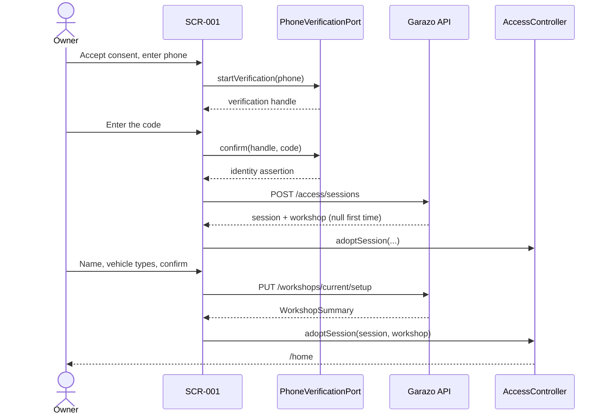

# E01-T07 · Build phone onboarding and workshop setup (SCR-001)

## 1. Feature goal

Let a new owner prove the registered phone, name the workshop, choose vehicle
types, and land in the operational home — with no path that reveals a workshop
before the server authorized one.

## 2. Business logic

`SCR-001` is the product's front door and its only unauthenticated screen. It
implements `FR-ACCESS-01`–`FR-ACCESS-04` end to end.

**Firebase proves the phone. It authorizes nothing** (`ADR-0007`). The app
completes phone verification, receives a signed assertion, and immediately
exchanges it at `POST /api/v1/access/sessions`. Everything the owner then sees
comes from the Garazo session. The app never derives a workshop, a name or a
permission from the provider's own response.

**Consent is a requirement, not a courtesy.** `ADR-0007` states the Flutter flow
must disclose that Google processes and stores authentication phone numbers for
spam and abuse prevention, and must obtain appropriate end-user consent. That
disclosure appears before verification starts, in both languages, and is part of
this screen's acceptance.

**Setup is one confirmed act.** Name and at least one approved vehicle type are
required (`SCR-001` interactions table). `PUT /workshops/current/setup` returns
the full workshop context, so the app opens `SCR-002` with no second call
(`FR-ACCESS-02`).

**Failure stays put and shows nothing.** An invalid phone, an expired code, or a
tenant failure keeps the owner on the same step with a localized message
(`SCR-001` states). No workshop record, no account hint, no "this number is not
registered" — the server returns one undifferentiated failure and the screen
must not decorate it into an oracle (`L-auth-003`).

The prototype's "start with demo data" control is **excluded from the product
contract** because it bypasses phone access (`SCR-001` entry and exit). Do not
build it.



Every provider or API failure returns to the same step with a localized message
and no workshop data.

## 3. What this task DOES

- Implement the `SCR-001` step flow: consent + phone, code, workshop name,
  vehicle types, confirm.
- Implement a client-side `PhoneVerificationPort` with a deterministic fake
  adapter and the real Firebase adapter behind the identical interface.
- Exchange the assertion for a Garazo session and hand it to `T06`'s
  `AccessController`.
- Submit workshop setup and open `/home` from the returned context.
- Ship all four required states (loading, error, empty, data) with the
  accessibility behaviour `SCR-001` specifies.

## 4. What this task does NOT do (scope fence)

- Do not edit `app.dart`, `routes.dart`, either `.arb` file, the generated l10n
  output, `pubspec.yaml` or `pubspec.lock`. `T06` owns all of them. A missing
  string key is a blocking question to the team lead, not a local edit.
- Do not add a dependency. `T06` already added the Firebase phone-auth SDK and
  secure storage under the `OQ-E01-2` gate.
- Do not write the session token yourself. Call
  `AccessController.adoptSession()`.
- Do not build `SCR-002` or `SCR-011` (`T08`, `T09`), or any protected money
  surface (E03).
- Do not build the prototype's "start with demo data" control.
- Do not build price presets. `SCR-001` marks them "source reference only" and
  the SRS requires only name and vehicle types.
- Do not distinguish "number not registered" from "wrong code" in the UI.
- Do not create a Firebase project, embed a credential, enable fictional-number
  testing in a release path, or make a real provider call in any test.
- Do not invent vehicle-type keys. They come from the contract enum `T01`
  publishes, gated by `OQ-E01-3`.

## 5. Files & changes

### Add

- `onboarding/data/phone_verification_port.dart` — the provider-neutral
  interface plus its sealed result type.
- `onboarding/data/fake_phone_verification_adapter.dart` — deterministic
  adapter for local runs, widget tests and `T10`.
- `onboarding/data/firebase_phone_verification_adapter.dart` — the real one;
  the **only** file in the app permitted to import a Firebase type.
- `onboarding/data/onboarding_repository.dart` — the session exchange and the
  setup call, through the generated client.
- `onboarding/application/onboarding_state.dart` — immutable step state.
- `onboarding/application/onboarding_controller.dart` — the view model.
- `onboarding/presentation/onboarding_steps.dart` — the step widgets.
- Three test files under `test/features/onboarding/`.

### Update

- `onboarding/presentation/onboarding_page.dart` — replace `T06`'s placeholder
  with the real screen.

### Delete

- None.

> The diff may not exceed this list. QA enforces.

## 6. Database changes

No DB changes. Nothing about setup is stored on the device; the workshop context
lives in `T06`'s access state and on the server.

## 7. API changes

No contract change. Consumes `T01`'s contract through the generated Dart client:

| Method | Path | Request | Success | Failure the screen must handle |
|---|---|---|---|---|
| POST | `/api/v1/access/sessions` | `{identityAssertion}` | `{session, workshop}` | 401 `AUTH.INVALID_CREDENTIALS` → same step, generic message |
| PUT | `/api/v1/workshops/current/setup` | `{name, vehicleTypes}` | `WorkshopSummary` | 400 `VALIDATION.INVALID_FIELD` → field errors; 409 `WORKSHOP.ALREADY_SET_UP` → restore and open `/home`; 401 → sign out |

Client-side validation, mirroring the contract exactly:

- `name`: 1–120 characters after trimming; whitespace-only is invalid; the
  confirm action stays disabled until it passes, with a localized explanation
  (`SCR-001` empty state).
- `vehicleTypes`: at least one, at most 12, no duplicates, values only from the
  contract enum.
- The screen sends no workshop identifier, no locale and no region profile. The
  server assigns `regionProfile: BD` and `locale: bn`.

## 8. Functions

```yaml
functions:
  - signature: "PhoneVerificationPort.start(String phone) -> Future<VerificationHandle>"
    params: { phone: "owner-entered number; never logged" }
    returns: "an opaque handle, or a failure result"
    purpose: "Provider-neutral start of phone possession proof"
  - signature: "PhoneVerificationPort.confirm(VerificationHandle handle, String code) -> Future<PhoneVerificationResult>"
    params: { handle: "from start()", code: "owner-entered one-time code; never logged" }
    returns: "sealed result carrying an opaque assertion, or a failure"
    purpose: "Turn a code into an assertion the server can verify"
  - signature: "FakePhoneVerificationAdapter.confirm(...) -> Future<PhoneVerificationResult>"
    params: { handle: "test handle", code: "documented test code" }
    returns: "a deterministic assertion, or a deterministic failure"
    purpose: "Let the screen, its tests and T10 run with no provider account"
  - signature: "OnboardingRepository.exchangeAssertion(String assertion) -> Future<AccessExchangeOutcome>"
    params: { assertion: "opaque provider assertion" }
    returns: "sealed outcome: session + optional workshop, or a generic failure"
    purpose: "The single crossing from provider identity to Garazo authority"
  - signature: "OnboardingRepository.completeSetup(String name, List<String> vehicleTypes) -> Future<SetupOutcome>"
    params: { name: "trimmed workshop name", vehicleTypes: "approved enum values" }
    returns: "sealed outcome: workshop summary, field errors, or a failure"
    purpose: "One-time setup with server-decided region and locale"
  - signature: "OnboardingController.acceptConsent() -> void"
    params: {}
    returns: "void; unlocks the phone step"
    purpose: "ADR-0007 requires recorded consent before verification starts"
  - signature: "OnboardingController.sendCode(String phone) -> Future<void>"
    params: { phone: "entered number" }
    returns: "void; emits loading then the code step or an error"
    purpose: "Step 1, with the busy state SCR-001 requires"
  - signature: "OnboardingController.verifyCode(String code) -> Future<void>"
    params: { code: "entered one-time code" }
    returns: "void; on success adopts the session and advances"
    purpose: "Step 2; a failure stays on this step and shows nothing else"
  - signature: "OnboardingController.toggleVehicleType(String value) -> void"
    params: { value: "an approved vehicle-type key" }
    returns: "void; updates the selection"
    purpose: "Multi-select chips per SCR-001"
  - signature: "OnboardingController.confirmSetup() -> Future<void>"
    params: {}
    returns: "void; on success hands the workshop to AccessController"
    purpose: "Step 4; the only place FR-ACCESS-01 and FR-ACCESS-02 complete"
```

## 9. UI changes

- **Design source:** `workspace/plan/01-design/screens/SCR-001-onboarding.md`
  and `prototype/SCR-001-onboarding.html`. The prototype is visual law.
- Surface: owner app, Android-first, 412×892 work frame.
- Layout: dark onboarding shell with the Garazo mark and progress dots; one
  rounded white panel showing a single step; the primary button pinned to the
  panel bottom.
- Components reused from the design system: `app-shell`, `form-control`,
  `button`, `selection-chip`, `status-badge`, `feedback`.
- States required:
  - **loading** — send and verify show busy text and do not advance the step;
  - **error** — invalid phone, expired code or tenant failure stays on the step
    with a localized message and no workshop data;
  - **empty** — a missing required input keeps the action disabled and explains
    why;
  - **data** — the completed step advances and the final confirm opens `/home`.
- Edge cases from the screen spec: long workshop names wrap; repeated code
  requests are rate-limited by the provider and the UI must show that honestly;
  offline verification reveals nothing.
- Accessibility (`NFR-A11Y-01`): focus follows step order; a step change moves
  focus to the heading; inputs keep persistent labels; phone and code fields use
  a numeric keyboard; errors are announced.
- Navigation: `/access` → `/home` on completed setup, via `T06`'s access gate.
  Never push `/home` directly.

## 10. External services & feature flags

- **Firebase Authentication**, through `PhoneVerificationPort` only. The fake
  adapter is what local runs and every test use. No credential, no network call.
- Adapter selection is build/run configuration and must default to the fake
  adapter. A release build that reaches the fake adapter would accept any code,
  so the selection must fail closed exactly as `T03` does server-side.
- `ADR-0007`: fictional-number and disabled-app-verification facilities are
  testing-only and must never be enabled or embedded in production.
- No feature flag.

## 11. Challenges / Risks

- **The provider result is not authority.** It is tempting to route to `/home`
  the moment Firebase says "verified". Nothing may render until the Garazo
  session exchange returns.
- **Decorated errors leak.** Mapping the server's one generic failure onto
  "number not registered" recreates the enumeration oracle the contract
  deliberately removed (`L-auth-003`).
- **A Firebase type escaping its adapter** makes `ADR-0004`'s replaceable-
  provider rule decorative. Assert it with an import test.
- **Double submit** on the confirm button creates a second setup attempt. Refuse
  re-entry while busy, exactly as E00's `SystemProbeViewModel` does, and treat
  409 `WORKSHOP.ALREADY_SET_UP` as success-by-restore rather than an error.
- **Step focus** is easy to lose on Android when the panel rebuilds; the
  accessibility requirement is explicit that focus moves to the heading.
- **`OQ-E01-3` blocks the vehicle-type chips.** Their stable keys and bn/en
  labels need owner approval. Do not ship placeholder keys.
- **`L-process-012` (binding).** Never interpolate a value into a log message —
  pass keyed fields. The phone number, the code, the assertion and the workshop
  name must not appear in a log at all.

## 12. Implementation checklist  (live execution log)

- [ ] `OQ-E01-3` vehicle-type keys and labels approved before the chip step
- [ ] tests written FIRST and failing for `FR-ACCESS-01`–`FR-ACCESS-04`
- [ ] consent disclosure shown, in both languages, before verification starts
- [ ] fake adapter is deterministic and its test codes are documented
- [ ] real Firebase adapter compiles; no Firebase type appears elsewhere
- [ ] adapter selection defaults to fake and fails closed in release
- [ ] all four steps ship loading, error, empty and data states
- [ ] a failed exchange stays on the step and shows no workshop value
- [ ] the server's generic failure is not differentiated in the UI
- [ ] confirm is disabled until name and at least one vehicle type are valid
- [ ] double confirm cannot create a second setup
- [ ] setup response opens `/home` with no second API call
- [ ] every string comes from `AppLocalizations`; no literal copy
- [ ] no inline hex or magic spacing; tokens only
- [ ] focus order, headings, labels and numeric keyboards verified

## 13. Test plan

### Automated

- `test_FR_ACCESS_03_valid_code_exchanges_for_a_garazo_session`
- `test_FR_ACCESS_04_failed_verification_shows_no_workshop_value` → the widget
  tree and the semantics tree contain no workshop name after failure.
- `test_FR_ACCESS_04_ui_does_not_differentiate_pre_session_failures` → unknown
  number and wrong code render the identical message.
- `test_FR_ACCESS_01_setup_requires_a_name_and_one_vehicle_type` → confirm stays
  disabled and the reason is announced.
- `test_FR_ACCESS_01_rejects_a_whitespace_only_name`
- `test_FR_ACCESS_02_successful_setup_opens_home_without_a_second_call`
- `test_FR_ACCESS_02_already_set_up_restores_and_opens_home`
- `test_FR_ACCESS_01_double_confirm_sends_one_setup_request`
- `test_ADR_0007_consent_is_shown_before_verification_starts`
- `test_ADR_0007_no_firebase_type_is_imported_outside_its_adapter`
- `test_ADR_0007_tests_make_no_real_provider_call` → the fake adapter is bound
  and any network attempt fails the test.
- `test_NFR_I18N_01_every_step_renders_in_bangla_and_english`
- `test_NFR_A11Y_01_step_change_moves_focus_to_the_heading`
- `test_NFR_A11Y_01_phone_and_code_fields_use_a_numeric_keyboard`
- `test_NFR_SEC_02_no_phone_code_or_assertion_is_logged`

### Manual QA

1. Fresh install → consent, phone, code, name, types, confirm → `/home`.
2. Wrong code → same step, generic message, nothing else revealed.
3. Kill the app mid-setup → relaunch returns to `/access` at the setup step.
4. Switch the device language → all onboarding copy switches.
5. Long workshop name → wraps, no overflow.

## 14. Acceptance criteria (EARS)

- **EARS-E01-T07-1** — WHEN a first-time owner confirms all required setup
  values, the system SHALL retain the workshop context and SHALL open `SCR-002`
  without a further request. (`FR-ACCESS-01`, `FR-ACCESS-02`)
- **EARS-E01-T07-2** — WHEN a registered owner completes valid phone
  verification, the system SHALL exchange the assertion for a Garazo session
  before rendering any workshop content. (`FR-ACCESS-03`, `ADR-0007`)
- **EARS-E01-T07-3** — IF phone verification or the session exchange fails,
  THEN the system SHALL remain on the same step and SHALL show no workshop
  record and no indication of whether the number is registered.
  (`FR-ACCESS-04`)
- **EARS-E01-T07-4** — WHILE the required workshop name or vehicle-type
  selection is missing, the system SHALL keep the confirm action unavailable and
  SHALL explain what is missing. (`FR-ACCESS-01`)
- **EARS-E01-T07-5** — WHEN phone verification is about to start, the system
  SHALL have disclosed the provider's phone-number processing and obtained
  consent. (`ADR-0007`)
- **EARS-E01-T07-6** — WHERE any onboarding string is displayed, the system
  SHALL render approved Bangla and English content. (`NFR-I18N-01`)

## 15. Self-review (agent fills BEFORE status: review-requested)

- [ ] All checklist items done (with commit hashes)
- [ ] `make test && make lint` pass
- [ ] Loading, error, empty and data states present on every step
- [ ] i18n complete — every key used exists in both ARB files (T06 authored them)
- [ ] No secrets/PII logged; no value interpolated into a log message
- [ ] Diff confined to §5 list; §4 respected

### Deviations from spec

(none)

### Files touched (actual)

- ...

## 16. Definition of Done

- [ ] All §14 criteria pass via tests named by EARS/trace ID
- [ ] **UI fidelity** — layout, chrome, progress dots, component structure,
      iconography, copy and focus states match `SCR-001` and its prototype;
      tokens only, no inline styling; divergences listed in §15 with a reason
- [ ] Peer-AI review approved by a different model
- [ ] **Task-level QA APPROVE — REQUIRED.** This is the authentication screen
- [ ] Squash-merged to epic branch; tracker + metrics stamped
- [ ] Graphiti episode written or "graph not consulted" noted
- [ ] Human verified at E01 checkpoint

## 17. Notes for the implementing agent

- Read `T06`'s `access_controller.dart` and `access_state.dart` first. Your
  screen never stores a token; it calls `adoptSession()` and lets the gate
  navigate.
- Document the fake adapter's test phone numbers and codes in the run log.
  `T10` builds its device journey on them.
- The prototype file is the visual law, but the SRS is the behavioural law.
  Where the prototype shows demo data or price presets, the SRS wins and those
  are out of scope.
- Firebase phone auth on Android:
  <https://firebase.google.com/docs/auth/android/phone-auth> — read the app
  verification section before writing the real adapter.

## 18. Handoff

At `review-requested`, hand to a different-model peer, then to task-level QA.
`T10` consumes the fake adapter and the completed journey.

## Open Questions

- **OQ-E01-3 applies here.** The approved vehicle-type keys and their Bangla and
  English labels must be answered before the chip step is implemented. The phone
  and name steps are not blocked by it.
  - **Status:** 🟡 open (tracked centrally on the epic)
  - **Answer:** _Approve the exact stable keys and bn/en labels._
  - **Answered by:** _project owner (manual)_
  - **Date:** _YYYY-MM-DD_

## Feedback log

- (human feedback on this deliverable lands here)

## Run log

- (fake-adapter test identities, screenshots against SCR-001, session refs)
