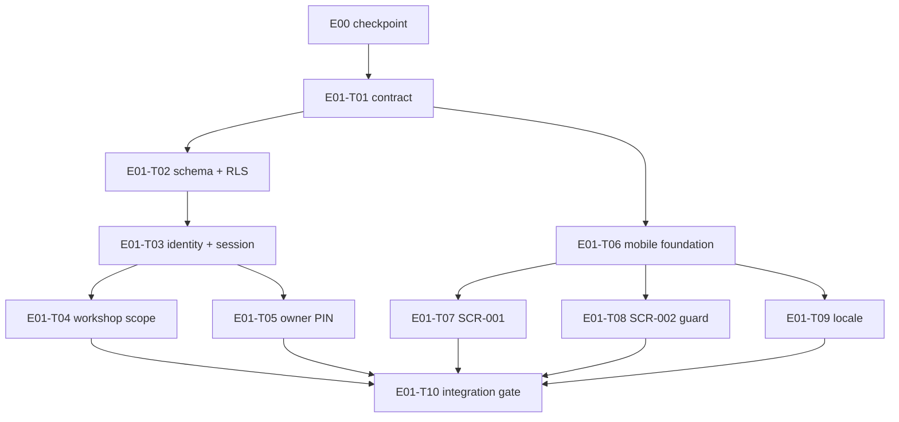

# E01 · Secure Workshop Access · Progress

**Status:** todo · **Started:** — · **Completed:** — · **Progress:** 0/10
> Only the ORCHESTRATOR edits status fields. Task flow: todo → in-progress →
> review-requested → (changes-requested →) done → verified; side states:
> blocked, frozen.

## Tasks

| Done | Task | Title | Lane | Status | Depends on | Owner |
|---|---|---|---|---|---|---|
| [ ] | E01-T01 | Define the secure-access API contract and regenerate clients | L0 contract | todo | E00 | developer-backend |
| [ ] | E01-T02 | Create the access schema and tenant policies | L1 data | todo | T01 | developer-backend |
| [ ] | E01-T03 | Implement phone identity and application sessions | L1 backend-session | todo | T02 | developer-backend |
| [ ] | E01-T04 | Implement workshop setup and server scope | L2 backend-workshop | todo | T03 | developer-backend |
| [ ] | E01-T05 | Implement owner-PIN grants and recovery | L3 backend-pin | todo | T03 | developer-backend |
| [ ] | E01-T06 | Build the mobile access/session foundation | L4 mobile-foundation | todo | T01 | developer-frontend |
| [ ] | E01-T07 | Build phone onboarding and workshop setup (SCR-001) | L5 mobile-onboarding | todo | T06 | developer-frontend |
| [ ] | E01-T08 | Build the authorized workshop home guard (SCR-002) | L6 mobile-home | todo | T06 | developer-frontend |
| [ ] | E01-T09 | Build Bangla/English presentation switching (SCR-011) | L7 mobile-locale | todo | T06 | developer-frontend |
| [ ] | E01-T10 | Prove access, isolation, PIN lifecycle, and locale integration | L8 integration | todo | T04,T05,T07,T08,T09 | qa |

## Dependency graph

## Explicit parallel lanes

WIP limit: at most three active implementation worktrees, and at most one
high-risk auth/session/PIN/migration task at a time. The latter risk rule may
reduce theoretical parallelism even where files do not collide.

| Wave | Tasks that may run together | Why files do not collide |
|---|---|---|
| 0 | T01 only | Owns canonical OpenAPI, generated clients, and lockfiles |
| 1 | T02 + T06 | T02 owns `infra/db` and server integration tests; T06 owns Flutter access foundation/config |
| 2 | T03 + T07 + T08 (or T09) | T03 owns server identity/session/adapters; each Flutter screen task owns a distinct feature directory and test tree |
| 3 | T04 + one of T07/T08/T09 | T04 owns workshop files; mobile tasks remain disjoint |
| 4 | T05 + remaining T07/T08/T09 | T05 owns PIN files; each mobile task writes a different Flutter feature directory; shared locale strings were pre-created by T06 |
| 5 | T10 only | Final integration task owns only E2E/evidence/wiring files after all slices merge |

**T04 → T05 serialization (corrected 2026-08-05).** T05 depends on T03 in the
DAG, but T04 and T05 both write `packages/server-core/src/index.ts` and
`apps/api/src/access/access.module.ts`. They may not run at the same time. T04
is the prior owner of both files; T05 rebases onto T04's merge before touching
either. This costs one wave of parallelism and removes a guaranteed merge
conflict on the epic's two composition files.

Anti-collision rule: any newly discovered need to touch another active lane's
file pauses that task. The team lead must re-shard or serialize it before the
diff expands. Lockfile, OpenAPI, generated-client, root app/navigation, and
shared locale-file changes are single-owner paths in this DAG.

## Single-owner files

Any task that needs a change in one of these files stops and asks the team
lead. It does not edit the file.

| File(s) | Owner | Consumers who must not edit |
|---|---|---|
| `contracts/openapi/garazo.v1.yaml`, both generated client trees | T01 | every other task |
| `infra/db/migrations/**`, `access.repository.ts`, `postgres-access.repository.ts`, `tenant-guard.ts` | T02 (T05 extends the two repository files after T02 merges) | T03, T04, T06–T10 |
| `apps/api/src/app.module.ts`, `session.guard.ts`, `.env.example`, `docs/operations/configuration.md` | T03 | T04, T05, T10 |
| `packages/server-core/src/index.ts`, `apps/api/src/access/access.module.ts` | T04 first, then T05 (serialized) | never concurrent |
| `apps/mobile/lib/app/app.dart`, `app/routes.dart`, both `.arb` files, `lib/l10n/generated/`, `pubspec.yaml`, `pubspec.lock`, `test/app/app_test.dart` | T06 | T07, T08, T09 |
| `apps/mobile/lib/features/access/**` | T06 | T07, T08, T09 |
| `Makefile`, `.github/workflows/ci.yml` | T02 (Makefile), E00 (CI); T10 appends in the final solo wave | no concurrent writer

## Blocked / Frozen

- **E01 implementation is dependency-blocked by E00:** E00 must pass
  independent QA and its human checkpoint first.
- **T01/T03/T05/T06:** blocked until the human approves exact new dependency
  versions/licenses and auth/session/PIN security parameters (`OQ-E01-2`).
- **T01/T02/T04/T07:** blocked until the human approves the exact stable
  workshop vehicle-type keys and bn/en labels (`OQ-E01-3`).
- **T02:** migration execution is blocked until explicit human approval; the
  spec and review may proceed before execution.
- **Real Firebase production enablement:** frozen until the Bangladesh-number
  delivery, privacy/consent, abuse, and current-cost pilot passes. Fake/local
  and emulator/test operation remain allowed.
- **NFR-ADOPTION-02:** frozen by Q-006/D-001 and absent from E01.

## Review log

(peer and task-level QA verdicts land here: date · task · reviewer · outcome)

## Event log (append-only)

- 2026-08-05 · E01 specification created from handoff `E01-spec`; all tasks todo.
- 2026-08-05 · Task specs T05–T10 written; DAG unchanged. Wave table corrected
  to serialize T04 before T05 (shared composition files), and a single-owner
  file table added. T06 confirmed as sole owner of the Flutter app root, route
  table, ARB files and `pubspec.*`, so T07/T08/T09 stay disjoint.
