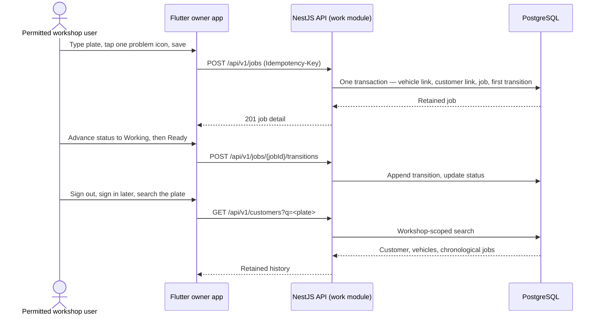
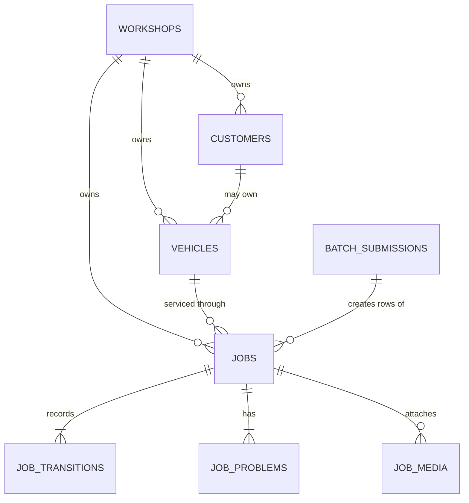
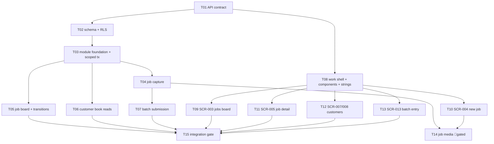

# E02 · Fast Jobs and Customer Book

- Traces from: SRS v1 (`FR-JOB-01`–`FR-JOB-14`, `FR-CUSTOMER-01`–`FR-CUSTOMER-04`,
  `FR-ONLINE-01`–`FR-ONLINE-03`), feature list v1 (`FT-003`–`FT-006`),
  design v1 (`SCR-003`, `SCR-004`, `SCR-005`, `SCR-007`, `SCR-008`, `SCR-013`),
  technical plan v1, `ADR-0002`, `ADR-0004`, `ADR-0005`, `ADR-0008`,
  `workspace/epics/E00-genesis/conventions.md`
- Traces to: `tasks/E02-T01` … `tasks/E02-T15`
- Status: specced — awaiting `/analyze E02` and the human dispatch gate
- Last updated: 2026-08-05

## Business goal

A workshop earns nothing while it writes on paper. E02 gives the workshop one
fast place to record what arrived, what is wrong with it, and what happened to
it. Every job silently builds the customer and vehicle book, so the next visit
starts from history instead of memory. This is the epic that makes the ≤45
second job card real and the retained workspace visible.

## User-visible outcome

After E02 a permitted workshop user can:

1. create a job from a plate plus one problem icon, with everything else optional;
2. see today's jobs filtered by state and move a job Open → Working → Ready → Delivered;
3. record a whole rush day after the fact through end-of-day batch entry that
   produces the *same* job records as live entry;
4. search a customer by name, phone, or plate and read a vehicle's service
   history in chronological order;
5. close the app, sign in again later, and find every acknowledged record.

None of this existed before E02. E01 could only let the owner in.

## Runnable flow when done

> Create and progress or batch-enter a job, then find retained customer and
> vehicle history in a later online session.

## Dependencies this epic consumes (does NOT re-implement)

| From | What E02 consumes | Enforced by |
|---|---|---|
| E00 | Repository layout, `conventions.md`, error envelope, cursor pagination, OpenAPI + generated clients, architecture tests, Compose/CI, design tokens | `E00-T01`–`E00-T05` |
| E00 | `RequestContext`, `AuthenticatedActor`, `WorkshopScope`, `OwnerMoneyGrant`, `AdminScope` access types | `E00-T02` |
| E01 | Authenticated session, server-resolved workshop scope, workshop record and its Bangladesh region profile (time zone for the business date), bn/en locale switch | `E01` |
| E03 | The owner-money grant issuer that satisfies `FR-JOB-10` for batch entry (see `OQ-E02-1`) | `E03` |

E02 never re-implements authentication, session handling, workshop resolution,
locale switching, or PIN verification. It **consumes** them and fails closed
when they are absent.

## Scope

**In scope**

- Live job capture: plate + one or more problem icons required; promised date,
  note, customer name/phone, vehicle model optional (`FR-JOB-01`–`FR-JOB-06`).
- Job lifecycle: Open → Working → Ready → Delivered with an immutable
  transition history (`FR-JOB-07`–`FR-JOB-09`).
- End-of-day batch entry of job rows with a confirmed business date, all-or-
  nothing submission, draft preservation on failure, and idempotent retry
  (`FR-JOB-10`–`FR-JOB-14`).
- Automatic customer and vehicle records built from job activity, with known
  plates linking instead of duplicating (`FR-CUSTOMER-01`, `FR-CUSTOMER-02`).
- Combined customer search by name, phone, or plate and chronological vehicle
  service history (`FR-CUSTOMER-03`, `FR-CUSTOMER-04`).
- Server-backed persistence and later-session retrieval of every acknowledged
  E02 record, with zero TireBook dependency (`FR-ONLINE-01`–`FR-ONLINE-03`).
- Owner-app screens `SCR-003`, `SCR-004`, `SCR-005` (non-money parts),
  `SCR-007`, `SCR-008`, `SCR-013` (job-row parts) plus the work shell,
  routes, shared components, and bn/en strings.
- Optional photo and voice capture attached to a job — behind its own human
  service gate (`E02-T14`, `FR-JOB-05`).
- PostgreSQL schema for the work module with row-level security as ADR-0005
  defense in depth.

**Out of scope**

| Excluded from E02 | Why | Owner |
|---|---|---|
| Bills, charge lines, prices, payments, dues, expenses, daily money, any amount field | `FR-014` money boundary, Q-004 | E03 |
| Owner-PIN verification, cooldown, recovery, grant issuance and relock timers | `FR-ACCESS-07`–`FR-ACCESS-15` | E03 (see `OQ-E02-1`) |
| The money step of `SCR-013` and the money parts of `SCR-005` (billing sheet, payment sheet, numeric keypad) | No bill or payment record exists in E02 | E03 |
| `SCR-002` dashboard, `SCR-006` bill share, `SCR-009` dues, `SCR-010` money | Money or aggregate surfaces | E03 |
| Customer due badge value or `hasDue` flag on `SCR-007` / `SCR-008` | `FR-CUSTOMER-05` is a money requirement | E03 |
| Next-service timing, reminders, odometer, reminder ROI | `FR-REMINDER-*` | E04 |
| Free-tier 30-job cap, ad surfaces, device limit, Pro gating on `SCR-003` | `FR-PLAN-01`–`FR-PLAN-08` | E04 |
| Analytics events and KPI queries (the `entryMode` **column** is created here, no event is emitted) | `FR-ANALYTICS-*` | E05 |
| Any offline cache, local database, queued write, sync, or conflict handling | `FR-OFFLINE-*` — E02 is online-first and must never claim an unsaved record succeeded | E06 |
| Plate OCR / automatic number-plate recognition | No OCR provider is selected; `FR-JOB-06` only requires that manual entry always works | New ADR + service gate |
| Job cancellation, reopening, rollback, deletion, or edit-after-save | Not approved states (lifecycle-analysis §1) | Not approved |
| Vehicle type field, odometer field | Design glyphs only; no SRS requirement | See `OQ-E02-2` |
| TireBook fields, branch, fleet, VAT | L2 boundary contracts | E12–E15 |

## Data-model changes

Two migrations. Both are human-gated (`AGENTS.md` rule 4).

| Migration | Tables | Task | Gate |
|---|---|---|---|
| `0002_work_module` | `customers`, `vehicles`, `jobs`, `job_problems`, `job_transitions`, `batch_submissions`, `idempotency_records` | `E02-T02` | 🧍 human migration approval |
| `0003_job_media` | `job_media` | `E02-T14` | 🧍 human migration approval + object-storage service gate |

`idempotency_records` is created by E02 because E02 is its first user. E03 and
E04 **extend** its use; they must not redefine it.

## API surface

All routes are versioned under `/api/v1`, use camelCase JSON, the single E00
error envelope, and opaque cursor pagination with `{items, nextCursor}`.
Every route is bearer-authenticated and workshop-scoped **server-side**.

| Method | Path | Owner task | Notes |
|---|---|---|---|
| POST | `/api/v1/jobs` | T01 contract → T04 impl | `Idempotency-Key` required |
| GET | `/api/v1/jobs` | T01 → T05 | cursor list |
| GET | `/api/v1/jobs/summary` | T01 → T05 | status chip counts |
| GET | `/api/v1/jobs/{jobId}` | T01 → T05 | full detail |
| POST | `/api/v1/jobs/{jobId}/transitions` | T01 → T05 | `Idempotency-Key` required |
| POST | `/api/v1/jobs/batch` | T01 → T07 | owner-money grant + `Idempotency-Key` required |
| GET | `/api/v1/vehicles/lookup` | T01 → T04 | known-plate match during capture |
| GET | `/api/v1/vehicles/{vehicleId}/jobs` | T01 → T06 | cursor list, newest first |
| GET | `/api/v1/customers` | T01 → T06 | combined search, cursor list |
| GET | `/api/v1/customers/{customerId}` | T01 → T06 | customer + vehicles |
| POST | `/api/v1/jobs/{jobId}/media` | T01 → T14 | flag `work.jobMedia`, default off |
| GET | `/api/v1/media/{mediaId}` | T01 → T14 | short-lived signed download |

Exact schemas, status codes, and validation live in `E02-T01`. No other task
may change the contract; a mismatch returns to T01 as a spec revision.

## UI screens

Design is law. Source of truth: `workspace/plan/01-design/screens/` +
`workspace/plan/01-design/prototype/` + `workspace/plan/01-design/tokens.json`.

| Screen | Route | Design source | Task |
|---|---|---|---|
| SCR-003 Jobs board | `/jobs` | `screens/SCR-003-jobs-board.md`, `prototype/SCR-003-jobs-board.html` | E02-T09 |
| SCR-004 New job card | `/jobs/new` | `screens/SCR-004-new-job.md`, `prototype/SCR-004-new-job.html` | E02-T10 |
| SCR-005 Job detail (non-money) | `/jobs/:jobId` | `screens/SCR-005-job-detail.md`, `prototype/SCR-005-job-detail.html` | E02-T11 |
| SCR-007 Customer and vehicle book | `/customers` | `screens/SCR-007-customers.md`, `prototype/SCR-007-customers.html` | E02-T12 |
| SCR-008 Customer detail | `/customers/:customerId` | `screens/SCR-008-customer-detail.md`, `prototype/SCR-008-customer-detail.html` | E02-T12 |
| SCR-013 Batch entry (job rows) | `/batch-entry` | `screens/SCR-013-batch-entry.md`, `prototype/SCR-013-batch-entry.html` | E02-T13 |
| Work shell, bottom navigation, shared components | all of the above | `design-system.md`, `components/*.html` | E02-T08 |

Every screen task must ship loading, error, empty, and data states, Bangla and
English strings, and WCAG AA contrast/focus/naming per `NFR-A11Y-01`.

## Acceptance criteria (epic-level, EARS)

SRS-owned criteria (verbatim ids — a test must exist per id):

- **EARS-JOB-1** — WHEN a user confirms a non-empty plate and one or more problem icons, the system SHALL save the job. (`FR-JOB-01`)
- **EARS-JOB-2** — IF a job has no plate, THEN the system SHALL identify the missing plate and keep the job unsaved. (`FR-JOB-02`)
- **EARS-JOB-3** — IF a job has no problem icon, THEN the system SHALL identify the missing problem and keep the job unsaved. (`FR-JOB-03`)
- **EARS-JOB-4** — WHEN optional photo, OCR, voice, media, price, customer, or timing input is skipped, the system SHALL keep the minimum job save available. (`FR-JOB-04`)
- **EARS-JOB-5** — WHEN an optional approved capture value is supplied, the system SHALL attach it to the saved job. (`FR-JOB-05`)
- **EARS-JOB-6** — IF plate photo or recognition is unavailable or unsuccessful, THEN the system SHALL allow typed plate entry without an OCR retry. (`FR-JOB-06`)
- **EARS-JOB-7** — WHEN promised timing is saved for a job, the system SHALL show it in the work list and job detail. (`FR-JOB-07`)
- **EARS-JOB-8** — WHEN a permitted user confirms an allowed status change, the system SHALL set the job to that state. (`FR-JOB-08`)
- **EARS-JOB-9** — WHEN a job status changes, the system SHALL append that transition to the job history. (`FR-JOB-09`)
- **EARS-JOB-10** — WHILE the owner PIN is locked, the system SHALL hide batch money and keep batch saving unavailable. (`FR-JOB-10`)
- **EARS-JOB-11** — WHEN a valid batch job is saved, the system SHALL make it available in the same job, customer, and vehicle records as a live job. (`FR-JOB-11`)
- **EARS-JOB-12** — WHEN valid batch rows are saved, the system SHALL retain the confirmed business date on every resulting record. (`FR-JOB-12`)
- **EARS-JOB-13** — IF a batch save fails, THEN the system SHALL retain every draft row without reporting success. (`FR-JOB-13`)
- **EARS-JOB-14** — WHEN a previously accepted batch submission is retried, the system SHALL create zero duplicate job or money effects. (`FR-JOB-14`)
- **EARS-CUSTOMER-1** — WHEN an unknown-plate job is saved with available customer details, the system SHALL establish its customer/vehicle relationship. (`FR-CUSTOMER-01`)
- **EARS-CUSTOMER-2** — WHEN a job uses a known plate, the system SHALL link the job to the existing vehicle instead of creating a duplicate vehicle. (`FR-CUSTOMER-02`)
- **EARS-CUSTOMER-3** — WHEN a user searches by a stored customer or vehicle identifier, the system SHALL show matching authorized records. (`FR-CUSTOMER-03`)
- **EARS-CUSTOMER-4** — WHEN an authorized user opens a vehicle record, the system SHALL show its linked jobs in chronological context. (`FR-CUSTOMER-04`)
- **EARS-ONLINE-1** — WHEN an MVP record save is acknowledged as successful, the system SHALL retain that record in the server-backed workshop workspace. (`FR-ONLINE-01`)
- **EARS-ONLINE-2** — WHEN the same workshop starts a later authenticated session with service connectivity, the system SHALL return its acknowledged record. (`FR-ONLINE-02`)
- **EARS-ONLINE-3** — WHILE TireBook is absent or unavailable, the system SHALL keep every approved MVP workflow operational. (`FR-ONLINE-03`)

E02-specific criteria (no SRS id exists; they enforce accepted ADRs and NFRs):

- **EARS-E02-1** — WHILE a request carries a workshop scope, the API SHALL return zero record owned by another workshop, at both the application query layer and the PostgreSQL row-security layer. (`NFR-SEC-01`, `ADR-0005`)
- **EARS-E02-2** — WHEN a consequential work write is retried with the same `Idempotency-Key` and the same payload, the system SHALL return the stored original result and SHALL create zero additional record. (`FR-JOB-14`, domain model §4)
- **EARS-E02-3** — IF a consequential work write reuses an `Idempotency-Key` with a different payload, THEN the system SHALL reject the request and SHALL change no record. (domain model §4)
- **EARS-E02-4** — WHEN the minimum job path is measured end to end on a reference Android device, the system SHALL complete a saved job in 45 seconds or less at the median of the recorded runs. (`NFR-PERF-01`)
- **EARS-E02-5** — WHEN any E02 owner-app screen renders, the system SHALL expose no money amount, due value, or price in its response payload, widget tree, accessibility tree, cache, log, or error state. (`NFR-SEC-02`, Q-004)
- **EARS-E02-6** — WHEN an E02 screen is displayed in Bangla or English, the system SHALL render approved localized content for every visible string and SHALL change zero stored business-data value. (`NFR-I18N-01`, `NFR-I18N-02`)

## Task list

| Task | Title | Layer | Size | MoSCoW | Depends on |
|------|-------|-------|------|--------|-----------|
| E02-T01 | Define the work API contract and regenerate clients | cross-cutting | M | must | — |
| E02-T02 | Create the work-module PostgreSQL schema and row-level security | infra | M | must | E02-T01 |
| E02-T03 | Build the work module foundation and workshop-scoped transaction runner | backend | M | must | E02-T02 |
| E02-T04 | Implement live job capture with customer and vehicle linking | backend | M | must | E02-T03 |
| E02-T05 | Implement the job board, job detail, and status transitions | backend | M | must | E02-T03 |
| E02-T06 | Implement customer search, customer detail, and vehicle history | backend | M | must | E02-T03 |
| E02-T07 | Implement idempotent end-of-day batch job submission | backend | M | should | E02-T04 |
| E02-T08 | Build the owner-app work shell, routes, components, and strings | frontend | M | must | E02-T01 |
| E02-T09 | Build the jobs board screen (SCR-003) | frontend | M | must | E02-T08 |
| E02-T10 | Build the new job card screen (SCR-004) | frontend | M | must | E02-T08 |
| E02-T11 | Build the job detail and status rail screen (SCR-005) | frontend | M | must | E02-T08 |
| E02-T12 | Build the customer book and customer detail screens (SCR-007, SCR-008) | frontend | M | must | E02-T08 |
| E02-T13 | Build the end-of-day batch entry screen (SCR-013) | frontend | M | should | E02-T08 |
| E02-T14 | Attach optional job photo and voice media | cross-cutting | M | could | E02-T04, E02-T10 |
| E02-T15 | Prove E02 integration, tenant isolation, and minimum-path evidence | cross-cutting | M | should | E02-T05…T13 |

## Test strategy

| Layer | What it proves | Where |
|---|---|---|
| Unit (`*.spec.ts`, colocated) | Transition policy, plate normalization, batch validation, idempotency fingerprinting | Each backend task |
| Unit (Flutter) | View-model state machines: idle/loading/data/empty/error | Each screen task |
| Widget (Flutter) | Every required state renders; accessible names; token-only styling | Each screen task |
| Integration (`tests/integration/work-*.spec.ts`) | Real PostgreSQL transactions, unique constraints, RLS policies, cursor pagination, transition history append | Each backend task |
| **Race** (mandatory) | Concurrent identical `Idempotency-Key`; concurrent transitions on one job; concurrent same-plate creation | T04, T05, T07 |
| Architecture (`tests/architecture/`) | No cross-module private import, no provider type in domain, no ad-hoc HTTP in Flutter widgets | T03 |
| Contract (`tests/contract/`) | OpenAPI validates; regenerated clients have zero drift | T01 |
| Tenant isolation suite | Two workshops, every E02 route, zero foreign record — application layer AND RLS layer | T15 |
| E2E (`tests/e2e/e02-*.spec.ts`) | Full runnable flow including sign-out / sign-in retrieval | T15 |
| Device journey (`integration_test/`) | Minimum-path timing evidence for `NFR-PERF-01` | T15 |

Bug-sweep focus for `/qa E02`: duplicate vehicles on concurrent same-plate
saves, tenant leakage through search `q`, money values leaking into any E02
payload, batch partial writes, transition history gaps, and untranslated strings.

## Risks & mitigations

| Risk | Mitigation |
|------|-----------|
| Two tasks race to create the same vehicle for one plate | `unique (workshop_id, plate_normalized)` + `INSERT … ON CONFLICT DO NOTHING … RETURNING` inside the job transaction; mandatory race test (`L-process-003`) |
| Row-level security is written but never actually enforced (app role has BYPASSRLS) | T02 adds a test that queries as the application role with a foreign `garazo.workshop_id` and asserts zero rows; T15 repeats it end to end (`L-auth-001`) |
| `NFR-PERF-01` measured on a fast emulator and declared green | T15 records device, network profile, and run count; the harness produces a baseline, not a pilot KPI claim |
| Money creeps into E02 because the design shows it on SCR-005/SCR-013 | Money is absent from the contract entirely; `EARS-E02-5` asserts absence at payload, widget, a11y tree, cache, log, and error level |
| Batch write partially commits and the client shows false success | One transaction, all-or-nothing, plus `FR-JOB-13` draft-preservation test on the client |
| Required env/config added without updating launchers | Any new required key updates `.env.example`, Compose, CI, tests, and operator docs in the same diff (`L-process-005`) |
| Untrusted `jobId` / `customerId` path params reach a typed uuid column and produce a driver 500 | Boundary validator per untrusted param mapping to the domain 404 (`L-process-006`) |
| Offline behavior sneaks in "because the design shows a sync hint" | The `SCR-003` sync hint renders as a static Pro teaser with no cache, no queue, no retry-on-reconnect; E06 owns real offline |
| ADR-0005 row-security consequence silently dropped | T02 implements it; T15's ADR-consequence check lists it (`L-auth-002`) |

## Third-party touchpoints

| Service | Used by | Status |
|---|---|---|
| PostgreSQL | T02–T07, T15 | Inventoried in E00; managed boundary, external to production Compose |
| Private object storage | T14 only | ⛔ Supplier not selected. `ADR-0006` leaves it a human gate. T14 must not start before it passes |
| OCR / plate recognition | none | ⛔ Not selected, not used, not stubbed. `FR-JOB-06` needs only the manual path |
| SMS, Firebase, TireBook | none | Not touched by E02 |

## Open Questions

- **OQ-E02-1 — Batch entry needs an owner-money grant that no epic before E03 issues.**
  `FR-JOB-10` requires batch entry to be unavailable while the owner PIN is
  locked. The grant that satisfies it is produced by owner-PIN verification,
  which the traceability matrix maps to `FR-014` / `FT-010` / **E03**. E02 is
  sequenced *before* E03. So E02 can implement the guard (it consumes the
  `OwnerMoneyGrant` port from `E00-T02` and fails closed) but no human can
  actually complete a batch save at the E02 checkpoint.
  Options:
  **A —** Keep the E03 boundary. E02 ships the guard bound to a
  `NoOwnerMoneyGrantReader` that always reports "absent". Batch entry is proven
  by automated tests with a fixture-issued grant, and the human-runnable batch
  demo moves to the E03 checkpoint. E02's runnable flow is then demonstrated
  through its "create and progress" branch only.
  **B —** Remap `FR-ACCESS-07`–`FR-ACCESS-12` and `FR-ACCESS-15` (the owner-PIN
  grant lifecycle) from E03 forward into E01. E01 already owns the session, and
  the matrix already maps `FR-ACCESS-13`/`FR-ACCESS-14` (PIN recovery OTP) to
  E01, so the split is already partial.
  **Recommendation: B.** It removes an existing split-ownership smell, makes
  E02's approved runnable flow literally runnable, and costs E01 one bounded
  security slice instead of leaving a dead endpoint through two checkpoints.
  Either answer leaves E02's code identical — E02 only ever consumes the port —
  so this does not block sharding, only the E01/E02 checkpoint demos.
  - **Status:** 🟡 open
  - **Answer:** _<empty — fill here>_
  - **Answered by:** _<human name | agent id> (manual|auto)_
  - **Date:** _<YYYY-MM-DD>_

- **OQ-E02-2 — Which descriptive vehicle fields are approved?**
  Approved design v1 shows a vehicle model (`Yamaha FZ`, `Honda Dio`) on
  `SCR-005`, `SCR-007`, and `SCR-008`; `SCR-007` says "truncate models".
  `SCR-008` also shows a vehicle-type word and mentions an unknown odometer.
  The SRS names only the plate. Constitution rule 5 forbids inventing fields;
  rule 14 makes the design law for UI.
  Options:
  **A —** Approve exactly one optional field `vehicles.model` (free text, ≤64
  characters), traced to `SCR-007`/`SCR-008`/`SCR-005`. Vehicle type stays a
  decorative glyph with no stored field. Odometer stays out of E02 — it appears
  only inside the E04 next-service sheet.
  **B —** Ship plate-only vehicle identity, render no model, and file a `D-###`
  design discrepancy.
  **Recommendation: A.** It is the smallest field set that keeps the approved
  screens honest. `E02-T01` and `E02-T02` are written under A and both name
  this question; if the answer is B, delete `model` from the contract and the
  migration before implementing. The `E02-T02` human migration gate is the
  natural place to confirm it.
  - **Status:** 🟡 open
  - **Answer:** _<empty — fill here>_
  - **Answered by:** _<human name | agent id> (manual|auto)_
  - **Date:** _<YYYY-MM-DD>_

- **OQ-E02-3 — Which business date does a live job carry?**
  `FR-JOB-12` requires batch rows to carry a confirmed business date.
  `FR-JOB-11` requires live and batch entry to produce the same record type,
  which means live jobs need the same column. The business date needs the
  workshop's time zone, which `NFR-I18N-03` assigns to the "BD region profile"
  owned by E01.
  Options:
  **A —** E02 reads the time zone from the E01 workshop record and derives the
  live job's business date server-side. E02 stores no time-zone value of its own.
  **B —** E02 hard-codes `Asia/Dhaka`.
  **Recommendation: A**, with B explicitly forbidden. If E01 exposes no region
  profile when `E02-T03` starts, `E02-T03` stops and raises a blocking question
  rather than hard-coding.
  - **Status:** 🟡 open
  - **Answer:** _<empty — fill here>_
  - **Answered by:** _<human name | agent id> (manual|auto)_
  - **Date:** _<YYYY-MM-DD>_

- **OQ-E02-4 — Media limits and object-storage supplier (blocks `E02-T14` only).**
  `FR-JOB-05` requires retaining supplied optional capture values, which
  includes photo and voice. `ADR-0005` puts binaries in private object storage,
  but the supplier is unselected and the domain model states that attachment
  size, retention, compression, and deletion "remain unapproved product/technical
  contracts and must not be invented here".
  Recommended starting contract, for approval: photo ≤ 5 MB, `image/jpeg`,
  `image/png`, `image/webp`; voice ≤ 2 MB and ≤ 60 seconds, `audio/aac`,
  `audio/mp4`, `audio/ogg`; maximum 5 media items per job; retention equals the
  lifetime of the job record; no server-side compression in E02; download only
  through a ≤ 5 minute signed URL after an authorization check.
  `E02-T14` is `status: blocked` until this and the object-storage service gate
  are both answered. Every other E02 task is unaffected.
  - **Status:** 🟡 open
  - **Answer:** _<empty — fill here>_
  - **Answered by:** _<human name | agent id> (manual|auto)_
  - **Date:** _<YYYY-MM-DD>_

## Analyze report

<appended by /analyze — do not fill manually>

**Team-lead pre-analyze notes (for the reviewer, not a substitute for the gate):**

| Check | Team-lead reading | Evidence |
|---|---|---|
| SRS coverage | 21 SRS ids covered, each in exactly one task | `FR-JOB-01`–`14`, `FR-CUSTOMER-01`–`04`, `FR-ONLINE-01`–`03` |
| Collision matrix | Zero shared file between any two tasks that can run concurrently | `tracker.md` §Parallel lanes |
| MoSCoW | **11/15 = 73% Must — over the 60% guidance, accepted as a recorded exception.** The SRS grades every `FR-JOB-*`, `FR-CUSTOMER-*`, and `FR-ONLINE-*` requirement Must, and each Must task sits on the runnable-flow path. Batch (T07/T13) is Should because the flow reads "progress **or** batch-enter"; media (T14) is Could; the integration gate (T15) is Should, matching the `E00-T05` precedent. Downgrading further would be dishonest, not deflation. | this table |
| Sizes | 15 × M, zero L | task frontmatter |
| Human gates retained | Migrations (T02, T14), new dependencies (T01, T08, T14), third-party service (T14), epic→development merge | task DoDs |
| Frozen requirement | `NFR-ADOPTION-02` / `Q-006` / `D-001` absent from every task | grep |
| Money boundary | Zero amount field in any E02 contract, schema, or widget | `EARS-E02-5` |

## Epic Definition of Done

- [ ] `/analyze E02` passes and the human approves dispatch.
- [ ] `OQ-E02-1`, `OQ-E02-2`, and `OQ-E02-3` are answered; `OQ-E02-4` is
      answered or `E02-T14` is formally deferred with a recorded remap.
- [ ] Every task passes peer review by a different agent/model.
- [ ] Task-level QA APPROVE recorded for `E02-T02`, `E02-T03`, `E02-T07`,
      and `E02-T14` (migrations, tenant-isolation boundary, idempotent money-
      adjacent write, media/storage boundary).
- [ ] Both migrations were human-approved before execution and are reversible.
- [ ] All 21 SRS EARS ids and all 6 `EARS-E02-*` ids pass via tests named by id.
- [ ] Tenant-isolation suite returns zero foreign record at the application
      layer **and** at the PostgreSQL row-security layer.
- [ ] Race tests pass for idempotent retry, concurrent transitions, and
      concurrent same-plate creation.
- [ ] `NFR-PERF-01` measurement harness exists and a baseline median is
      recorded with its device and run count — stated as a baseline, not a
      pilot KPI claim.
- [ ] Every E02 screen ships loading, error, empty, and data states, complete
      bn/en strings, and passes the WCAG AA checks in `NFR-A11Y-01`.
- [ ] Zero money value appears in any E02 payload, widget tree, accessibility
      tree, cache, log, or error state.
- [ ] Zero offline cache, local store, write queue, or sync code exists.
- [ ] `make verify` green from a clean clone; contract drift zero.
- [ ] Independent `/qa E02` approves, then the human runs the runnable flow at
      the E02 checkpoint and marks it verified.
- [ ] Traceability matrix updated by the orchestrator in the same commit set.

## Retro

→ `retro.md` (written by `/retro` after completion)
