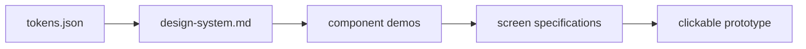

# Design System — Garazo

- Traces from: approved PRD v1 (`FR-001`–`FR-025`, `FR-090`–`FR-097`),
  approved feature list v1 (`FT-001`–`FT-031`)
- Companion files: `workspace/plan/01-design/tokens.json` (machine-readable),
  `workspace/plan/01-design/components/` (one HTML file per component),
  `workspace/plan/01-design/prototype/` (clickable screens)
- Source: locked HTML prototype v1,
  `workspace/assets/design-imports/GarazoPrototypeStandalone.html`
- Status: approved
- Last updated: 2026-07-27

`tokens.json` is the source of truth. This document and every component or
prototype file derive from it. A token change must ripple through all lower
levels in one design sync.

The locked HTML remains the visual authority above this generated chain.

## 1. Brand & tone

Garazo feels direct, practical, and calm during workshop rush. Bangla comes
first. Orange marks the next action. Dark chrome frames neutral work surfaces.
Rounded cards and sheets keep dense records approachable.

Owner money stays hidden until the owner PIN succeeds. Operational job details
remain visible to permitted workshop users.

### Import provenance

| Imported area | Exact prototype labels |
|---|---|
| App and navigation shell | `Garazo app`, `Dashboard`, `S1 Jobs board`, `S6 Customers`, `S7 Dues and reminders`, `S8 Money` |
| Entry and job work | `S10 Onboarding`, `S2 New job card`, `S3 Job detail` |
| Customer and sharing | `S5 Bill share preview`, `S6 Customer detail` |
| Protected and paid states | `S8 PIN gate`, `S9 Reminder teaser (locked)`, `S9 Reminder ROI`, `S11 Paywall` |
| Overlays | `Quick actions sheet`, `S4 Billing sheet`, `S4 Payment`, `S9 Next service sheet`, `S8 Entries drill-down`, `S8 Quick expense`, `S7 Bulk SMS confirm`, `Notifications sheet` |
| Settings | `Settings` |
| Human-approved additions | `Q-003` decision on 2026-07-27: owner batch entry and authorized admin controls |

## 2. Design tokens (mirrors tokens.json)

### Color

| Token | Light | Dark | Usage |
|---|---|---|---|
| `color.background` / `.canvas` | neutral work surface | dark outer canvas | app surface and outer canvas |
| `color.surface` / `.shell` | white cards | dark shell | cards, panels, app chrome |
| `color.text` / `.textMuted` | near-black | neutral gray | primary and secondary copy |
| `color.primary` / `.onDark` | Garazo orange | white | actions and action labels |
| `color.danger` / `.success` / `.warning` | red | green / amber | due, completion, and caution |
| `color.border` / `.borderStrong` | light neutral | stronger neutral | controls and dividers |

The orange `color.primary` is the visual anchor. Money success uses green.
Dues and invalid PIN states use red. Do not use color as the only cue.

### Typography

| Token | Value | Usage |
|---|---|---|
| `font.family.base` | Geist, Hind Siliguri, system sans-serif | mixed Bangla and English interface |
| `font.family.bangla` | Hind Siliguri, Geist, system sans-serif | Bangla-first long copy |
| `font.family.mono` | Geist Mono, system monospace | technical values only |
| `font.size.xs`–`.display` | 12px–38px | labels through PIN and money emphasis |
| `font.weight.regular/medium/bold/heavy` | 400 / 600 / 700 / 800 | body, controls, headings, logo |

### Spacing, radius, shadow, motion

| Scale | Tokens | Rule |
|---|---|---|
| Spacing | `space.1`–`space.12` | 4px base; 14px page gutter is a source exception |
| Radius | `radius.sm`–`radius.3xl`, `.sheet`, `.pill` | cards use 14px–18px; sheets use 22px top corners |
| Elevation | `shadow.xs`–`.toast` | cards stay light; sheets and toasts rise higher |
| Motion | `motion.fast/base/slow` | 150ms feedback; 220ms sheets; 300ms onboarding |

## 3. Components

Each demo is local and uses no library. Its styles come from the CSS variables
generated from `tokens.json`.

| Component | File | States covered | Used on screens |
|---|---|---|---|
| App shell | `components/app-shell.html` | default, offline, loading, error | SCR-002–SCR-003, SCR-007, SCR-009–SCR-010 |
| Button | `components/button.html` | default, hover, focus, disabled, loading, error | all screens |
| Form control | `components/form-control.html` | default, hover, focus, disabled, loading, error, empty | SCR-001, SCR-004, SCR-007 |
| Selection chip | `components/selection-chip.html` | default, hover, focus, selected, disabled, loading, error, empty | SCR-003–SCR-005, SCR-009, SCR-011 |
| Content card | `components/content-card.html` | default, hover, focus, disabled, loading, error, empty | SCR-002–SCR-003, SCR-007–SCR-011 |
| Job row | `components/job-row.html` | default, hover, focus, disabled, loading, error, empty | SCR-002–SCR-003 |
| Status badge | `components/status-badge.html` | default, working, ready, overdue, disabled, loading, error, empty | SCR-002–SCR-005 |
| Bottom navigation | `components/bottom-navigation.html` | default, hover, focus, selected, disabled | SCR-002–SCR-003, SCR-007, SCR-009–SCR-010 |
| Bottom sheet | `components/bottom-sheet.html` | default, focus, disabled, loading, error, empty | SCR-002–SCR-005, SCR-009–SCR-010 |
| Numeric keypad | `components/numeric-keypad.html` | default, hover, focus, disabled, loading, error, empty | SCR-005, SCR-010 |
| Money summary | `components/money-summary.html` | locked, default, loading, error, empty | SCR-002, SCR-009–SCR-010, SCR-012 |
| Bill card | `components/bill-card.html` | default, loading, error, empty | SCR-005–SCR-006 |
| Feedback | `components/feedback.html` | loading, success, error, empty, offline, toast | all screens |
| Admin shell | `components/admin-shell.html` | default, focus, disabled, loading, error, empty | SCR-014 |

## 4. Layout & responsive rules

The design canon is an Android-first 412×892 frame. Production screens fill
the device viewport. Desktop prototype pages center that frame on a dark
canvas.

- Keep a 14px page gutter and 10px–12px card gaps.
- Use a fixed dark top bar and a five-item bottom bar on shell screens.
- Keep primary actions near the bottom thumb zone.
- Open quick work in rounded bottom sheets. Keep context visible behind a
  scrim.
- At widths below 360px, stack paired controls. Never shrink tap targets below
  44px.
- At wider widths, preserve a 412px work column. Do not turn the owner app into
  a desktop dashboard.
- The separate support-admin surface may use a responsive two-column shell up
  to `layout.adminMaxWidth`. It is not part of owner-app navigation.

## 5. Interaction & accessibility standards

- Keep logical focus order: header, content, primary action, navigation.
- Every icon-only control needs a visible or accessible name.
- Show a 2px focus ring using `color.focus`.
- Meet WCAG AA contrast. Pair color with text, shape, or an icon.
- Announce saved, sent, failed, and locked results in a polite live region.
- Preserve Bangla line height at 1.5 or higher.
- Use `aria-busy` during loading and keep the current task context.
- Empty states explain what is absent and show the next valid action.
- Errors stay near the failed control. Never expose owner money in error copy.
- Mask due, reminder ROI, and attributed-income values outside an owner-PIN
  unlocked context. Protected routes and amount reveals must request the PIN.
- Keep non-money job, customer, vehicle, and reminder details visible to
  permitted workshop users.
- Sheets trap focus while open. Escape and the close control dismiss them.
- A shared-device timeout or explicit lock hides all protected money again.

## 6. Screen index

| ID | Screen | Spec | Prototype | Features |
|---|---|---|---|---|
| SCR-001 | Onboarding and phone access | `screens/SCR-001-onboarding.md` | `prototype/SCR-001-onboarding.html` | FT-001, FT-002, FT-017 |
| SCR-002 | Workshop dashboard | `screens/SCR-002-dashboard.md` | `prototype/SCR-002-dashboard.html` | FT-003, FT-005, FT-009–FT-011, FT-013–FT-014, FT-017, FT-019 |
| SCR-003 | Jobs board | `screens/SCR-003-jobs-board.md` | `prototype/SCR-003-jobs-board.html` | FT-004–FT-005, FT-014, FT-017, FT-020 |
| SCR-004 | New job card | `screens/SCR-004-new-job.md` | `prototype/SCR-004-new-job.html` | FT-004, FT-017, FT-019 |
| SCR-005 | Job detail and billing | `screens/SCR-005-job-detail.md` | `prototype/SCR-005-job-detail.html` | FT-005, FT-007, FT-012–FT-013, FT-017 |
| SCR-006 | Bill share preview | `screens/SCR-006-bill-share.md` | `prototype/SCR-006-bill-share.html` | FT-008, FT-016–FT-017 |
| SCR-007 | Customer and vehicle book | `screens/SCR-007-customers.md` | `prototype/SCR-007-customers.html` | FT-006, FT-017 |
| SCR-008 | Customer detail | `screens/SCR-008-customer-detail.md` | `prototype/SCR-008-customer-detail.html` | FT-006, FT-012–FT-013, FT-017 |
| SCR-009 | Dues and reminders | `screens/SCR-009-dues-reminders.md` | `prototype/SCR-009-dues-reminders.html` | FT-009, FT-012–FT-013, FT-015–FT-017 |
| SCR-010 | Private money | `screens/SCR-010-private-money.md` | `prototype/SCR-010-private-money.html` | FT-010–FT-011, FT-017 |
| SCR-011 | Settings | `screens/SCR-011-settings.md` | `prototype/SCR-011-settings.html` | FT-014–FT-017, FT-020, FT-022–FT-024 |
| SCR-012 | Pro and SMS offer | `screens/SCR-012-pro-offer.md` | `prototype/SCR-012-pro-offer.html` | FT-014–FT-016, FT-017 |
| SCR-013 | End-of-day batch entry | `screens/SCR-013-batch-entry.md` | `prototype/SCR-013-batch-entry.html` | FT-005, FT-010, FT-017 |
| SCR-014 | Authorized admin controls | `screens/SCR-014-admin-controls.md` | `prototype/SCR-014-admin-controls.html` | FT-018 |

Billing, payment, next-service, entry drill-down, expense, bulk SMS,
notifications, and quick actions remain sheet states. Their parent screen
specs document them. The paywall is canonical SCR-012 because it has its own
paid-feature journey and a near-full-height source surface.

## 7. Feature-to-screen coverage

| Feature | Design coverage | Canonical screen or status |
|---|---|---|
| FT-001 | covered | SCR-001 |
| FT-002 | covered | SCR-001 phone and OTP states |
| FT-003 | cross-cutting | all online MVP screens; no separate UI |
| FT-004 | covered | SCR-003, SCR-004 |
| FT-005 | covered | SCR-003 and SCR-005 cover live work; SCR-013 covers approved end-of-day batch entry |
| FT-006 | covered | SCR-007, SCR-008 |
| FT-007 | covered | SCR-005 billing and payment sheets |
| FT-008 | covered | SCR-006 |
| FT-009 | covered | SCR-002, SCR-009 |
| FT-010 | covered | SCR-010 owns PIN entry; protected routes and values in SCR-002, SCR-005–SCR-009, SCR-012–SCR-013 use that gate |
| FT-011 | covered | SCR-010 expense and entry sheets |
| FT-012 | covered | SCR-005 next-service sheet, SCR-008, SCR-009 |
| FT-013 | covered | SCR-002, SCR-008, SCR-009 |
| FT-014 | covered | SCR-003 cap warning, SCR-011, SCR-012 |
| FT-015 | covered | SCR-009, SCR-011, SCR-012 |
| FT-016 | covered | SCR-006, SCR-009, SCR-011, SCR-012 |
| FT-017 | cross-cutting | all released screens, with SCR-011 controls |
| FT-018 | covered | SCR-014 is the human-approved additive admin surface |
| FT-019 | cross-cutting | measured interactions and admin reporting contract; no separate owner screen |
| FT-020 | source teaser only | Pro “synced” and backup states in SCR-003/SCR-011; detailed offline UI deferred |
| FT-021 | cross-cutting, deferred | first paying cohort; no distinct prototype surface |
| FT-022 | source teaser only | locked module card in SCR-011; P1 details require later approval |
| FT-023 | source teaser only | locked module card in SCR-011; P1 details require later approval |
| FT-024 | source teaser only | locked module card and quick-action state; P1 details require later approval |
| FT-025 | deferred, not designed | P1 report pack has no prototype reference |
| FT-026 | deferred, not designed | P1 public history has no prototype reference |
| FT-027 | deferred, not designed | L2 multi-branch |
| FT-028 | deferred, not designed | L2 fleet accounts |
| FT-029 | deferred, not designed | L2 TireBook booking intake |
| FT-030 | deferred, not designed | L2 TireBook history exchange |
| FT-031 | deferred, not designed | L2 VAT invoicing |

All 31 feature IDs appear once in this coverage table. Deferred rows do not
create hidden commitments.

## Handoff → SRS authoring

- Produced by: Codex designer on 2026-07-27 · Status: approved
- **Decided (do not reopen without escalating):** the locked HTML prototype v1
  remains visual law; tokens flow down to every component and screen;
  12 source-derived screen IDs model the actual prototype surfaces; SCR-013
  and SCR-014 are the two human-approved additions from Q-003; named sheets
  remain documented states; Q-004 requires PIN protection for due, ROI, and
  attributed-income values.
- **Open (`Q-###`):** N/A — Q-003 and Q-004 were answered on 2026-07-27.
- **Watch out:** FT-020 and FT-022–FT-024 have teasers only. FT-021 and
  FT-025–FT-031 have no detailed design commitment. Source-derived screens may
  show masked placeholders where the locked prototype exposed protected values.
- **Next stage must:** author the SRS against approved SCR-001 through SCR-014.
  Carry the owner-PIN boundary into EARS acceptance criteria.
- **Must NOT change without a D-### + human ping:** source v1 provenance,
  `color.primary`, the 412×892 Android-first frame, Bangla-first copy, confirm-first
  job capture, owner-PIN privacy, or deferred release boundaries.
