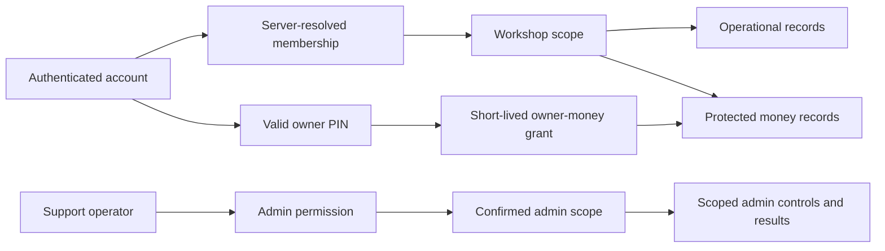

# Garazo Domain Model

- Status: technical plan v1 — conceptual model, not a database schema
- Last updated: 2026-07-30
- Traces from: approved SRS v1 (`FR-ACCESS-*`–`FR-ONLINE-*`,
  `NFR-SEC-*`, `NFR-REL-*`); approved screens `SCR-001`–`SCR-014`;
  forecast `FC-001`–`FC-021`
- Traces to: accepted `ADR-0002`, `ADR-0004`, `ADR-0005`, `ADR-0007`,
  `ADR-0008`, and `ADR-0009`

This model names concepts and ownership boundaries already implied by the
approved requirements. It does not authorize schema fields, API payloads,
provider choices, P1/L2 implementation, or a support-incidence definition.
`Q-006`/`D-001` remains frozen.

## 1. Core language

| Term | Meaning in Garazo | Primary trace |
|---|---|---|
| Workshop | Tenant boundary within which authorized operational and money records live | FR-ACCESS-05, NFR-SEC-01 |
| Account | Authenticated human identity; workshop access is granted separately | FR-ACCESS-03–FR-ACCESS-05 |
| Membership | Relationship between an account, workshop, and permitted operational role | FR-ACCESS-05 |
| Owner-money grant | Short-lived step-up authorization produced by valid owner PIN; never equivalent to the main session | FR-ACCESS-07–FR-ACCESS-15 |
| Customer | Workshop customer that may own or use linked vehicles; no Garazo account required | FR-CUSTOMER-* |
| Vehicle | Workshop-scoped vehicle identified through approved identifiers and linked service history | FR-CUSTOMER-* |
| Job | Live or batch-created workshop work record with the same lifecycle and record type | FR-JOB-* |
| Bill | Confirmed charge record originating from one job | FR-BILLING-01–FR-BILLING-02 |
| Payment | Retained value applied to a bill or outstanding due exactly once | FR-BILLING-03–FR-BILLING-10 |
| Ledger entry | Immutable financial effect used to reconcile daily categories | FR-CASH-*, FR-EXPENSE-* |
| Service schedule | Confirmed future service timing associated with a vehicle | FR-REMINDER-01–FR-REMINDER-02 |
| Reminder occurrence | One due occurrence that may create at most one successful send | FR-REMINDER-03–FR-REMINDER-05 |
| Reminder attribution | Link from an eligible return job to its originating sent reminder | FR-REMINDER-06–FR-REMINDER-09 |
| Entitlement | Current Free/Pro capability boundary that never owns workshop records | FR-PLAN-01–FR-PLAN-08 |
| SMS-credit entry | Immutable credit addition or successful-send consumption effect | FR-PLAN-09–FR-PLAN-12 |
| Admin scope | Product or workshop scope within which a support operator may act | FR-ADMIN-* |
| Admin audit | Immutable record of a successful admin mutation and its approved evidence | FR-ADMIN-05 |
| Product event | Evidence for approved product metrics, distinct from operational logs | FR-ANALYTICS-* |
| Durable intent | Technology-neutral record that consequential asynchronous work is owed | FR-REMINDER-02, FR-REMINDER-04, FR-BILLING-09 |
| Idempotency identity | Stable identity used to make retried consequential writes have one effect | FR-JOB-14, FR-BILLING-10, FR-EXPENSE-03, FR-PLAN-11 |

## 2. Bounded contexts

| Context | Owns | May reference | Must not expose |
|---|---|---|---|
| Access and workshop scope | Accounts, memberships, devices/sessions, owner-PIN credential policy, owner-money grants | Workshop identity | OTP, PIN, session secret, or foreign-workshop records |
| Workshop work | Customers, vehicles, jobs, job transitions, optional media references | Actor/workshop scope | Protected money when owner grant is absent |
| Billing and money | Bills, charge lines, payments, dues, expenses, ledger effects | Job, customer, vehicle | Protected values without owner grant |
| Reminders | Service schedules, occurrences, send results, return attribution | Vehicle, job, entitlement, SMS wallet | Protected ROI without owner grant |
| Plans and credits | Free-period usage, entitlements, SMS-credit entries | Workshop, successful send result | Provider-specific purchase or send state |
| Admin and configuration | Approved controls, scopes, referrals, lookup permissions, audits | Workshop and product identifiers | Any result outside operator scope |
| Product evidence | Approved job/reminder/entitlement events and derived metrics | Stable source-record identities | Undefined `NFR-ADOPTION-02` classification |
| Integration boundary | Provider-neutral requests/results for identity, messaging, media, share handoff, future TireBook | Owning context intent | Provider SDK types in domain records |

## 3. Conceptual relationships

```mermaid
classDiagram
  class Workshop
  class Account
  class Membership
  class Session
  class OwnerMoneyGrant
  class Customer
  class Vehicle
  class Job
  class JobTransition
  class MediaReference
  class Bill
  class Payment
  class LedgerEntry
  class ServiceSchedule
  class ReminderOccurrence
  class ReminderAttribution
  class Entitlement
  class SmsCreditEntry
  class AdminOperator
  class AdminScope
  class AdminAudit
  class ProductEvent
  class DurableIntent
  class IdempotencyIdentity

  Account "1" --> "0..*" Membership : receives
  Workshop "1" --> "1..*" Membership : authorizes
  Account "1" --> "0..*" Session : authenticates
  Session "1" --> "0..*" OwnerMoneyGrant : may step up

  Workshop "1" --> "0..*" Customer : owns
  Workshop "1" --> "0..*" Vehicle : owns
  Customer "0..1" --> "0..*" Vehicle : linked to
  Vehicle "1" --> "0..*" Job : serviced through
  Job "1" --> "1..*" JobTransition : records
  Job "1" --> "0..*" MediaReference : attaches
  Job "1" --> "0..1" Bill : originates
  Bill "1" --> "0..*" Payment : receives
  Bill "1" --> "0..*" LedgerEntry : produces effects
  Payment "1" --> "1..*" LedgerEntry : produces effects

  Vehicle "1" --> "0..*" ServiceSchedule : schedules
  ServiceSchedule "1" --> "0..*" ReminderOccurrence : becomes due as
  ReminderOccurrence "1" --> "0..1" ReminderAttribution : attributes
  ReminderAttribution "1" --> "1" Job : links return

  Workshop "1" --> "0..*" Entitlement : has history
  Workshop "1" --> "0..*" SmsCreditEntry : has ledger
  ReminderOccurrence "1" --> "0..1" SmsCreditEntry : consumes on success

  AdminOperator "1" --> "0..*" AdminScope : is authorized for
  AdminScope "1" --> "0..*" AdminAudit : constrains
  Workshop "1" --> "0..*" ProductEvent : emits approved evidence

  IdempotencyIdentity "1" --> "1" Job : protects batch or live save
  IdempotencyIdentity "1" --> "0..*" LedgerEntry : protects money effect
  DurableIntent "0..*" --> "1" ReminderOccurrence : performs
```

Cardinalities are conceptual. Exact optionality, keys, fields, and deletion
rules belong to approved task contracts after the datastore ADR is accepted.

## 4. Aggregate and transaction boundaries

| Command boundary | Records that must agree at acknowledgement | Required invariant |
|---|---|---|
| Save live job | Job, initial transition, customer/vehicle link, approved analytics event | Minimum input valid; known vehicle is not duplicated |
| Save batch | All accepted job rows, related money effects, business date, idempotency identity | Retry creates zero duplicate job or money effect |
| Confirm bill/payment | Bill/payment, due, ledger effects, idempotency identity | Balance and daily money reconcile exactly once |
| Recover due | Payment, outstanding balance, ledger effects, idempotency identity | Due reduces exactly once |
| Save expense | Expense/ledger effect, idempotency identity | Net applies the expense once |
| Schedule reminder | Service timing, occurrence or durable intent | One due occurrence has at most one successful send |
| Complete SMS send | Normalized provider result, successful-send record, SMS-credit entry | One successful send consumes one credit exactly once |
| Admin mutation | New scoped value and admin audit | Failed mutation retains prior value and creates no success audit |
| Entitlement change | New entitlement history and approved analytics event | Existing workshop records remain unchanged |

No cross-context command may be reported successful until its required retained
records agree. A selected implementation may use one local transaction or a
durable coordination pattern, but the result is fixed by the SRS.

## 5. Tenant and authorization boundaries

- Every workshop-owned record is resolved through the authorized workshop
  context; client-supplied scope is an input, never proof.
- Operational permission and owner-money permission are different.
- Owner-money grant termination follows explicit lock, protected-route exit,
  app background, or five minutes of protected-area inactivity.
- Support-operator authorization is separate from workshop-user identity and
  always has an explicit scope.
- Future branch and fleet boundaries are L2 contracts only. The MVP model must
  avoid global assumptions that prevent them, but must not implement them.

## 6. Structured data and media

The forecast estimates 180 GB cumulative data by M+12 and says optional media
is the largest uncertainty (`FC-010`). Therefore:

- structured identities, relationships, transactions, audit, idempotency, and
  async intent need a queryable transactional record boundary;
- photo, voice, and generated bill binaries belong in private object storage
  behind workshop-scoped metadata and authorization;
- no public object URL is a substitute for an authorization check;
- attachment size, retention, compression, and deletion behavior remain
  unapproved product/technical contracts and must not be invented here.

## 7. Future-stage compatibility

| Future boundary | Compatibility kept now | Not authorized now |
|---|---|---|
| Offline/sync (`FR-OFFLINE-*`) | Stable record identities, idempotent commands, explicit versions/timestamps where later approved | Conflict fields, local schema, merge rules, detailed UI |
| Mechanics/inventory/appointments/reports/history | Clear module ownership and workshop scope | Tables, fields, permissions, workflows |
| Multi-branch/fleet | Workshop scope is explicit and not hard-coded to one device | Branch/fleet entities or aggregation |
| TireBook | Provider-neutral, version-capable integration boundary; Garazo remains standalone | API fields, consent records, exchange implementation |
| VAT | Bills remain first-class records | Invoice fields, numbering, tax calculation |

## Handoff

- This conceptual model is input to the nine accepted ADRs, not a physical
  schema.
- Any physical model or API contract must be introduced through an approved
  task and remain within the accepted decisions.
- Keep `NFR-ADOPTION-02` absent from implementation planning until an approved
  amendment resolves `Q-006`/`D-001`.
