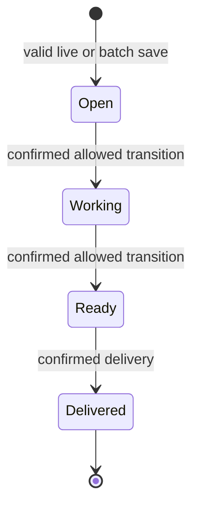
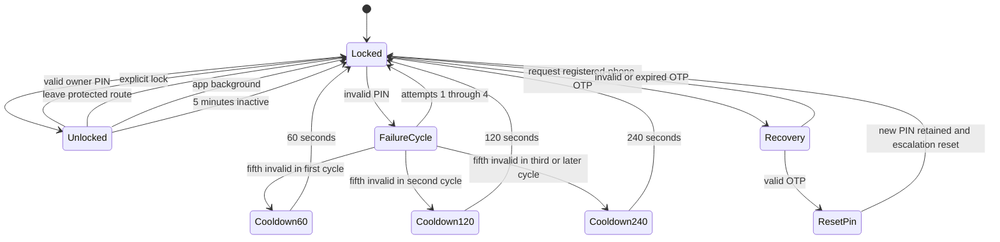
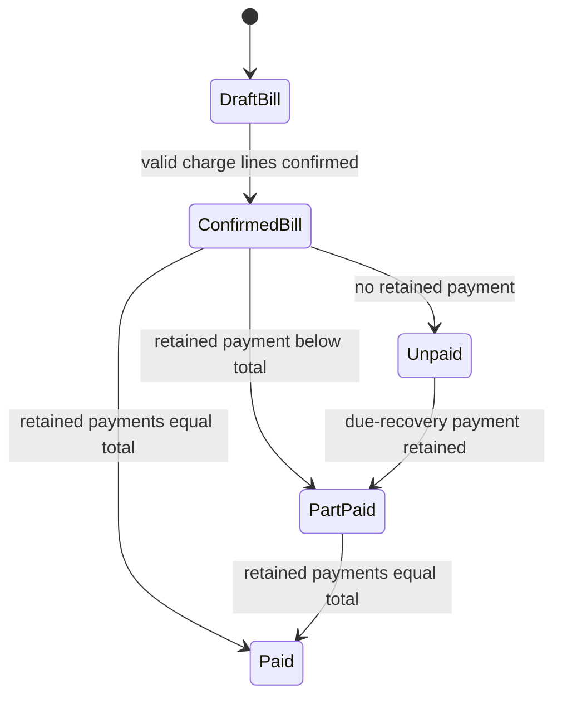
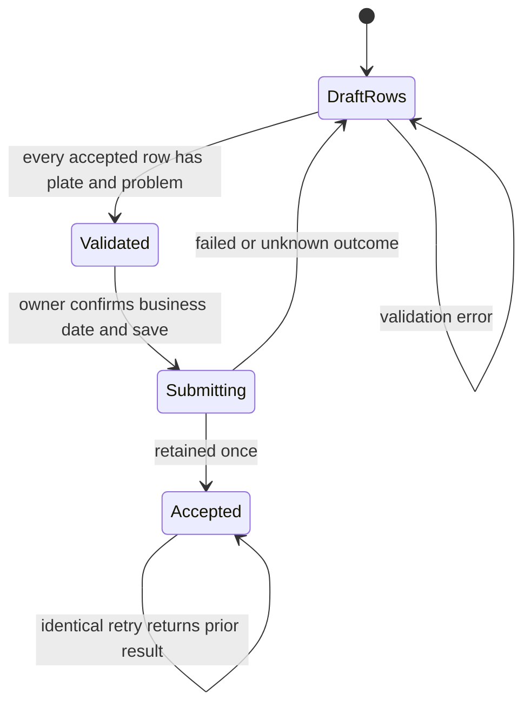
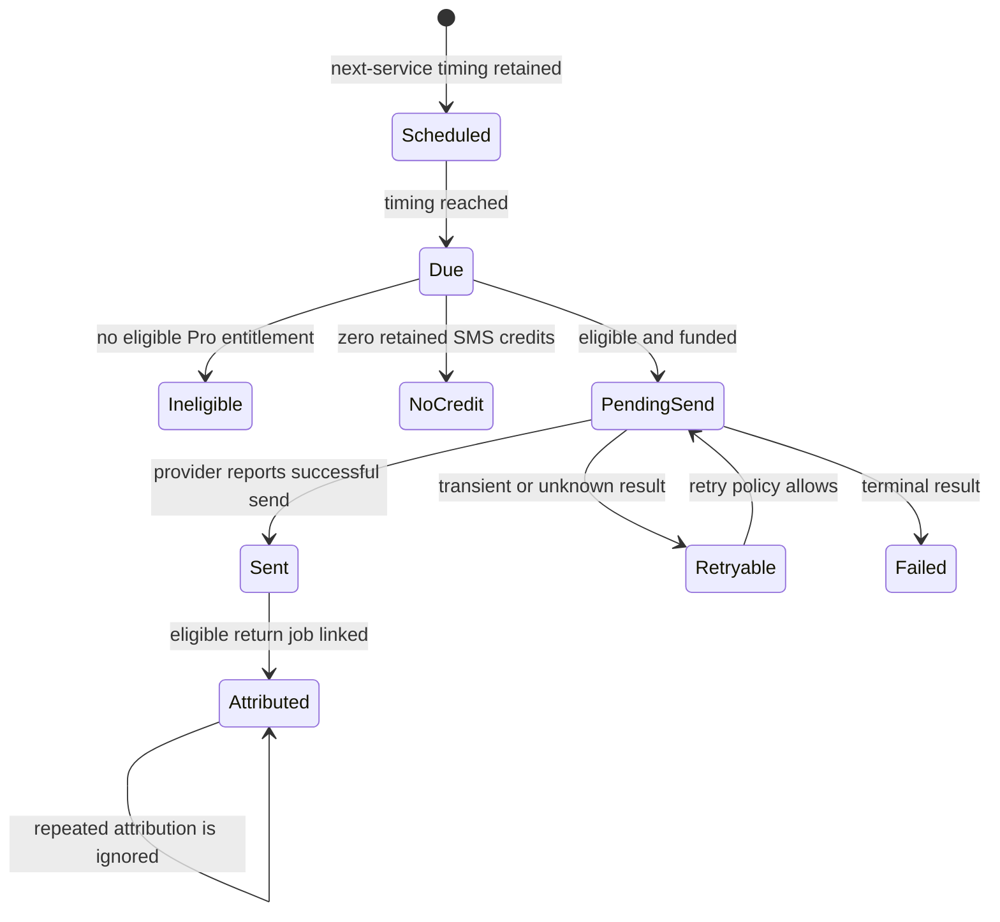
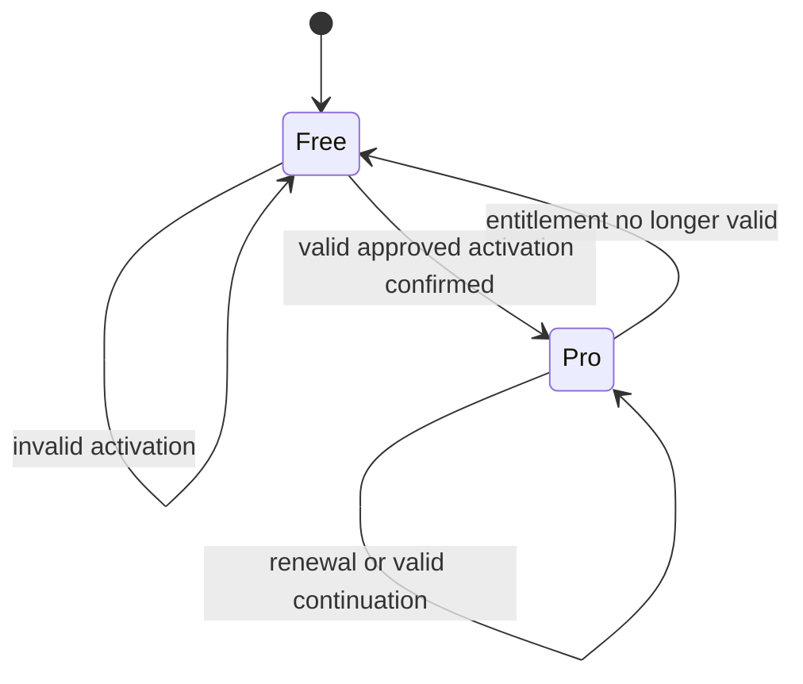
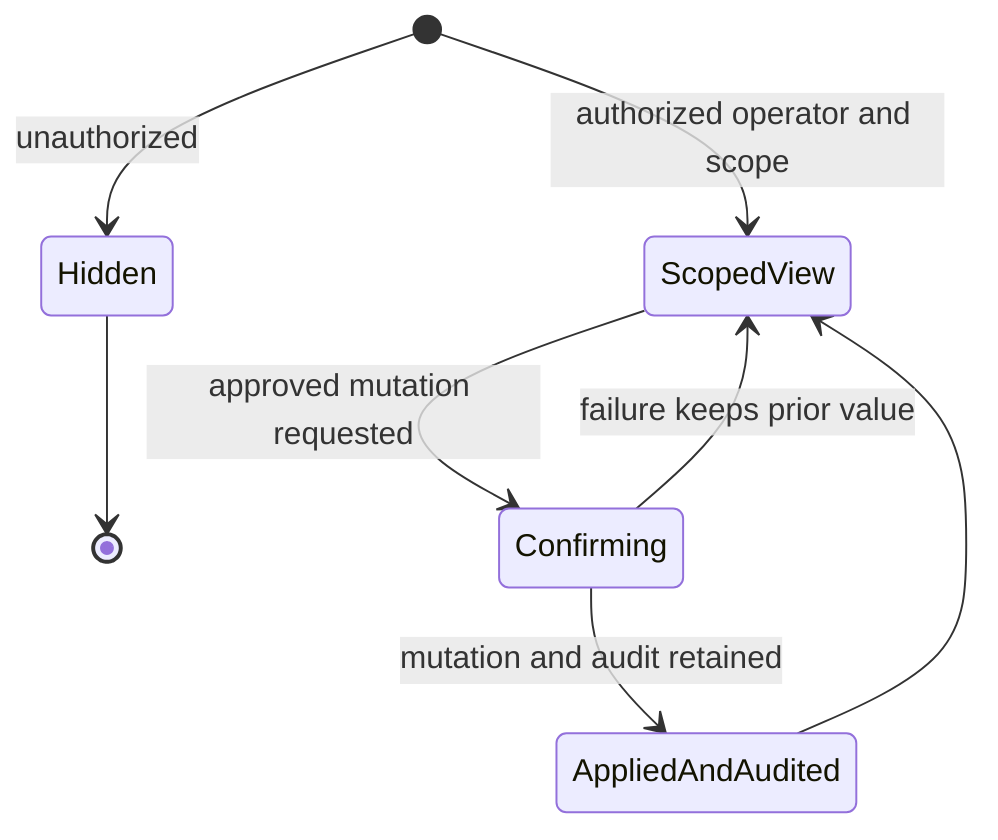
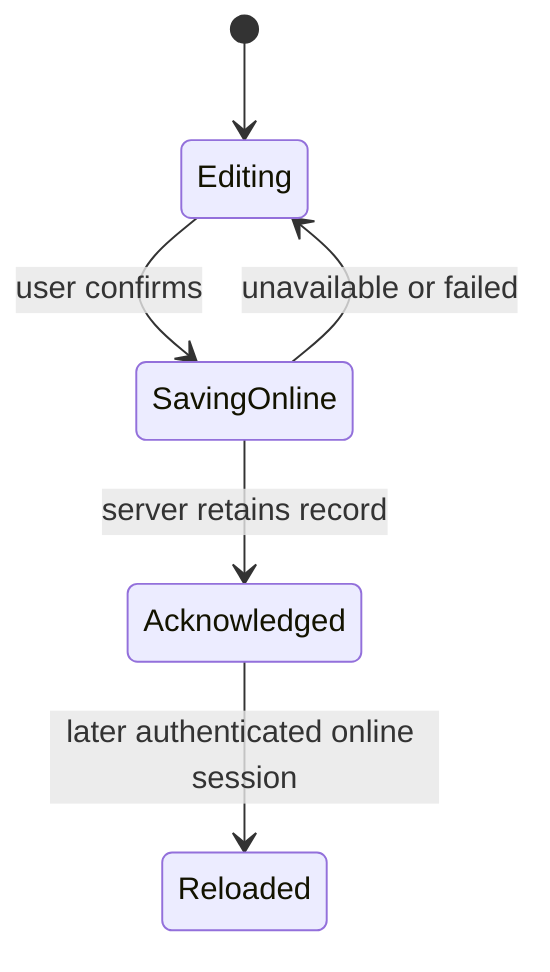
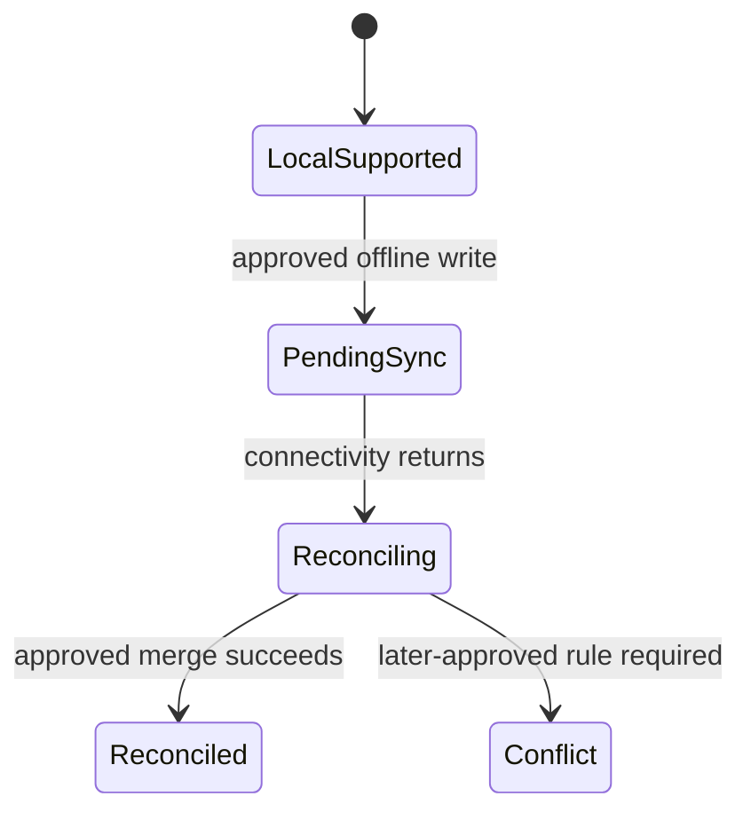

# Garazo Lifecycle Analysis

- Status: technical plan v1 — behavior analysis, not implementation detail
- Last updated: 2026-07-30
- Traces from: approved SRS v1; `Q-005`; approved design
  `SCR-003`, `SCR-005`, `SCR-009`, `SCR-010`, `SCR-012`–`SCR-014`;
  `FC-009`, `FC-012`, `FC-020`, `FC-021`
- Traces to: accepted `ADR-0002`, `ADR-0004`, `ADR-0005`, `ADR-0007`,
  `ADR-0008`, `ADR-0009`

Only states and effects supported by the approved sources are treated as
product behavior. Technology-specific queue/session/provider states are
illustrative boundaries constrained by the accepted ADRs; exact task
contracts remain unapproved.

## 1. Job lifecycle

The approved design shows four ordered states. The SRS permits only allowed
transitions and requires an immutable transition history.



Invariants:

- live and batch entry create the same job type;
- every accepted transition appends history;
- a disallowed transition leaves state unchanged;
- delivery may retain an optional next-service timing;
- cancellation, reopening, rollback, and deletion states are not approved and
  are intentionally absent.

## 2. Owner-money access and PIN cooldown



During any cooldown, PIN verification is rejected and no protected value is
revealed. A successful PIN or completed recovery resets the next failure-cycle
cooldown to 60 seconds. Main authentication and owner-money authorization are
separate lifecycles.

## 3. Bill, payment, due, and ledger lifecycle



The state labels are derived views over retained bill and payment records, not
permission to create a mutable balance field. Invariants:

- bill total equals retained charge lines;
- unpaid balance equals bill total minus retained payments;
- a positive balance creates a tracked due;
- payment/due recovery and ledger effects are one acknowledged transaction
  boundary;
- a retried payment or recovery produces one financial effect;
- protected values are absent from responses while owner money is locked.

## 4. Batch submission lifecycle



The client retains all draft rows after failure. If the outcome is unknown, it
retries with the same idempotency identity and must not create a second job or
money effect.

## 5. Reminder and SMS-credit lifecycle



`Retryable` and `Failed` are technical delivery-boundary states, not new
customer-facing promises. Required effects:

- one reminder occurrence has at most one successful send;
- one successful SMS consumes one credit exactly once;
- an ineligible or no-credit attempt creates no successful send;
- attribution increments return count once;
- ROI values derive from retained reminders, attributions, jobs, and payments
  and require an owner-money grant.

Expected M+12 volume is 5,600 SMS sends/month, so correctness and evidence
dominate throughput (`FC-012`, `FC-020`).

## 6. Entitlement lifecycle



- entitlement changes preserve all workshop records;
- Free usage counts only successfully saved jobs in the current approved
  period;
- the 31st Free job is not saved after 30 successful current-period jobs;
- Pro-only actions remain unavailable while entitlement is absent;
- exact collection/provider states remain an unselected third-party concern.

## 7. Admin mutation lifecycle



The mutation and success audit are one acknowledged boundary. An audit contains
the SRS-required operator, control, prior value, new value, scope, and time.
No additional admin powers are inferred.

## 8. Online-first and future offline lifecycle

MVP:



First paying cohort boundary only:



The second diagram preserves the contract shape but does not choose local
storage, conflict fields, merge policy, or screen behavior. Those details need
separate approval before FT-020/FT-021 implementation.

## 9. Complex flow sequence

This sequence is technology-neutral and shows the most consequential combined
MVP path: owner authorization, bill/payment retention, due/ledger consistency,
and optional asynchronous SMS.

```mermaid
sequenceDiagram
  actor Owner
  participant App
  participant Access
  participant Billing
  participant Records
  participant Async
  participant Provider

  Owner->>App: Enter owner PIN
  App->>Access: Verify PIN and cooldown atomically
  Access-->>App: Short-lived protected grant
  Owner->>App: Confirm bill and payment
  App->>Billing: Submit command and idempotency identity
  Billing->>Access: Validate actor, workshop and protected grant
  Billing->>Records: Begin atomic record change
  Billing->>Records: Retain bill, payment, due and ledger effects
  Billing->>Records: Retain SMS intent when requested
  Records-->>Billing: Commit once
  Billing-->>App: Acknowledge retained result

  Async->>Records: Claim due intent
  Async->>Records: Recheck entitlement, credit and prior success
  Async->>Provider: Send provider-neutral message
  Provider-->>Async: Normalized success or failure
  Async->>Records: Record result; consume credit once on success
```

Failure analysis:

| Failure point | Required result |
|---|---|
| PIN invalid/cooldown | No protected value; no billing command |
| Authorization expires before submit | Reject; no partial record |
| Transaction fails | No acknowledgement; prior state remains |
| Response lost after commit | Same idempotency identity returns the retained result |
| Worker crashes after claim | Durable intent becomes claimable again under the selected queue policy |
| Provider outcome unknown | Retry only under a policy that prevents a second successful effect |
| Provider success, result-save retry | Unique success/idempotency rule prevents second credit consumption |

## 10. Aggressive-scenario review

At `FC-021`, job volume rises to 36,000/month and peak concurrency to 68.
The first checks are queue lag, database lock/connection waits, aggregate-query
latency, media growth, and provider throttling. The domain lifecycle does not
change when capacity changes; scaling must preserve the same idempotency,
authorization, transition, and audit invariants.

## Handoff

- Use these lifecycles to evaluate ADR options and later derive tests.
- Do not add states such as job cancellation, refund, write-off, reminder
  opt-out, or offline conflict resolution without an approved SRS/task change.
- Keep `NFR-ADOPTION-02` frozen under `D-001`.
