# Technical Plan — Garazo

- Traces from: approved BRD v1; approved PRD v1; approved feature list v1
  (`FT-001`–`FT-031`); approved design v1 (`SCR-001`–`SCR-014`);
  approved SRS v1; verified traceability matrix; approved forecast
  (`FC-001`–`FC-021`)
- Traces to: proposed product decisions (`ADR-0001`–`ADR-0009`) and the
  future development plan
- Status: draft — all foundational decisions await the project owner
- Last updated: 2026-07-29

This document compares foundations. It does not choose them. Each proposed ADR
has two or three real options, a weighted comparison, an advisory
recommendation, and a `Decision` that remains `⏳ AWAITING HUMAN`.

`Q-006` and `D-001` freeze only `NFR-ADOPTION-02`. This plan does not define,
instrument, or claim verification of the support-incidence KPI.

## 1. Inputs digest

- Garazo is a Bangla-first, Android-first owner app plus a separate authorized
  support-admin surface. Fourteen approved screens define the current visual
  contract (`SCR-001`–`SCR-014`).
- The MVP is online-first and must work without TireBook. Offline operation and
  multi-device reconciliation start only with the first paying cohort
  (`FR-ONLINE-*`, `FR-OFFLINE-*`, `NFR-INDEPENDENCE-01`).
- The minimum live job path is intentionally small: plate plus one problem
  icon, zero optional text, with a pilot median of 45 seconds or less
  (`FR-JOB-01`–`FR-JOB-06`, `NFR-PERF-01`).
- Money effects require exact reconciliation and retry safety. Batch jobs,
  payments, due recovery, expenses, SMS credits, and reminder attribution
  must not duplicate financial effects (`FR-JOB-14`, `FR-BILLING-10`,
  `FR-EXPENSE-03`, `FR-PLAN-11`).
- Every business record belongs to an authorized workshop. Owner-private
  values require a short-lived owner-PIN grant and admin operations require
  separate scoped authorization and audit (`NFR-SEC-01`–`NFR-SEC-04`).
- Expected M+12 load is only 30 peak concurrent accounts and 45 application
  requests/second, with 16,000 jobs/month (`FC-008`, `FC-009`, `FC-011`,
  `FC-020`). This does not justify distributed-system complexity by itself.
- Expected stored data reaches 180 GB by M+12, with optional job media as the
  main uncertainty (`FC-010`, `FC-020`). Structured data and media need
  different storage treatment.
- Expected SMS traffic is 5,600 sends/month at M+12. Delivery deduplication,
  credit accounting, retries, and evidence matter more than raw throughput
  (`FC-012`, `FC-015`, `FC-020`).
- The aggressive M+12 test reaches 68 peak concurrent accounts, 36,000
  jobs/month, and 1,200 registered workshops. The request-rate envelope
  remains the explicit 45 requests/second forecast row until the forecast is
  amended; no larger rate is invented (`FC-011`, `FC-021`).
- Infrastructure must be reviewed against the approved
  ৳30,000–৳90,000/month M+12 envelope after current provider quotes exist.
  Relative cost labels below are not quotes (`FC-016`, `FC-020`).
- Feature depth is material: 17 of 31 features are depth L, mostly because of
  security, money, background work, offline reconciliation, and future
  integrations. The plan keeps those boundaries explicit instead of treating
  Garazo as simple CRUD.

## 2. System context

The boxes below are logical responsibilities, not selected deployable services.

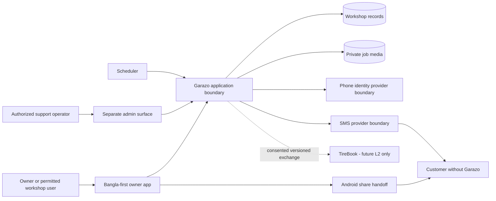

### Domain boundary map

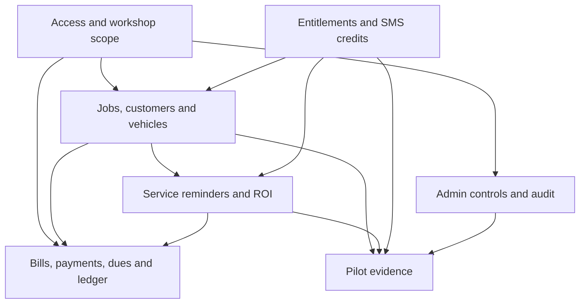

The full conceptual model is in
`workspace/plan/03-technical/domain/domain-model.md`. State and retry analysis
is in `workspace/plan/03-technical/domain/lifecycle-analysis.md`.

## 3. Decision areas

Scores and rankings in the ADRs are advisory. A score of 1 is weak and 5 is
strong for the named criterion. Weights total 100; weighted totals are out of
500.

### 3.1 Application stack

**Options considered**

| | Option A | Option B | Option C |
|---|---|---|---|
| Summary | Flutter/Dart owner app; Next.js admin; NestJS/TypeScript API | Expo/React Native owner app; Next.js admin; NestJS/TypeScript API | Kotlin/Jetpack Compose owner app; Next.js admin; Spring Boot/Kotlin API |
| Pros | Strong custom mobile UI; source BRD already names Flutter as an input; mature Android release path | One main language across app, admin, and API; broad web reuse | Direct Android platform access; first-party Android architecture guidance |
| Cons | Two-language product; less UI code shared with admin | Native dependency compatibility and Expo/React Native upgrade work | Android-only client; separate web and backend stacks; highest initial surface |
| Cost (build/run) | Medium build; run cost mainly depends on hosting choice, to be checked against `FC-016` | Potentially lowest build duplication; same run-cost dependency on `FC-016` | Highest relative build surface; same run-cost dependency on `FC-016` |
| Fits forecast | All three exceed `FC-020` and `FC-021`; throughput does not distinguish them | Same | Same |
| Team/agent friendliness | Conventional but split Dart/TypeScript | Strong single-language tooling | Strong platform conventions but more toolchains |
| Exit cost if wrong | High after mobile features and local persistence land | High after native modules and local persistence land | Very high if cross-platform becomes necessary |

**Leading-option sketch for evaluation only**

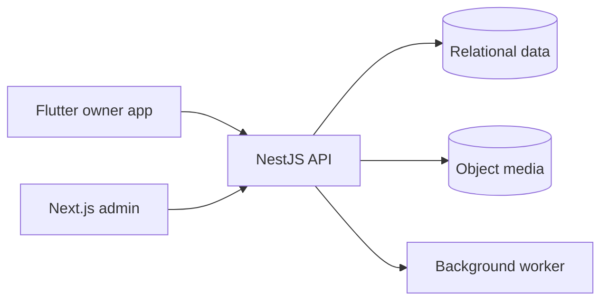

**Recommendation:** Option A is the advisory leader because the approved
412×892 Android-first design has a custom visual system, the locked BRD names
Flutter as an input, and the future offline path benefits from a stable mobile
repository layer. The real downside is permanent Dart/TypeScript split and
less reuse with the admin surface. The demand forecast does not decide this
choice (`FC-008`, `FC-011`, `FC-020`).

**Decision:** proposed `ADR-0001-application-stack.md`.

### 3.2 Architecture style

**Options considered**

| | Option A | Option B | Option C |
|---|---|---|---|
| Summary | Modular monolith with explicit domain modules and a separately runnable worker | Domain microservices with independent data ownership | Function-per-capability serverless backend |
| Pros | One transactional boundary; simplest operations; modules can later be extracted | Independent deployment and scaling; strong failure boundaries when mature | Fine-grained scaling; low idle compute |
| Cons | Requires disciplined module boundaries; broad deployment blast radius | Distributed transactions, versioning, tracing, and operations from day one | Workflow fragmentation, cold-start and local-testing complexity, provider coupling |
| Cost (build/run) | Lowest relative operational surface for `FC-020`; validate against `FC-016` | Highest relative operational surface without forecast need (`FC-011`, `FC-016`) | Variable provider cost; quotation and workload tests required by `FC-016` |
| Fits forecast | Strong | Weak at launch; capacity is unnecessary | Adequate, but complexity is not forecast-driven |
| Team/agent friendliness | Strong conventional boundaries | More coordination and contract work | More provider-specific behavior |
| Exit cost if wrong | Medium if module APIs and ownership stay explicit | High consolidation cost | High provider and orchestration migration cost |

**Leading-option sketch for evaluation only**

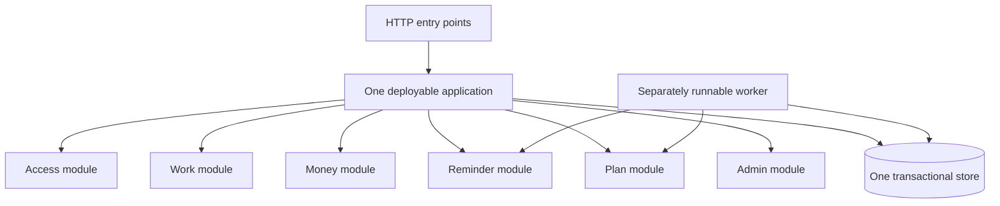

**Recommendation:** Option A. The first-year expected and aggressive business
envelopes are small compared with the coordination cost of distributed
transactions, while money and SMS-credit writes need strong atomicity
(`FC-008`, `FC-011`, `FC-020`, `FC-021`). Extraction remains possible if
observability later shows a real bottleneck.

**Decision:** proposed `ADR-0002-architecture-style.md`.

### 3.3 Delivery methodology

**Options considered**

| | Option A | Option B | Option C |
|---|---|---|---|
| Summary | Flow-based Kanban with thin vertical slices and WIP limits | Two-week Scrum increments | Layer-first milestones: data, API, then UI |
| Pros | Fits harness lanes and gated task flow; releases runnable journeys early | Predictable events and explicit sprint goal | Local efficiency within each technical layer |
| Cons | Needs strict WIP discipline and active prioritization | Ceremony overhead and spillover risk for uneven L features | Integration and usability risks appear late |
| Cost (build/run) | Process cost only; no infrastructure effect on `FC-016` | More scheduled ceremony | Highest rework risk against 45-second path and pilot evidence |
| Fits forecast | Good for low-confidence forecasts that need measured feedback (`FC-004`–`FC-012`) | Good if a stable team can hold a sprint cadence | Weak because pilot risks surface late (`FC-002`) |
| Team/agent friendliness | Strong with one-task/branch/worktree rules | Good but task gates can cross sprint boundaries | Strong locally, weak end-to-end |
| Exit cost if wrong | Low | Low to medium | Medium because unfinished layers accumulate |

**Leading-option sketch for evaluation only**

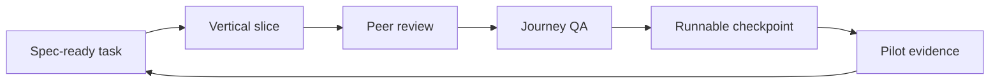

**Recommendation:** Option A because requirements and forecasts are
low-confidence until pilot use, while the harness already enforces small tasks,
review, QA, and checkpoint flow. Vertical slices expose the minimum-job speed,
privacy, and money invariants earlier (`FC-002`, `FC-004`–`FC-012`).

**Decision:** proposed `ADR-0003-delivery-methodology.md`.

### 3.4 Third-party service boundary

**Options considered**

| | Option A | Option B | Option C |
|---|---|---|---|
| Summary | Provider ports/adapters inside owning modules, durable intent/result records, and provider-neutral domain states | Direct provider SDK calls inside use cases | Separate integration service from day one |
| Pros | Testable failure handling; supplier replacement contained; core writes do not depend on live providers | Fastest first happy path; least code | Strong runtime isolation; independent deployment |
| Cons | More interfaces, fixtures, and explicit state mapping | Vendor behavior leaks into domain; retries and replacement become scattered | Distributed operations and consistency overhead |
| Cost (build/run) | Moderate build, low added runtime; supplier cost remains governed by `FC-015`/`FC-016` | Lowest build, potentially high exit cost | Highest run/operations relative to `FC-011` and `FC-016` |
| Fits forecast | Strong for modest but consequential `FC-012` SMS volume | Throughput fits, reliability risk does not | Excess capacity for `FC-012` |
| Team/agent friendliness | Strong explicit contracts | Easy initially, hard to test comprehensively | More repositories/deployments and contract work |
| Exit cost if wrong | Low to medium | High after SDK types and callbacks spread | Medium to high to consolidate |

**Leading-option sketch for evaluation only**

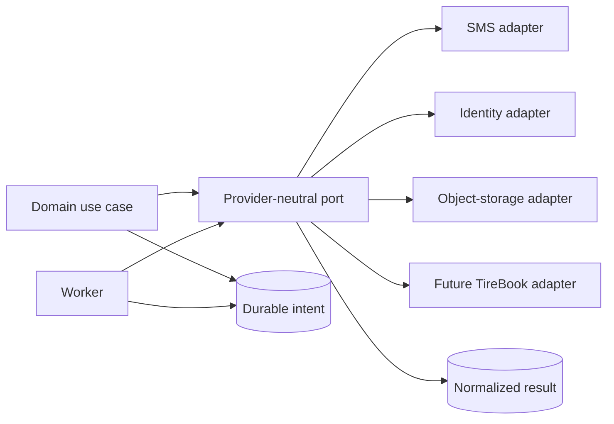

**Recommendation:** Option A. Garazo's provider volume is modest, but a send
must consume credit exactly once and show delivery evidence; that favors clear
ports and durable state over distributed deployment (`FC-012`, `FC-015`,
`FC-020`). The extra adapter code is a real up-front cost.

**Decision:** proposed `ADR-0004-third-party-service-boundary.md`.

### 3.5 Datastore

**Options considered**

| | Option A | Option B | Option C |
|---|---|---|---|
| Summary | Managed PostgreSQL for structured records; object storage for media | Managed MySQL/InnoDB for structured records; object storage for media | Firestore document store plus object storage |
| Pros | Transactions, relational constraints, row-level security, strong reporting/query fit | Mature transactions and relational constraints; broad managed availability | Mobile SDKs and document/offline capabilities |
| Cons | Schema migrations and connection management; row-level security needs careful tests | Tenant isolation relies more heavily on application/query discipline | Cross-aggregate money/reporting model is harder; provider-shaped data and higher exit cost |
| Cost (build/run) | Managed quote required within `FC-016`; one main structured store | Same | Usage pricing must be modeled from observed reads/writes; no forecast row exists yet |
| Fits forecast | Strong for `FC-009` jobs and `FC-010` structured/media split | Strong | Capacity fits, domain fit is weaker |
| Team/agent friendliness | Strong SQL/tooling and explicit constraints | Strong SQL/tooling | Fast document start, more invariant logic in application |
| Exit cost if wrong | Medium | Medium | High data-model and offline migration cost |

**Leading-option sketch for evaluation only**

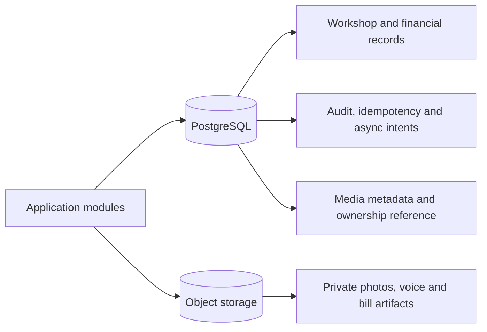

**Recommendation:** Option A. The domain is relational and has multiple
exact-once money effects, tenant joins, audit requirements, and KPI queries.
PostgreSQL also offers database-level row security as defense in depth. Media
must remain in object storage because it dominates the `FC-010` estimate.

**Decision:** proposed `ADR-0005-datastore.md`.

### 3.6 Hosting and runtime

**Options considered**

| | Option A | Option B | Option C |
|---|---|---|---|
| Summary | Managed container platform such as Cloud Run, managed SQL, object storage | Managed Kubernetes such as GKE Autopilot, managed SQL, object storage | Single hardened VM with Docker Compose; managed SQL and object storage |
| Pros | Low platform administration; independent API/worker revisions; scale controls | Maximum workload flexibility and service extraction path | Simple mental model; predictable always-on host |
| Cons | Provider coupling, cold starts unless minimum instances, connection planning | Cluster and Kubernetes complexity exceeds current need | Patching, host failover, deploy safety, and capacity are operator work |
| Cost (build/run) | Current quote required against `FC-016`; cap autoscaling to protect SQL | Usually highest relative platform surface at `FC-020`; quote required | Host cost can be predictable but human operations are not free; quote required |
| Fits forecast | Strong for `FC-011` | Capacity far beyond need | Capacity can fit `FC-020`, with weaker resilience |
| Team/agent friendliness | Strong container contract and repeatable deployment | More manifests and operational knowledge | Simple locally, manual production controls |
| Exit cost if wrong | Medium if containers and standard SQL are retained | Medium | Medium to managed containers |

**Leading-option sketch for evaluation only**

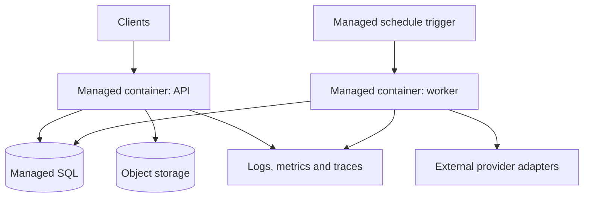

**Recommendation:** Option A, with a current provider quote and region review
before acceptance. It matches the small `FC-011` request envelope and reduces
operations while preserving a container exit path. Configure instance and
database-connection limits; autoscaling is not a substitute for capacity
planning.

**Decision:** proposed `ADR-0006-hosting-runtime.md`.

### 3.7 Authentication and session

**Options considered**

| | Option A | Option B | Option C |
|---|---|---|---|
| Summary | Firebase/Identity Platform phone OTP for owner identity, backend authorization, separate server-side owner-PIN grant | Auth0 passwordless SMS, backend authorization, separate server-side owner-PIN grant | First-party OTP and sessions through an approved SMS adapter, plus server-side owner-PIN grant |
| Pros | Mature mobile flow, app verification and test-phone support | Mature identity platform and configurable SMS-provider path | Maximum control of Bangladesh routing, data, and session behavior |
| Cons | Google identity coupling; phone-only auth has known security trade-offs; coverage and pricing need validation | Vendor and SMS-provider coupling; embedded mobile flow needs careful UX | Highest security, abuse, recovery, delivery, and operations burden |
| Cost (build/run) | Quote Bangladesh OTP and active-user behavior against `FC-016`; not covered by `FC-012` reminder volume | Same | SMS and security operations must be modeled separately; no approved figure exists |
| Fits forecast | All fit `FC-006`; security and recovery matter more than scale | Same | Same |
| Team/agent friendliness | Strong SDK/docs, but requires backend token verification | Strong docs, more tenant configuration | Most custom code and security tests |
| Exit cost if wrong | High identity migration; mitigated by internal account mapping | High identity migration | Medium provider migration, high maintenance burden |

**Leading-option sketch for evaluation only**

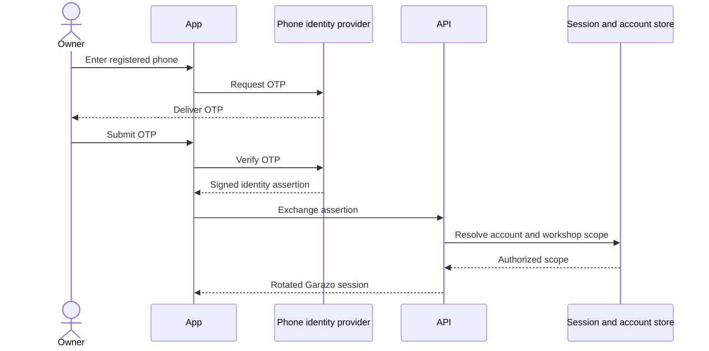

Owner-PIN verification is a separate step-up grant and follows the approved
60/120/240-second cooldown, relock, and registered-phone OTP recovery behavior
from `Q-005`.

**Recommendation:** Option A, subject to a Bangladesh delivery/price pilot and
privacy review. Managed phone verification reduces custom authentication risk,
but Garazo must still own account-to-workshop authorization and must not treat
the phone provider's token as owner-money authorization.

**Decision:** proposed `ADR-0007-auth-session.md`.

### 3.8 API style

**Options considered**

| | Option A | Option B | Option C |
|---|---|---|---|
| Summary | Versioned REST/JSON described by OpenAPI | GraphQL schema and operations | gRPC/Protocol Buffers for clients and internal calls |
| Pros | Language-neutral mobile/admin contract; HTTP tooling; future external API fit | Client-selectable fields and strong schema | Compact typed contracts and streaming support |
| Cons | Endpoint and representation discipline required; possible over/under-fetching | Cache/authorization/query-cost complexity; future public integration less conventional | Browser/mobile gateway work and weaker manual inspection |
| Cost (build/run) | Similar at `FC-011`; build/tooling cost is the discriminator | Similar throughput, more query controls | Similar throughput, more gateway/tooling |
| Fits forecast | Strong | Capacity unnecessary but functional | Capacity unnecessary |
| Team/agent friendliness | Strong contract generation and black-box tests | Strong schema tooling, more resolver complexity | Strong generated types, less familiar HTTP debugging |
| Exit cost if wrong | Medium | High client/query migration | High transport and client migration |

**Leading-option sketch for evaluation only**

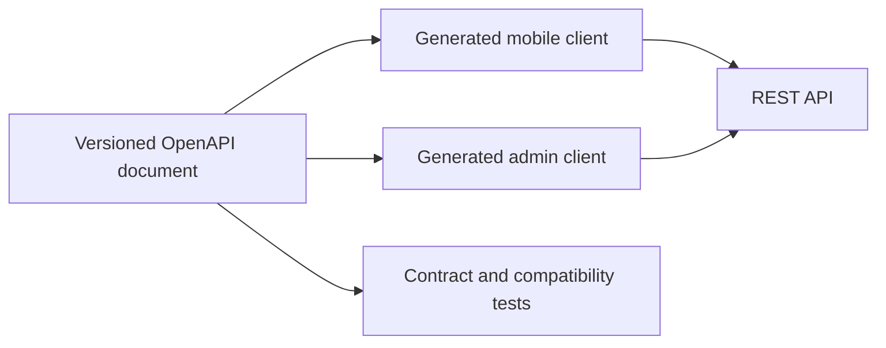

**Recommendation:** Option A. Garazo has two clients in different technology
stacks under the leading stack option and a future versioned TireBook contract.
At `FC-011`, GraphQL or gRPC performance advantages are not a planning driver.

**Decision:** proposed `ADR-0008-api-style.md`.

### 3.9 Background jobs and queue

**Options considered**

| | Option A | Option B | Option C |
|---|---|---|---|
| Summary | Database-backed durable jobs in the relational store; stack-compatible worker library | Redis-backed BullMQ and a dedicated worker | Managed HTTP task queue such as Cloud Tasks |
| Pros | Enqueue in the same transaction as domain state; one fewer data service | Mature retries, delays, concurrency, and horizontal workers | Managed retry/rate controls and low queue operations |
| Cons | Queue load shares database; library choice depends on accepted stack | Adds Redis and cross-store atomicity/outbox work | Cloud coupling; domain transaction and task creation still need reconciliation |
| Cost (build/run) | Lowest added infrastructure for `FC-012`; monitor database impact against `FC-010`/`FC-016` | Added managed Redis cost requires quote under `FC-016` | Usage quote required; no approved task-volume row beyond `FC-012` |
| Fits forecast | Strong for 5,600 SMS/month (`FC-012`) | Strong but excess throughput | Strong |
| Team/agent friendliness | Simple topology, careful SQL/worker tests | Strong Node tooling if ADR-0001 chooses Node | Strong operational interface, more emulator/integration work |
| Exit cost if wrong | Medium behind a queue port | Medium | Medium to high provider migration |

**Leading-option sketch for evaluation only**

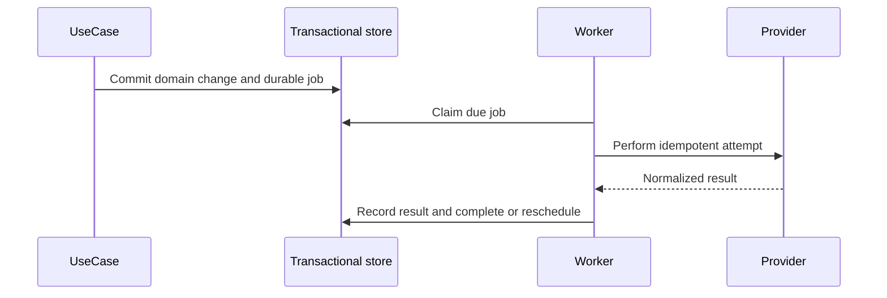

**Recommendation:** Option A for the approved expected envelope. It makes the
domain write and async intent atomic without adding Redis, which directly
supports exact-once credit and reminder requirements. Establish extraction
triggers: sustained queue lag, database contention, or provider workload that
cannot be isolated within the accepted performance budget.

**Decision:** proposed `ADR-0009-background-jobs-queue.md`.

## 4. Target architecture (chosen)

N/A — foundational decisions are not yet chosen. Completing a target
architecture now would violate the human decision gate.

The dependency order below shows how a later accepted architecture will be
assembled; it does not select an option.

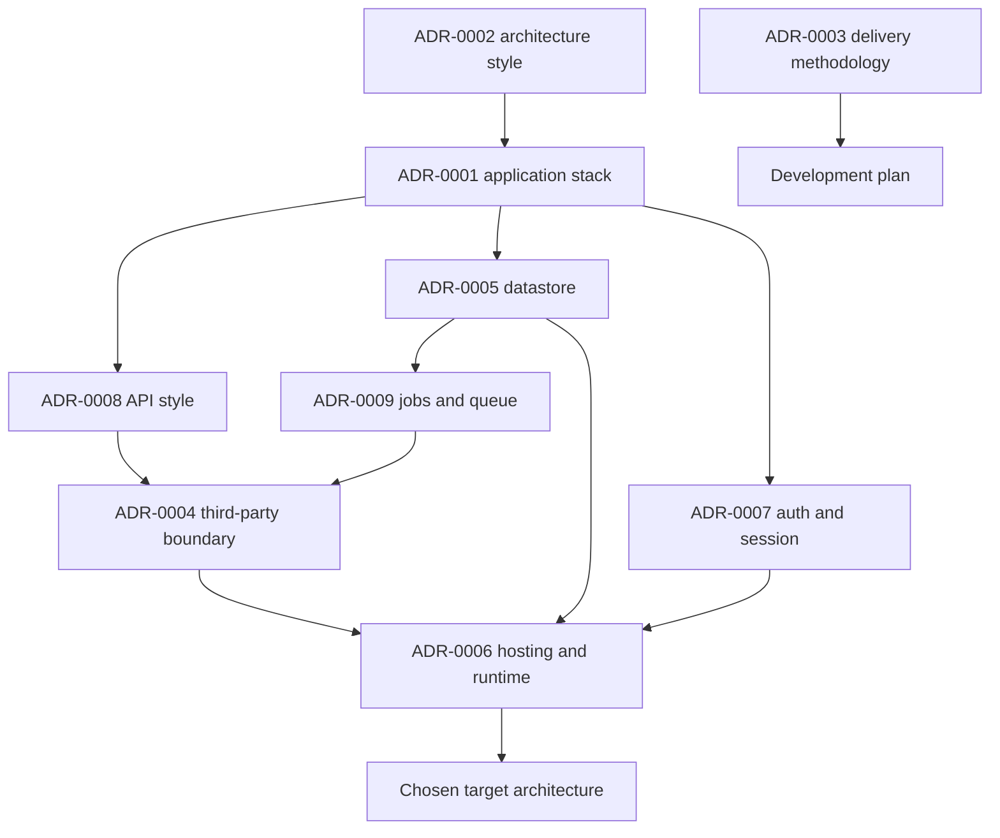

### Most complex flow: reference sequence, technology-neutral

This sequence expresses required state and transaction boundaries. Queue,
provider, API, and datastore technologies remain unresolved by
`ADR-0005`/`ADR-0008`/`ADR-0009`.

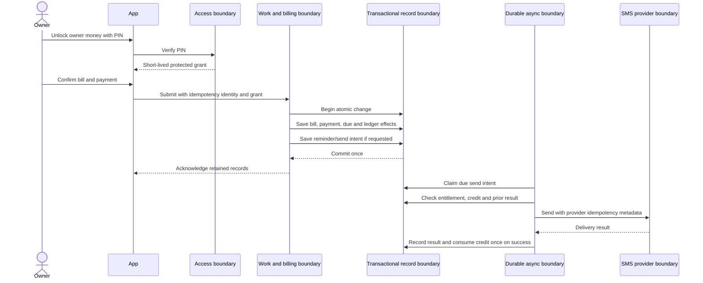

## 5. Cross-cutting concerns

These are decision-independent draft conventions derived from the approved
SRS and inherited lessons. Epic 00 may encode them only after the related
foundational ADRs are accepted.

### Security

- Resolve workshop scope on the server for every business read/write. A client
  workshop identifier is never authorization (`NFR-SEC-01`).
- Phone identity, Garazo session, workshop membership, support-operator
  permission, and owner-PIN protected grant are separate checks.
- Return one generic pre-session failure shape to avoid account enumeration
  (`L-auth-003`). Rotate the Garazo session after authentication
  (`L-auth-001`).
- Store no owner PIN in plaintext. Verify the approved cooldown atomically and
  cover parallel attempts (`Q-005`, `L-process-003`).
- Protected amounts are filtered at API/read-model boundaries as well as
  masked in UI; cache and accessibility output must contain no locked value
  (`NFR-SEC-02`, `NFR-SEC-03`).

**Draft Epic 00 convention:** every request context carries authenticated actor
identity and server-resolved workshop/scope; protected-money responses require
an unexpired server-validated owner grant.

### Observability

- Use structured logs with request/operation correlation, actor class,
  workshop scope as a non-secret identifier, result code, duration, and
  provider attempt reference.
- Never log OTPs, PINs, session tokens, customer phone content, protected money
  values, or raw provider payloads.
- Measure request latency/error, database saturation, queue lag/age, provider
  success/failure, duplicate suppression, and media volume. Review against
  `FC-010`–`FC-012`, `FC-016`, and `FC-021`.
- Product events remain separate from operational telemetry. No
  `NFR-ADOPTION-02` event is implemented while `D-001` is frozen.

**Draft Epic 00 convention:** all entry points and background jobs emit the
same correlation ID through logs, metrics, audit, and provider attempt state.

### Error handling

- Use stable domain error codes and Bangla/English presentation at the client.
  Provider errors are normalized and do not leak provider-specific data into
  domain contracts.
- Consequential side effects are awaited or durably recorded; never
  fire-and-forget money, audit, media cleanup, SMS credit, or reminder state
  (`L-process-004`).
- Validate every untrusted route/body identifier before a typed datastore
  operation (`L-process-006`).
- A retry must carry an idempotency identity and must not turn an unknown
  outcome into a second financial effect.

**Draft Epic 00 convention:** one error envelope contains stable code,
localized-message key, correlation ID, and field errors; it never carries a
protected value.

### Testing

- Unit tests cover state machines and calculations. Integration tests cover
  transactions, constraints, tenant isolation, audit, queue claims, and
  provider-result mapping.
- Money, credit, single-use OTP, PIN cooldown, admin mutation, and job-state
  paths require parallel race tests (`L-auth-004`, `L-process-003`).
- Real-browser tests cover admin sessions, cookies/CORS if used, accessibility,
  and protected-value absence (`L-process-007`, `NFR-A11Y-01`).
- Device/emulator tests cover owner-app background relock, route relock,
  5-minute inactivity, locale switch, share handoff, camera permission
  fallback, and reconnect persistence.
- The minimum job path is timed separately for live and batch entry. Load tests
  validate 45 requests/second until the forecast changes (`FC-011`).

**Draft Epic 00 convention:** no financial or authorization path is complete
without happy, rejection, retry, and concurrent-attempt tests.

### CI/CD

- Build immutable artifacts once and promote the same artifact through
  environments. Database migrations are reviewed, backward-compatible during
  rollout, and separately human-approved.
- Required configuration changes update every launcher, example environment,
  CI path, and deployment definition in the same task (`L-process-005`).
- CI gates formatting, static analysis, unit tests, integration tests,
  generated-contract drift, secret scan, dependency audit, accessibility
  checks, and the relevant journey tests.
- Production deploys require health checks, migration status, rollback steps,
  and post-deploy smoke/tenant-isolation checks.

**Draft Epic 00 convention:** every deployable exposes readiness and liveness;
schema migration is a separately logged, human-approved step, never application
startup magic.

## 6. Capacity and upgrade path

The expected baseline is `FC-020`; the aggressive scenario is `FC-021`.

| Concern | Expected posture | First likely pressure | Detection | Upgrade path |
|---|---|---|---|---|
| Request handling | Small horizontally repeatable API footprint for 45 requests/second (`FC-011`) | Database connections or slow aggregate reads, not CPU count | p95/p99 latency, connection pool wait, query time | Query/index review, bounded read models, then scale containers |
| Structured records | One transactional relational store for 16,000 jobs/month (`FC-009`, `FC-020`) | Aggregate/report queries and indexes | table/index growth, slow queries, lock waits | Read models/replica after measured need |
| Media | Private object storage; 180 GB total-data estimate at M+12 (`FC-010`) | Attachment size/rate and derived bill artifacts | bytes/workshop, upload failures, object count | Compression/limits, lifecycle policy, CDN only for approved public artifacts |
| Messaging | Durable scheduled work for 5,600 sends/month (`FC-012`) | Provider throttling/failure and queue lag | oldest job age, retry count, provider response | Rate-aware workers; separate queue/Redis/managed tasks if DB contention appears |
| Operations | Keep monthly infrastructure inside the approved envelope after quotes (`FC-016`) | Unbounded logs/media or minimum-instance spend | cost by service/workshop, storage growth | Budgets, retention, right-sizing, provider review |

No capacity figure above exceeds an approved `FC-###` input. New limits require
a forecast amendment before they become commitments.

## 7. Risks and mitigations

| Risk | Trigger | Mitigation | Owner |
|---|---|---|---|
| Foundational choices are accepted as a bundle without understanding trade-offs | Human review skips individual ADRs | Present one decision area at a time in the recommended order below | Architect + project owner |
| Q-006 behavior is accidentally invented | A task or event claims `NFR-ADOPTION-02` | Keep `D-001` frozen; require approved SRS amendment first | PM + architect |
| Cross-workshop leak | Missing or bypassed workshop predicate/policy | Server-resolved scope, database defense where selected, negative isolation suite | Backend + QA |
| Protected money appears in cache, errors, logs, or accessibility tree | A locked path returns the value and relies only on visual masking | Filter before serialization; explicit locked read models; security tests | Mobile/web/backend + QA |
| Duplicate financial or SMS-credit effect | Timeout, retry, parallel submit, worker replay | Idempotency identity, unique constraint, atomic transaction, concurrency tests | Backend |
| SMS/OTP provider failure blocks core work | Supplier outage or poor Bangladesh delivery | Provider ports, normalized failures, manual WhatsApp handoff where approved; Garazo remains standalone | Backend + operations |
| Media cost exceeds forecast | Attachment rate or average size materially exceeds `FC-010` | Measure bytes/job; explicit limits/compression/retention require later approved contract | Product + operations |
| Serverless/container autoscaling exhausts SQL | Burst or configuration error | Connection pooling, max instances, load tests at `FC-011` | Infrastructure |
| Premature microservices consume delivery capacity | Architecture selected for hypothetical scale | Require measured extraction trigger tied to `FC-011`/`FC-021` | Architect |
| First-paying-cohort offline scope is treated as MVP | Teaser screens are mistaken for approved detailed design | Keep `FR-OFFLINE-*` and FT-020/FT-021 out of MVP epics until detailed approval | Team lead |

## 8. Decisions index

| ADR | Decision | Status |
|---|---|---|
| ADR-0001 | Application stack | proposed — awaiting human |
| ADR-0002 | Architecture style | proposed — awaiting human |
| ADR-0003 | Delivery methodology | proposed — awaiting human |
| ADR-0004 | Third-party service boundary | proposed — awaiting human |
| ADR-0005 | Datastore | proposed — awaiting human |
| ADR-0006 | Hosting and runtime | proposed — awaiting human |
| ADR-0007 | Authentication and session | proposed — awaiting human |
| ADR-0008 | API style | proposed — awaiting human |
| ADR-0009 | Background jobs and queue | proposed — awaiting human |

### Recommended human decision order

1. `ADR-0002` architecture style
2. `ADR-0003` delivery methodology
3. `ADR-0001` application stack
4. `ADR-0005` datastore
5. `ADR-0008` API style
6. `ADR-0007` authentication and session
7. `ADR-0009` background jobs and queue
8. `ADR-0004` third-party service boundary
9. `ADR-0006` hosting and runtime

This order resolves structure before implementation technology, then data and
contracts before identity/async integration, and hosting last.

## 9. Official source snapshot

These primary sources were checked on 2026-07-29. They support technology
facts only; they do not make Garazo's human decisions.

| Area | Official source |
|---|---|
| Flutter architecture and deployment | [Flutter app architecture](https://docs.flutter.dev/app-architecture/guide) · [Flutter deployment](https://docs.flutter.dev/deployment) |
| Expo/React Native | [Expo new architecture](https://docs.expo.dev/guides/new-architecture/) · [Expo local-first guide](https://docs.expo.dev/guides/local-first/) |
| Native Android | [Android app architecture](https://developer.android.com/topic/architecture) · [Android offline-first data layer](https://developer.android.com/topic/architecture/data-layer/offline-first) |
| NestJS/OpenAPI | [NestJS documentation](https://docs.nestjs.com/) · [NestJS OpenAPI](https://docs.nestjs.com/openapi/introduction) |
| Architecture styles | [Azure Architecture Center: architecture styles](https://learn.microsoft.com/en-gb/azure/architecture/guide/architecture-styles/) · [microservices trade-offs](https://learn.microsoft.com/en-us/azure/architecture/guide/architecture-styles/microservices) |
| Delivery methods | [Kanban Guide](https://kanbanguides.org/the-kanban-guide/) · [Scrum Guide](https://scrumguides.org/download.html) · [Shape Up](https://basecamp.com/shapeup) |
| PostgreSQL/MySQL | [PostgreSQL row-security policy](https://www.postgresql.org/docs/current/sql-createpolicy.html) · [MySQL InnoDB transaction model](https://dev.mysql.com/doc/refman/8.0/en/innodb-transaction-model.html) |
| Managed containers | [Cloud Run overview](https://cloud.google.com/run/docs/overview/what-is-cloud-run) · [GKE Autopilot overview](https://cloud.google.com/kubernetes-engine/docs/concepts/autopilot-overview) · [Docker Compose production](https://docs.docker.com/compose/how-tos/production/) |
| Phone identity/session | [Firebase Android phone authentication](https://firebase.google.com/docs/auth/android/phone-auth) · [Auth0 SMS passwordless](https://auth0.com/docs/authenticate/passwordless/authentication-methods/sms-otp) · [OWASP session management](https://cheatsheetseries.owasp.org/cheatsheets/Session_Management_Cheat_Sheet.html) |
| API contracts | [OpenAPI specification](https://spec.openapis.org/oas/latest.html) · [gRPC overview](https://grpc.io/docs/what-is-grpc/) |
| Queues | [pg-boss project documentation](https://github.com/timgit/pg-boss) · [BullMQ queues](https://docs.bullmq.io/guide/queues) · [Cloud Tasks retries](https://cloud.google.com/tasks/docs/configure-retry-task) |

## Handoff

- Produced by: architect agent on 2026-07-29
- Status: draft; no foundational decision has been accepted
- Decided: approved SRS, domain invariants, release boundaries, and
  forecast-backed planning baseline only
- Awaiting human: `ADR-0001` through `ADR-0009`, one area at a time
- Frozen: `Q-006` / `D-001` / `NFR-ADOPTION-02`; no instrumentation or
  verification work may claim it
- Next step: present `ADR-0002` first, capture the human's accept/override and
  reasoning, then update its status and consequences before presenting the
  next area
- Must not do yet: complete the chosen target architecture, finalize Epic 00
  conventions, advance to `/dev-plan`, or commit a decision as accepted
