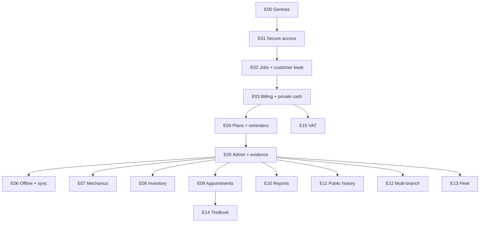
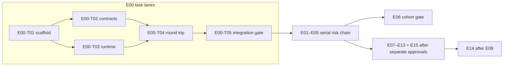

# Development Plan — Garazo

- Traces from: approved feature list v1, technical plan v1, ADR-0001–ADR-0009,
  design v1, SRS v1, traceability matrix
- Traces to: Epics (`E00`–`E15`)
- Status: approved — human gate passed 2026-07-30
- Last updated: 2026-07-30

`Q-006` / `D-001` keeps `NFR-ADOPTION-02` frozen. No epic below may define,
instrument, implement, or claim verification of that KPI before an approved
SRS amendment.

## 1. Epic map

E00 is the skeleton. Each later epic ends in a flow a human can run. Future
stage epics are mapped for coverage but remain scope-gated; the boundary
contracts do not authorize implementation.

| ID | Epic | Runnable flow when done | Features | Release gate | Depends on | Size | Status |
|---|---|---|---|---|---|---|---|
| E00 | Genesis and walking skeleton | From a clean clone, a human starts the Compose stack, opens the flag-gated diagnostic UI, sends one request through the API to PostgreSQL, sees the retained result, and runs green CI checks. | — | Dev-plan approved; dependency, migration, auth/security, and production-config gates remain explicit | — | M | specced |
| E01 | Secure workshop access | An owner verifies the registered phone, completes workshop setup, enters only the authorized workshop, changes Bangla/English presentation, and sees no workshop data after failed access. | FT-001, FT-002, FT-017 | MVP | E00 | L | pending |
| E02 | Fast jobs and customer book | A permitted workshop user creates a minimum live job from plate plus one problem, progresses or batch-enters work, then finds the retained customer/vehicle history in a later online session without TireBook. | FT-003, FT-004, FT-005, FT-006 | MVP | E01 | L | pending |
| E03 | Private billing and daily cash | An owner unlocks money, bills a job, records full/partial payment or due recovery exactly once, shares a customer-safe bill, records an expense, reconciles the day, and relocks every protected value. | FT-007, FT-008, FT-009, FT-010, FT-011 | MVP; high-risk auth/money QA | E02 | L | pending |
| E04 | Plans, credits, and service reminders | A human activates an approved Pro entitlement or remains Free, observes limits, adds/uses SMS credits, schedules one reminder, records its delivery/return once, and views protected ROI. | FT-012, FT-013, FT-014, FT-015, FT-016 | MVP; provider/dependency gates | E03 | L | pending |
| E05 | Admin controls and pilot evidence | An authorized support operator selects a scope, reads permitted support/metric evidence, applies one approved control with an audit, while an unauthorized operator sees no control or protected result. | FT-018, FT-019 | MVP; excludes frozen NFR-ADOPTION-02 | E04 | L | pending |
| E06 | Offline work and reconciliation | In the first paying cohort, an eligible Pro workshop uses only the approved records offline, reconnects, and sees zero lost acknowledged record, duplicate money effect, or foreign-workshop record. | FT-020, FT-021 | First-paying-cohort SRS/design/detail approval | E05 | L | gated |
| E07 | Mechanics and salary | After separate P1 approval, an owner manages approved mechanic and salary records while a mechanic sees no owner-private money without explicit permission. | FT-022 | P1 detail/design approval | E05 | M | gated |
| E08 | Inventory | After separate P1 approval, an owner records a stock movement and sees the item quantity reconcile to retained movements without duplicate effect. | FT-023 | P1 detail/design approval | E05 | M | gated |
| E09 | Appointments and booking | After separate P1 approval, a customer submits a valid public booking and the authorized workshop opens the retained vehicle/customer details. | FT-024 | P1 detail/design approval | E05 | M | gated |
| E10 | Reports | After separate P1 approval, an owner selects an approved report and period and sees totals reconcile to retained records or a truthful empty state. | FT-025 | P1 detail/design approval | E05 | M | gated |
| E11 | Public vehicle history | After separate P1 approval, an owner shares a vehicle-history link and a customer sees only approved fields and zero private workshop money. | FT-026 | P1 detail/design approval | E05 | M | gated |
| E12 | Multi-branch operation | After separate L2 approval, an authorized owner selects one branch and sees only permitted branch records, with aggregates limited to approved branches. | FT-027 | L2 detail/design approval | E05 | L | gated |
| E13 | Fleet accounts | After separate L2 approval, a workshop opens a fleet account and can distinguish its vehicles, jobs, bills, and balances from retail and other-fleet records. | FT-028 | L2 detail/design approval | E05 | L | gated |
| E14 | TireBook exchange | After separate L2 approval and consent, a TireBook booking enters Garazo and approved service history leaves through versioned contracts; disabling TireBook leaves Garazo operational. | FT-029, FT-030 | L2 consent/API/detail approval | E09 | L | gated |
| E15 | VAT invoices | After separate L2 approval, an owner issues a VAT invoice only with approved required data and sees it linked to its originating bill. | FT-031 | L2 tax/detail/design approval | E03 | M | gated |

### Feature coverage check

| Release stage | Features assigned exactly once | Count |
|---|---|---:|
| MVP | E01: FT-001, FT-002, FT-017 · E02: FT-003–FT-006 · E03: FT-007–FT-011 · E04: FT-012–FT-016 · E05: FT-018, FT-019 | 19 |
| First paying cohort | E06: FT-020, FT-021 | 2 |
| P1 | E07: FT-022 · E08: FT-023 · E09: FT-024 · E10: FT-025 · E11: FT-026 | 5 |
| L2 | E12: FT-027 · E13: FT-028 · E14: FT-029, FT-030 · E15: FT-031 | 5 |
| **Total** | **FT-001–FT-031; no duplicate and no unmapped feature** | **31** |



## 2. Sequencing rationale

- E00 retires integration risk first: two languages, generated contracts,
  modular boundaries, PostgreSQL, the selected single-VM Compose topology, and
  one visible end-to-end round trip.
- E01 establishes identity, server-resolved tenancy, locale, and session
  boundaries before any workshop record exists.
- E02 proves the ≤45-second core job journey and retained online workspace
  before money, providers, or paid capability add risk.
- E03 introduces owner-PIN and financial invariants as one runnable flow; it
  receives high-risk task QA and concurrency tests before dependent ROI,
  credits, and reminders.
- E04 adds entitlement, durable work, provider outcomes, and credit
  idempotency only after the underlying job and money records are trusted.
- E05 completes the separate admin/audit boundary and approved pilot evidence.
  `FR-ANALYTICS-04` and `NFR-ADOPTION-02` remain excluded while D-001 is
  frozen; FT-019 covers only currently defined analytics.
- E06 and E07–E15 stay behind their release-specific human gates. Mapping
  preserves coverage without treating boundary contracts or teaser designs as
  build permission.

## 3. Parallelization map

- WIP limit: at most three implementation tasks across active worktrees, and
  at most one high-risk auth/money/migration task at a time.
- Critical MVP chain: E00 → E01 → E02 → E03 → E04 → E05. These epics do not
  run in parallel because each consumes a validated user-flow contract from
  the prior checkpoint.
- Inside E00, T02 (contract/module boundaries) and T03
  (runtime/CI/operations) may run after T01 in separate worktrees; their file
  plans do not overlap. T04 merges both. T05 is the final integration task.
- Lean routing: T01–T04 use the `build` tier against their complete contracts;
  T05 and independent high-risk/final review use `deep`. Each task starts with
  fresh context and selectively reads only its declared files and references.
- After E05 and separate scope approval, E07–E13 can be planned as independent
  lanes. E14 waits for E09 because booking intake depends on the appointments
  contract. E15 depends only on the trusted E03 bill boundary, but remains L2
  gated.
- Merge points are epic branches after peer review; the independent epic QA
  gate and human checkpoint must pass before a dependent epic is sharded.



## 4. Checkpoint plan

| Checkpoint | Human runs/reviews | Required evidence | Possible remap |
|---|---|---|---|
| E00 | Clean-clone setup; Compose API/admin/worker boot; diagnostic UI → API → PostgreSQL → UI; CI | Green unit/integration/E2E, generated-contract drift check, Compose health, rebuild/recovery rehearsal | Fix skeleton before feature work; do not bypass |
| E01 | Valid/invalid phone access, setup, workshop isolation, locale switch | Auth/security QA, Bangladesh Firebase pilot status, no foreign data | Provider failure returns to `/tech-plan`; no silent fallback |
| E02 | Minimum live job, allowed progression, batch retry, customer/vehicle lookup, later session | Timed live/batch evidence, persistence and tenant tests | Split optional media if it threatens minimum-path speed |
| E03 | PIN cooldown/relock/recovery, bill/payment/due/share/expense/day reconciliation | High-risk QA, concurrent retry tests, protected-value absence | Freeze money expansion until all invariants pass |
| E04 | Free/Pro boundary, credit addition/consumption, one service reminder and ROI | Queue/provider failure evidence, idempotency and entitlement tests | Change provider adapter only through approved dependency/service gate |
| E05 | Authorized/unauthorized admin, scoped mutation/audit, approved KPI views | Admin security QA and event reconciliation; explicit absence of NFR-ADOPTION-02 claim | Resolve D-001 only through SRS amendment |
| E06 | Approved records offline then reconcile | Zero loss/duplicate/tenant leak; separately approved conflict policy | Remap supported records from pilot evidence |
| E07–E15 | The exact future runnable flow in §1 | New approved detail/design plus epic QA | Reorder or split only at the preceding checkpoint |

Each checkpoint receives the runnable flow, independent QA report, current
traceability, actual task metrics, unresolved risks, and a proposed remap
(including “no change”).

## 5. Remap log

Filled over time by `/checkpoint` when epics are re-scoped.

| Date | Change | Reason | Checkpoint |
|---|---|---|---|
| N/A | No remap yet | Initial draft | N/A |

## Approval record

- **Approved 2026-07-30 — E00 write-scope bootstrap:** the accepted
  multi-application repository uses root-level `apps/`, `packages/`,
  `contracts/`, `scripts/`, and `docs/`. The current `harness.yaml`
  intentionally says E00 replaces the placeholder `product_code` scope, but
  the project owner approved replacing `write_scopes.product_code` with:

  ```yaml
  product_code:
    - src/
    - tests/
    - apps/
    - packages/
    - contracts/
    - scripts/
    - docs/
    - package.json
    - pnpm-lock.yaml
    - pnpm-workspace.yaml
    - .node-version
    - .flutter-version
    - tsconfig.base.json
    - eslint.config.mjs
    - prettier.config.mjs
    - .gitignore
    - .dockerignore
    - .env.example
    - README.md
  ```

  Also replace the backend role line with:

  ```yaml
  developer-backend:
    [product_code, infra/db/, infra/compose/, Makefile, workspace/epics/]
  ```

  This keeps T01/T02/T04 with the backend implementation role while granting
  only the database/Compose and Makefile paths those cross-cutting tasks need.
  `.github/`, the rest of `infra/`, `docker/`, and `Makefile` remain in the
  existing devops scope for T03/T05. The approved harness change is committed
  separately so its protected-file history stays explicit.
- No foundational conflict blocks approval. Implementation still pauses at
  the repository's explicit gates for new dependencies, migrations,
  auth/security code, secrets/environment changes, and production
  configuration.
- Deferred, not reopened: Q-006 / D-001 / NFR-ADOPTION-02.

## Handoff

- Produced by: team-lead agent on 2026-07-30
- Status: approved by the project owner on 2026-07-30
- Decided inputs applied: ADR-0001–ADR-0009, approved SRS/design, medium
  profile, risk-first vertical-flow Kanban
- Coverage: FT-001–FT-031 each appear in exactly one non-E00 epic
- Validation: DAG/template/coverage/collision checks pass; the current
  constitution validator reports only paths covered by the protected
  `product_code`/backend-scope replacement listed above
- E00 next: run `/analyze E00`, then obtain the exact dependency approval
  before dispatching E00-T01
- Must not do: advance state to build, shard feature epics, implement future
  boundary contracts, claim NFR-ADOPTION-02, add dependencies, run migrations,
  create secrets, or change production configuration before their gates
